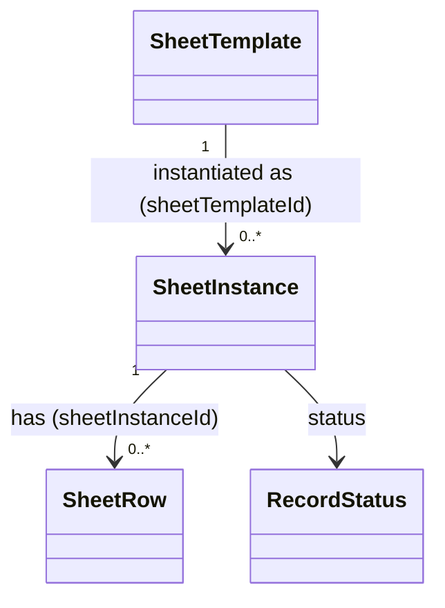

# SheetInstance（sheet_instance.dart）

| 新規作成・更新日 | 作成・更新者名 | 作成・更新内容 |
|---|---|---|
| 2026-09-25 | minamiyama | 新規作成 |
| 2026-09-25 | minamiyama | agents.md階層改訂に伴い`domain/entities/`へ移動 |

## 概要

営業日ごとに1枚作成される実際の伝票（インスタンス）を表すドメインエンティティ。[SheetTemplate](./sheet_template.md)のどの列構成を使ったかと、営業日（`businessDate`）を持つ。紙伝票のPDF右上の「月／日」に相当する。配下に複数の[SheetRow](./sheet_row.md)（来店・卓ごとの行）を持つ。DB定義は [db_schema.md](../../../../../../../requried/db_schema.md) §5.5 `t_sheet_instance` に対応する。

## 依存関係シーケンス図

## 項目一覧

| 項目論理名 | 項目物理名 | カプセルの型 | データ型 | バリデーション | 備考 |
|---|---|---|---|---|---|
| 伝票インスタンスID | sheetInstanceId | - | string | 必須, ULID形式 | PK |
| 伝票フォーマットID | sheetTemplateId | - | string | 必須, FK→[SheetTemplate](./sheet_template.md) | どのフォーマットを使ったか |
| 営業日 | businessDate | - | DateTime | 必須, 日付のみ(YYYY-MM-DD) | PDF右上の「月／日」に相当 |
| 論理削除状態 | status | - | [RecordStatus](./enums/record_status.md) | 必須 | デフォルト`active` |
| 作成日時 | createdAt | - | DateTime | 必須, ISO8601 | - |
| 更新日時 | updatedAt | - | DateTime | 必須, ISO8601 | - |
