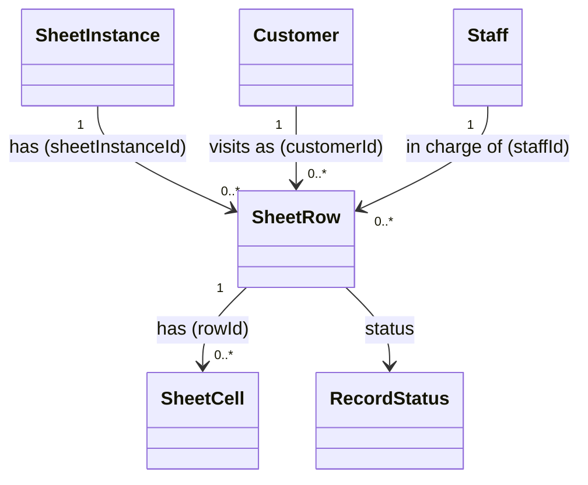

# SheetRow（sheet_row.dart）

| 新規作成・更新日 | 作成・更新者名 | 作成・更新内容 |
|---|---|---|
| 2026-09-25 | minamiyama | 新規作成 |
| 2026-09-25 | minamiyama | agents.md階層改訂に伴い`domain/entities/`へ移動 |

## 概要

1組の来店・卓（データ行）を表すドメインエンティティ。DBの物理テーブル名は`t_row`だが、Flutter標準の`Row`ウィジェットとの名称衝突を避けるため、Dartクラス名は`SheetRow`とする。[SheetInstance](./sheet_instance.md)配下に複数存在し、任意で[Customer](./customer.md)・[Staff](./staff.md)と紐付く。配下の[SheetCell](./sheet_cell.md)の`amount`合計は`totalAmount`にキャッシュされ、DBトリガーにより自動更新される（FR-2）。DB定義は [db_schema.md](../../../../../../../requried/db_schema.md) §5.8 `t_row` に対応する。

## 依存関係シーケンス図

## 項目一覧

| 項目論理名 | 項目物理名 | カプセルの型 | データ型 | バリデーション | 備考 |
|---|---|---|---|---|---|
| 行ID | rowId | - | string | 必須, ULID形式 | PK |
| 伝票インスタンスID | sheetInstanceId | - | string | 必須, FK→[SheetInstance](./sheet_instance.md) | どの日の伝票の行か |
| 顧客ID | customerId | optional | string | 任意, FK→[Customer](./customer.md) | 未登録の来店は`null` |
| スタッフID | staffId | optional | string | 任意, FK→[Staff](./staff.md) | 担当スタッフ |
| 表示順 | rowOrder | - | int | 必須 | - |
| 合計金額 | totalAmount | - | int | 必須 | デフォルト0。[SheetCell](./sheet_cell.md)の`amount`合計のキャッシュ。DBトリガー(`trg_t_cell_ai/au/ad`)により自動更新されるため、アプリ側から直接書き込まない |
| 論理削除状態 | status | - | [RecordStatus](./enums/record_status.md) | 必須 | デフォルト`active` |
| 作成日時 | createdAt | - | DateTime | 必須, ISO8601 | - |
| 更新日時 | updatedAt | - | DateTime | 必須, ISO8601 | - |
