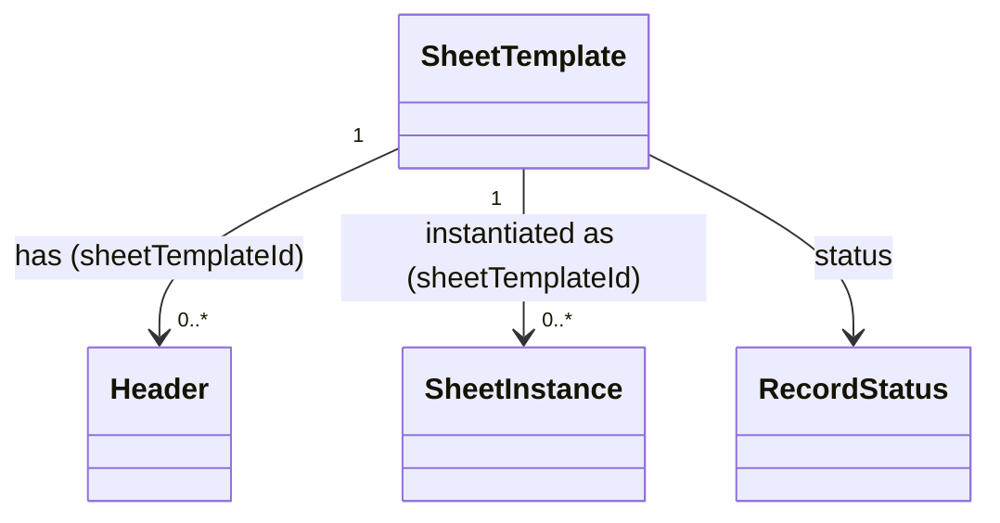

# SheetTemplate（sheet_template.dart）

| 新規作成・更新日 | 作成・更新者名 | 作成・更新内容 |
|---|---|---|
| 2026-09-25 | minamiyama | 新規作成 |
| 2026-09-25 | minamiyama | agents.md階層改訂に伴い`domain/entities/`へ移動 |

## 概要

伝票フォーマットの定義（列構成のテンプレート）を表すドメインエンティティ。紙伝票（例:「寿」）1種類に対して1レコード存在し、[Header](./header.md)（列定義）を配下に持つ。テンプレート管理機能（FR-1）で[CreateTemplateUsecase](../usecases/create_template_usecase.md)・[AddHeaderUsecase](../usecases/add_header_usecase.md)から生成・参照され、[SheetTemplateRepository](../repositories/sheet_template_repository.md)（インターフェース）を介して永続化される。DB定義は [db_schema.md](../../../../../../../requried/db_schema.md) §5.1 `m_sheet_template` に対応する。

## 依存関係シーケンス図

## 項目一覧

| 項目論理名 | 項目物理名 | カプセルの型 | データ型 | バリデーション | 備考 |
|---|---|---|---|---|---|
| 伝票フォーマットID | sheetTemplateId | - | string | 必須, ULID形式 | PK。[IdGenerator](../../../../core/utils/id_generator.md)で発行する |
| フォーマット名 | name | - | string | 必須 | 例:「寿」 |
| 論理削除状態 | status | - | [RecordStatus](./enums/record_status.md) | 必須 | デフォルト`active` |
| 作成日時 | createdAt | - | DateTime | 必須, ISO8601 | - |
| 更新日時 | updatedAt | - | DateTime | 必須, ISO8601 | - |
