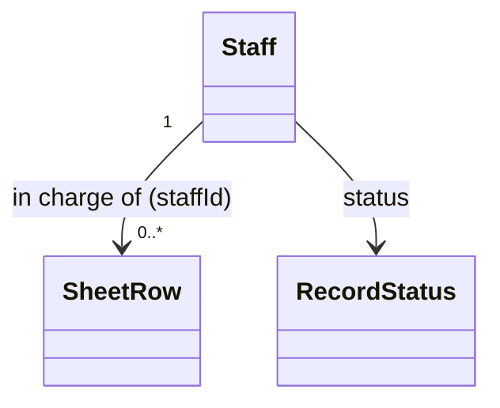

# Staff（staff.dart）

| 新規作成・更新日 | 作成・更新者名 | 作成・更新内容 |
|---|---|---|
| 2026-09-25 | minamiyama | 新規作成 |
| 2026-09-25 | minamiyama | agents.md階層改訂に伴い`domain/entities/`へ移動 |

## 概要

店舗スタッフを表すドメインエンティティ。[SheetRow](./sheet_row.md)に担当スタッフとして紐付けられ、スタッフ別・期間別の売上集計（FR-4、[StaffDailySales](./staff_daily_sales.md)）の軸として使用する。DB定義は [db_schema.md](../../../../../../../requried/db_schema.md) §5.7 `m_staff` に対応する。

## 依存関係シーケンス図

## 項目一覧

| 項目論理名 | 項目物理名 | カプセルの型 | データ型 | バリデーション | 備考 |
|---|---|---|---|---|---|
| スタッフID | staffId | - | string | 必須, ULID形式 | PK |
| スタッフ氏名 | name | - | string | 必須 | - |
| スタッフ略称 | staffCode | optional | string | 任意 | 伝票上の略称（PDFの「P」「カ」等） |
| 論理削除状態 | status | - | [RecordStatus](./enums/record_status.md) | 必須 | デフォルト`active` |
| 作成日時 | createdAt | - | DateTime | 必須, ISO8601 | - |
| 更新日時 | updatedAt | - | DateTime | 必須, ISO8601 | - |
