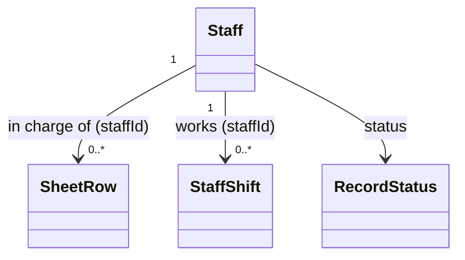

# Staff（staff.dart）

| 新規作成・更新日 | 作成・更新者名 | 作成・更新内容 |
|---|---|---|
| 2026-09-25 | minamiyama | 新規作成 |
| 2026-09-25 | minamiyama | agents.md階層改訂に伴い`domain/entities/`へ移動 |
| 2026-09-27 | minamiyama | `staffCode`の説明を訂正（[agents.md](../../../../../../../requried/agents.md)により「P」「カ」は決済方法と判明したため）。[StaffShift](./staff_shift.md)との関係を追加 |

## 概要

店舗スタッフを表すドメインエンティティ。[SheetRow](./sheet_row.md)に担当スタッフ（会計を行った人、行右端の「担当」列）として紐付けられるほか、[StaffShift](./staff_shift.md)を通じて日次の勤務シフトにも紐付く。スタッフ別・期間別の売上集計（FR-4、[StaffDailySales](./staff_daily_sales.md)）の軸としても使用する。DB定義は [db_schema.md](../../../../../../../requried/db_schema.md) §5.7 `m_staff` に対応する。

## 依存関係シーケンス図

```mermaid
classDiagram
    Staff "1" --> "0..*" SheetRow : in charge of (staffId)
    Staff "1" --> "0..*" StaffShift : works (staffId)
    Staff --> RecordStatus : status
```

## 項目一覧

| 項目論理名 | 項目物理名 | カプセルの型 | データ型 | バリデーション | 備考 |
|---|---|---|---|---|---|
| スタッフID | staffId | - | string | 必須, ULID形式 | PK |
| スタッフ氏名 | name | - | string | 必須 | - |
| スタッフ略称 | staffCode | optional | string | 任意 | スタッフの社内コード・略称。伝票上の「P」「カ」は決済方法（[SheetRow.paymentMethod](./sheet_row.md)）を表す別概念であり、本フィールドとは無関係 |
| 論理削除状態 | status | - | [RecordStatus](./enums/record_status.md) | 必須 | デフォルト`active` |
| 作成日時 | createdAt | - | DateTime | 必須, ISO8601 | - |
| 更新日時 | updatedAt | - | DateTime | 必須, ISO8601 | - |
