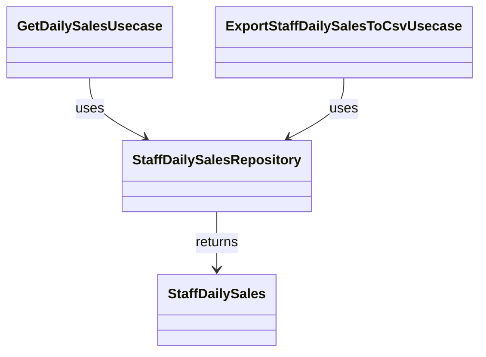

# StaffDailySales（staff_daily_sales.dart）

| 新規作成・更新日 | 作成・更新者名 | 作成・更新内容 |
|---|---|---|
| 2026-09-25 | minamiyama | 新規作成 |
| 2026-09-25 | minamiyama | agents.md階層改訂に伴い`domain/entities/`へ移動 |

## 概要

スタッフ別・日別の売上集計結果を表すドメインエンティティ。永続化対象のテーブルではなく、[db_schema.md](../../../../../../../requried/db_schema.md) §6 のビュー`v_staff_daily_sales`の1行を表す読み取り専用の値オブジェクト。[StaffDailySalesRepository](../repositories/staff_daily_sales_repository.md)の返却値、[GetDailySalesUsecase](../usecases/get_daily_sales_usecase.md)（FR-4）・[ExportStaffDailySalesToCsvUsecase](../usecases/export_staff_daily_sales_to_csv_usecase.md)（FR-3）で使用する。

## 依存関係シーケンス図

## 項目一覧

| 項目論理名 | 項目物理名 | カプセルの型 | データ型 | バリデーション | 備考 |
|---|---|---|---|---|---|
| スタッフID | staffId | - | string | 必須 | `v_staff_daily_sales.staff_id` |
| スタッフ氏名 | staffName | - | string | 必須 | `v_staff_daily_sales.staff_name` |
| 営業日 | businessDate | - | DateTime | 必須, 日付のみ(YYYY-MM-DD) | `v_staff_daily_sales.business_date` |
| 来店件数 | customerCount | - | int | 必須 | `v_staff_daily_sales.customer_count` |
| 売上合計 | totalSales | - | int | 必須 | `v_staff_daily_sales.total_sales`。単位は円 |
