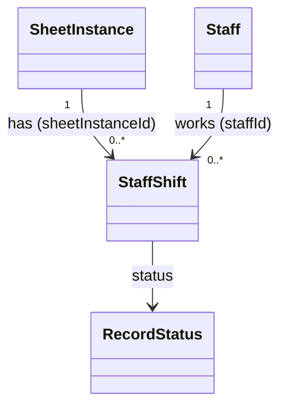

# StaffShift（staff_shift.dart）

| 新規作成・更新日 | 作成・更新者名 | 作成・更新内容 |
|---|---|---|
| 2026-09-27 | minamiyama | 新規作成（[agents.md](../../../../../../../requried/agents.md)のスタッフ欄仕様を反映） |

## 概要

伝票右上の「スタッフ」欄（氏名・就業時刻・ドリンクバック）を表すドメインエンティティ。[SheetRow](./sheet_row.md)の担当スタッフ（会計を行った人）とは別概念で、営業日（[SheetInstance](./sheet_instance.md)）単位でのスタッフの勤務記録を表す。紙伝票では「(氏名) 就業開始時間(hh:mm) ~ 就業完了時間(hh:mm) D ドリンクバック欄」の行が3行ある。DB定義は [db_schema.md](../../../../../../../requried/db_schema.md) §5.10 `t_staff_shift` に対応する。

## 依存関係シーケンス図

## 項目一覧

| 項目論理名 | 項目物理名 | カプセルの型 | データ型 | バリデーション | 備考 |
|---|---|---|---|---|---|
| シフトID | shiftId | - | string | 必須, ULID形式 | PK |
| 伝票インスタンスID | sheetInstanceId | - | string | 必須, FK→[SheetInstance](./sheet_instance.md) | どの日のシフトか |
| スタッフID | staffId | optional | string | 任意, FK→[Staff](./staff.md) | 未選択（「未定」）の場合は`null` |
| 就業開始時刻 | startTime | optional | string | 任意, `HH:mm`形式 | 未入力の場合は`null`。画面側は未入力時に現在時刻を初期値としてボタン表示する（[VoucherStaffBar](../../presentation/widgets/voucher_staff_bar.md)参照） |
| 就業終了時刻 | endTime | optional | string | 任意, `HH:mm`形式 | 未入力の場合は`null`。初期値の扱いは`startTime`と同様 |
| ドリンクバック | drinkBack | optional | string | 任意 | 紙伝票の「D」欄。自由記述（string型） |
| 論理削除状態 | status | - | [RecordStatus](./enums/record_status.md) | 必須 | デフォルト`active` |
| 作成日時 | createdAt | - | DateTime | 必須, ISO8601 | - |
| 更新日時 | updatedAt | - | DateTime | 必須, ISO8601 | - |
