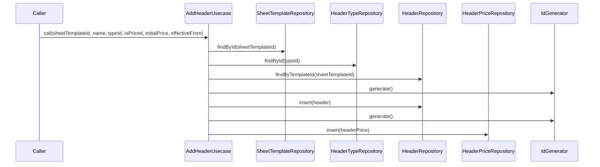

# AddHeaderUsecase（add_header_usecase.dart）

| 新規作成・更新日 | 作成・更新者名 | 作成・更新内容 |
|---|---|---|
| 2026-09-25 | minamiyama | 新規作成 |

## 処理概要

伝票フォーマットに列（[Header](../entities/header.md)）を1件追加するユースケース（FR-1）。価格対象の列の場合は初期単価（[HeaderPrice](../entities/header_price.md)）も併せて登録する。列構成をシートごとに自由に増減できるようにするための機能。[SheetTemplateRepository](../repositories/sheet_template_repository.md)・[HeaderTypeRepository](../repositories/header_type_repository.md)・[HeaderRepository](../repositories/header_repository.md)・[HeaderPriceRepository](../repositories/header_price_repository.md)・[IdGenerator](../../../../core/utils/id_generator.md)に依存する。

## 処理シーケンス図

## call

### 処理概要
指定した伝票フォーマットに列を追加する。価格対象の列（`isPriced=true`）の場合は初期単価も同時に登録する。

### input

| 項目論理名 | 項目物理名 | カプセルの型 | データ型 | バリデーション | 備考 |
|---|---|---|---|---|---|
| 伝票フォーマットID | sheetTemplateId | - | string | 必須 | - |
| 列名 | name | - | string | 必須 | 例:「お茶ハイ」 |
| 型ID | typeId | - | int | 必須 | [HeaderType](../entities/header_type.md)参照 |
| 価格対象フラグ | isPriced | - | bool | 必須 | - |
| 初期単価 | initialPrice | optional | int | `isPriced=true`の場合必須 | 単位は円 |
| 単価適用開始日 | effectiveFrom | optional | DateTime | `isPriced=true`の場合必須, 日付のみ | - |

### output

| 項目論理名 | 項目物理名 | カプセルの型 | データ型 | 備考 |
|---|---|---|---|---|
| 列 | - | - | [Header](../entities/header.md) | - |

### exception

| exception論理名 | exception物理名 | エラーコード | エラーメッセージ | 備考 |
|---|---|---|---|---|
| レコード未検出 | [RecordNotFoundException](../../../../core/errors/record_not_found_exception.md) | - | - | `sheetTemplateId`または`typeId`が存在しない場合 |
| 業務ルール違反 | [ValidationException](../../../../core/errors/validation_exception.md) | - | - | `isPriced=true`かつ`initialPrice`または`effectiveFrom`が未指定の場合 |

### 処理詳細
1. [SheetTemplateRepository.findById](../repositories/sheet_template_repository.md)を呼び出し、`sheetTemplateId`の存在を確認する。
2. [HeaderTypeRepository.findById](../repositories/header_type_repository.md)を呼び出し、`typeId`の存在を確認する。
3. 条件a: `isPriced=true`かつ（`initialPrice`が`null`または`effectiveFrom`が`null`）の場合、`ValidationException`を送出し処理を終了する。\
   条件b: それ以外の場合、次のステップへ進む。
4. [HeaderRepository.findByTemplateId](../repositories/header_repository.md)を呼び出し、変数`existingHeaders`に格納する。\
   条件a: `existingHeaders`が空の場合、変数`displayOrder`に1を格納する。\
   条件b: `existingHeaders`が空でない場合、変数`displayOrder`に`existingHeaders`内の最大`displayOrder`+1を格納する。
5. [IdGenerator.generate](../../../../core/utils/id_generator.md)を呼び出し、変数`columnId`に格納する。
6. `sheetTemplateId`・`typeId`・`name`・`displayOrder`・`isPriced`・`status=active`から[Header](../entities/header.md)エンティティを組み立て、変数`header`に格納する。
7. [HeaderRepository.insert](../repositories/header_repository.md)を`header`で呼び出し、永続化する。
8. 条件a: `isPriced=true`の場合\
   (1). [IdGenerator.generate](../../../../core/utils/id_generator.md)を呼び出し、変数`priceId`に格納する。\
   (2). `columnId`・`initialPrice`・`effectiveFrom`・`effectiveTo=null`から[HeaderPrice](../entities/header_price.md)エンティティを組み立て、変数`headerPrice`に格納する。\
   (3). [HeaderPriceRepository.insert](../repositories/header_price_repository.md)を`headerPrice`で呼び出し、永続化する。\
   条件b: `isPriced=false`の場合、このステップをスキップする。
9. `header`を返却する。

### 変数一覧

| 変数論理名 | 変数物理名 | データ型 | 格納値 | 備考欄 |
|---|---|---|---|---|
| 既存列一覧 | existingHeaders | list<[Header](../entities/header.md)> | [HeaderRepository.findByTemplateId](../repositories/header_repository.md)の返却値 | 表示順算出のための中間結果 |
| 表示順 | displayOrder | int | ステップ4で算出した値 | - |
| 列ID | columnId | string | [IdGenerator.generate](../../../../core/utils/id_generator.md)の返却値 | ULID形式 |
| 列 | header | [Header](../entities/header.md) | ステップ6で組み立てたエンティティ | - |
| 価格ID | priceId | string | [IdGenerator.generate](../../../../core/utils/id_generator.md)の返却値 | ULID形式。`isPriced=true`の場合のみ使用 |
| 単価改定履歴 | headerPrice | [HeaderPrice](../entities/header_price.md) | ステップ8(2)で組み立てたエンティティ | `isPriced=true`の場合のみ使用 |
