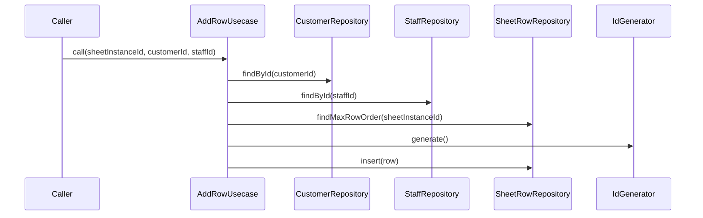

# AddRowUsecase（add_row_usecase.dart）

| 新規作成・更新日 | 作成・更新者名 | 作成・更新内容 |
|---|---|---|
| 2026-09-25 | minamiyama | 新規作成 |

## 処理概要

伝票インスタンスに1組の来店・卓（[SheetRow](../entities/sheet_row.md)）を追加するユースケース（FR-1）。[SheetRowRepository](../repositories/sheet_row_repository.md)・[CustomerRepository](../repositories/customer_repository.md)・[StaffRepository](../repositories/staff_repository.md)・[IdGenerator](../../../../core/utils/id_generator.md)に依存する。

## 処理シーケンス図

## call

### 処理概要
伝票インスタンスに1組の来店・卓を追加する。

### input

| 項目論理名 | 項目物理名 | カプセルの型 | データ型 | バリデーション | 備考 |
|---|---|---|---|---|---|
| 伝票インスタンスID | sheetInstanceId | - | string | 必須 | - |
| 顧客ID | customerId | optional | string | 任意 | 未登録の来店は`null`（「NEW様」等） |
| スタッフID | staffId | optional | string | 任意 | - |

### output

| 項目論理名 | 項目物理名 | カプセルの型 | データ型 | 備考 |
|---|---|---|---|---|
| 行 | - | - | [SheetRow](../entities/sheet_row.md) | - |

### exception

| exception論理名 | exception物理名 | エラーコード | エラーメッセージ | 備考 |
|---|---|---|---|---|
| レコード未検出 | [RecordNotFoundException](../../../../core/errors/record_not_found_exception.md) | - | - | `customerId`または`staffId`を指定した場合で、該当レコードが存在しない場合 |

### 処理詳細
1. 条件a: `customerId`が指定されている場合、[CustomerRepository.findById](../repositories/customer_repository.md)を呼び出し存在を確認する。\
   条件b: 指定されていない場合、このステップをスキップする。
2. 条件a: `staffId`が指定されている場合、[StaffRepository.findById](../repositories/staff_repository.md)を呼び出し存在を確認する。\
   条件b: 指定されていない場合、このステップをスキップする。
3. [SheetRowRepository.findMaxRowOrder](../repositories/sheet_row_repository.md)を呼び出し、変数`maxRowOrder`に格納する。
4. `maxRowOrder`+1を変数`rowOrder`に格納する。
5. [IdGenerator.generate](../../../../core/utils/id_generator.md)を呼び出し、変数`rowId`に格納する。
6. `sheetInstanceId`・`customerId`・`staffId`・`rowOrder`・`totalAmount=0`・`status=active`から[SheetRow](../entities/sheet_row.md)エンティティを組み立て、変数`row`に格納する。
7. [SheetRowRepository.insert](../repositories/sheet_row_repository.md)を`row`で呼び出し、永続化する。
8. `row`を返却する。

### 変数一覧

| 変数論理名 | 変数物理名 | データ型 | 格納値 | 備考欄 |
|---|---|---|---|---|
| 現在の最大表示順 | maxRowOrder | int | [SheetRowRepository.findMaxRowOrder](../repositories/sheet_row_repository.md)の返却値 | - |
| 表示順 | rowOrder | int | `maxRowOrder + 1` | - |
| 行ID | rowId | string | [IdGenerator.generate](../../../../core/utils/id_generator.md)の返却値 | ULID形式 |
| 行 | row | [SheetRow](../entities/sheet_row.md) | ステップ6で組み立てたエンティティ | - |
