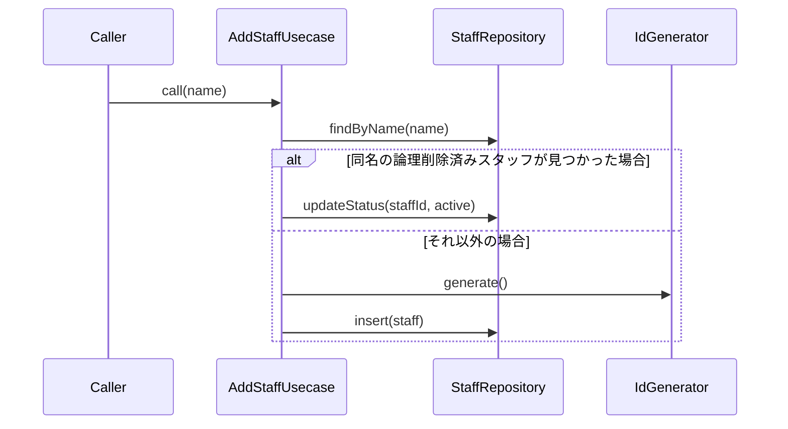

# AddStaffUsecase（add_staff_usecase.dart）

| 新規作成・更新日 | 作成・更新者名 | 作成・更新内容 |
|---|---|---|
| 2026-09-29 | minamiyama | 新規作成（スタッフ管理機能、FR-7） |
| 2026-09-29 | minamiyama | 過去に論理削除した同名のスタッフが存在する場合、重複作成せず論理削除を取り消す（復元する）よう変更。[StaffRepository.findByName](../repositories/staff_repository.md)への依存を追加 |

## 処理概要

スタッフを1件追加するユースケース（FR-7）。過去に論理削除した同名のスタッフが存在する場合は、重複して新規作成せず論理削除を取り消す（復元する）。[StaffRepository](../repositories/staff_repository.md)・[IdGenerator](../../../../core/utils/id_generator.md)に依存する。

## 処理シーケンス図

## call

### 処理概要
指定した氏名でスタッフを追加する。同名の論理削除済みスタッフが存在する場合は復元し、それ以外の場合（同名のスタッフが存在しない、または既に有効な同名スタッフが存在する場合）は新規に追加する。

### input

| 項目論理名 | 項目物理名 | カプセルの型 | データ型 | バリデーション | 備考 |
|---|---|---|---|---|---|
| 氏名 | name | - | string | 必須, 空文字列・空白のみ不可 | - |

### output

| 項目論理名 | 項目物理名 | カプセルの型 | データ型 | 備考 |
|---|---|---|---|---|
| スタッフ | - | - | [Staff](../entities/staff.md) | 復元した場合は復元後の内容、新規追加した場合は新規エンティティ |

### exception

| exception論理名 | exception物理名 | エラーコード | エラーメッセージ | 備考 |
|---|---|---|---|---|
| 業務ルール違反 | [ValidationException](../../../../core/errors/validation_exception.md) | - | - | `name`が空文字列・空白のみの場合 |

### 処理詳細
1. 条件a: `name`が空文字列または空白のみの場合、`ValidationException`を送出し処理を終了する。\
   条件b: それ以外の場合、次のステップへ進む。
2. [StaffRepository.findByName](../repositories/staff_repository.md)を`name`で呼び出し、変数`existing`に格納する。
3. 条件a: `existing`が非`null`かつ`existing.status`が`deleted`の場合、[StaffRepository.updateStatus](../repositories/staff_repository.md)を`existing.staffId`・`status=active`で呼び出して復元し、復元後の[Staff](../entities/staff.md)（`existing`の内容を`status=active`・`updatedAt=現在時刻`で上書きしたもの）を返却して処理を終了する。\
   条件b: それ以外の場合（`existing`が`null`、または`existing.status`が`active`の場合）、次のステップへ進む。
4. [IdGenerator.generate](../../../../core/utils/id_generator.md)を呼び出し、変数`staffId`に格納する。
5. `staffId`・`name`・`status=active`から[Staff](../entities/staff.md)エンティティを組み立て、変数`staff`に格納する。
6. [StaffRepository.insert](../repositories/staff_repository.md)を`staff`で呼び出し、永続化する。
7. `staff`を返却する。

### 変数一覧

| 変数論理名 | 変数物理名 | データ型 | 格納値 | 備考欄 |
|---|---|---|---|---|
| 同名の既存スタッフ | existing | [Staff](../entities/staff.md)? | [StaffRepository.findByName](../repositories/staff_repository.md)の返却値 | 論理削除済みも含む |
| スタッフID | staffId | string | [IdGenerator.generate](../../../../core/utils/id_generator.md)の返却値 | ULID形式。ステップ3条件bの場合のみ使用 |
| スタッフ | staff | [Staff](../entities/staff.md) | ステップ5で組み立てたエンティティ | ステップ3条件bの場合のみ使用 |
