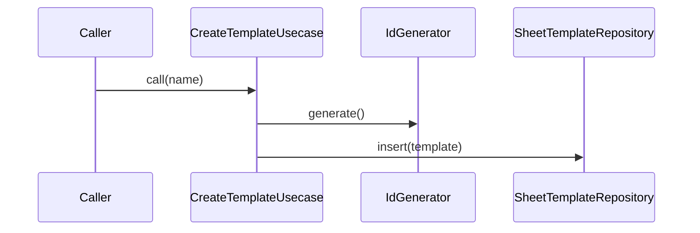

# CreateTemplateUsecase（create_template_usecase.dart）

| 新規作成・更新日 | 作成・更新者名 | 作成・更新内容 |
|---|---|---|
| 2026-09-25 | minamiyama | 新規作成 |

## 処理概要

新しい伝票フォーマット（[SheetTemplate](../entities/sheet_template.md)）を作成するユースケース（FR-1）。[SheetTemplateRepository](../repositories/sheet_template_repository.md)（インターフェース）・[IdGenerator](../../../../core/utils/id_generator.md)に依存する。

## 処理シーケンス図

## call

### 処理概要
指定した名前で新しい[SheetTemplate](../entities/sheet_template.md)を作成し、永続化する。

### input

| 項目論理名 | 項目物理名 | カプセルの型 | データ型 | バリデーション | 備考 |
|---|---|---|---|---|---|
| フォーマット名 | name | - | string | 必須 | 例:「寿」 |

### output

| 項目論理名 | 項目物理名 | カプセルの型 | データ型 | 備考 |
|---|---|---|---|---|
| 伝票フォーマット | - | - | [SheetTemplate](../entities/sheet_template.md) | - |

### exception

なし

### 処理詳細
1. [IdGenerator.generate](../../../../core/utils/id_generator.md)を呼び出し、変数`sheetTemplateId`に格納する。
2. `name`・`status=active`・現在時刻の`createdAt`/`updatedAt`から[SheetTemplate](../entities/sheet_template.md)エンティティを組み立て、変数`template`に格納する。
3. [SheetTemplateRepository.insert](../repositories/sheet_template_repository.md)を`template`で呼び出し、永続化する。
4. `template`を返却する。

### 変数一覧

| 変数論理名 | 変数物理名 | データ型 | 格納値 | 備考欄 |
|---|---|---|---|---|
| 伝票フォーマットID | sheetTemplateId | string | [IdGenerator.generate](../../../../core/utils/id_generator.md)の返却値 | ULID形式 |
| 伝票フォーマット | template | [SheetTemplate](../entities/sheet_template.md) | ステップ2で組み立てたエンティティ | - |
