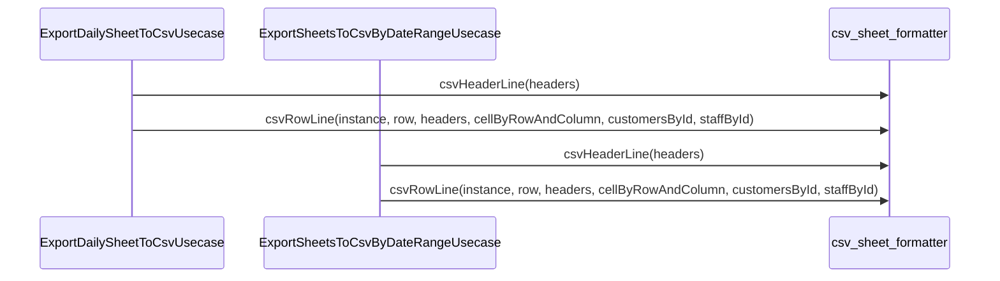

# csv_sheet_formatter（csv_sheet_formatter.dart）

| 新規作成・更新日 | 作成・更新者名 | 作成・更新内容 |
|---|---|---|
| 2026-09-29 | minamiyama | 新規作成（[ExportDailySheetToCsvUsecase](./export_daily_sheet_to_csv_usecase.md)からの行組み立てロジック切り出し、FR-3） |

## 処理概要

CSV出力（[ExportDailySheetToCsvUsecase](./export_daily_sheet_to_csv_usecase.md)・[ExportSheetsToCsvByDateRangeUsecase](./export_sheets_to_csv_by_date_range_usecase.md)）で共有する行組み立てロジックを提供するトップレベル関数群。列構成は「営業日」「お名前」＋紙伝票の各列（価格列＋MEMO列）＋「合計金額」「担当」の順で固定する。単日出力・期間出力の両ユースケースが同一の列構成・エスケープ仕様を保つための共通化。

## 処理シーケンス図

## csvHeaderLine

### 処理概要
CSVの1行目（ヘッダー行）を組み立てる。

### input

| 項目論理名 | 項目物理名 | カプセルの型 | データ型 | バリデーション | 備考 |
|---|---|---|---|---|---|
| 列一覧 | headers | list | [Header](../entities/header.md) | 必須 | `displayOrder`昇順 |

### output

| 項目論理名 | 項目物理名 | カプセルの型 | データ型 | 備考 |
|---|---|---|---|---|
| ヘッダー行の各値 | - | list | string | 「営業日」「お名前」＋`headers`の列名＋「合計金額」「担当」の順。各値はエスケープ済み |

### exception

なし

### 処理詳細
1. 「営業日」「お名前」＋`headers`の各列名＋「合計金額」「担当」を順に並べ、各値を[escapeCsvValue](#escapecsvvalue)でエスケープしたリストを返却する。

## csvRowLine

### 処理概要
1営業日・1行分のCSV行（カンマ区切り文字列）を組み立てる。

### input

| 項目論理名 | 項目物理名 | カプセルの型 | データ型 | バリデーション | 備考 |
|---|---|---|---|---|---|
| 伝票インスタンス | instance | - | [SheetInstance](../entities/sheet_instance.md) | 必須 | 営業日の解決に使用 |
| 行 | row | - | [SheetRow](../entities/sheet_row.md) | 必須 | - |
| 列一覧 | headers | list | [Header](../entities/header.md) | 必須 | `displayOrder`昇順 |
| 行列キー別セルMap | cellByRowAndColumn | map | string(key), [SheetCell](../entities/sheet_cell.md)(value) | 必須 | キーは`"rowId:columnId"`。呼び出し側が事前に構築（O(1)参照のため） |
| 顧客ID別顧客Map | customersById | map | string(key), [Customer](../entities/customer.md)(value) | 必須 | 呼び出し側が事前に構築 |
| スタッフID別スタッフMap | staffById | map | string(key), [Staff](../entities/staff.md)(value) | 必須 | 呼び出し側が事前に構築 |

### output

| 項目論理名 | 項目物理名 | カプセルの型 | データ型 | 備考 |
|---|---|---|---|---|
| CSV行 | - | - | string | カンマ区切りの1行。列順は[csvHeaderLine](#csvheaderline)と同一 |

### exception

なし

### 処理詳細
1. 条件a: `row.customerId`が`null`でない場合、`customersById[row.customerId]`を変数`customer`に格納する。\
   条件b: `null`の場合、`customer`に`null`を格納する。
2. 条件a: `row.staffId`が`null`でない場合、`staffById[row.staffId]`を変数`staff`に格納する。\
   条件b: `null`の場合、`staff`に`null`を格納する。
3. 営業日（[sqlite_date.formatDateOnly](../../../../core/utils/sqlite_date.md)で`instance.businessDate`を整形）、お名前（`customer?.name`、`null`の場合は空文字列）、`headers`の各列に対応する`"rowId:columnId"`キーで`cellByRowAndColumn`を参照した値（列の`isPriced`に応じて`amount`または`content`）、合計金額（`row.totalAmount`）、担当（`staff?.name`、`null`の場合は空文字列）を順に並べ、各値を[escapeCsvValue](#escapecsvvalue)でエスケープしたリストを組み立てる。
4. 組み立てたリストをカンマで結合し、返却する。

## escapeCsvValue

### 処理概要
値がカンマ・ダブルクォート・改行のいずれかを含む場合、CSVの値として安全な形（ダブルクォートで囲み、内部のダブルクォートは`""`にエスケープ）に変換する。

### input

| 項目論理名 | 項目物理名 | カプセルの型 | データ型 | バリデーション | 備考 |
|---|---|---|---|---|---|
| 値 | value | - | string | 必須 | - |

### output

| 項目論理名 | 項目物理名 | カプセルの型 | データ型 | 備考 |
|---|---|---|---|---|
| エスケープ済みの値 | - | - | string | - |

### exception

なし

### 処理詳細
1. 条件a: `value`がカンマ・ダブルクォート・改行のいずれかを含む場合、内部のダブルクォートを`""`に置換した上でダブルクォートで囲んだ文字列を返却する。\
   条件b: いずれも含まない場合、`value`をそのまま返却する。
