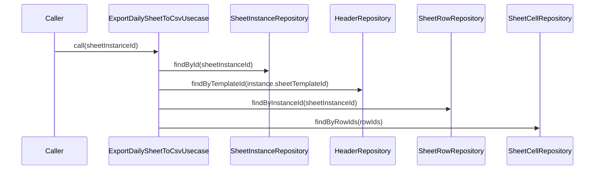

# ExportDailySheetToCsvUsecase（export_daily_sheet_to_csv_usecase.dart）

| 新規作成・更新日 | 作成・更新者名 | 作成・更新内容 |
|---|---|---|
| 2026-09-25 | minamiyama | 新規作成 |
| 2026-09-25 | minamiyama | セル検索をMap化しO(n^2)を回避するよう処理詳細を修正 |

## 処理概要

指定した伝票インスタンス（1営業日分の伝票）を、紙伝票と同じ列構成のCSVとして出力するユースケース（FR-3）。[SheetInstanceRepository](../repositories/sheet_instance_repository.md)・[HeaderRepository](../repositories/header_repository.md)・[SheetRowRepository](../repositories/sheet_row_repository.md)・[SheetCellRepository](../repositories/sheet_cell_repository.md)に依存する。本ユースケースはCSV文字列の組み立てまでを責務とし、ファイルへの書き出し・共有はpresentation層が行う。

## 処理シーケンス図

## call

### 処理概要
指定した伝票インスタンスをCSV文字列として出力する。行数×列数に対して線形の計算量になるよう、セルは`(rowId, columnId)`をキーとしたMapへ事前変換してから参照する（O(n²)の回避）。

### input

| 項目論理名 | 項目物理名 | カプセルの型 | データ型 | バリデーション | 備考 |
|---|---|---|---|---|---|
| 伝票インスタンスID | sheetInstanceId | - | string | 必須 | - |

### output

| 項目論理名 | 項目物理名 | カプセルの型 | データ型 | 備考 |
|---|---|---|---|---|
| CSV文字列 | - | - | string | 1行目が列名（ヘッダー）、2行目以降が行データ |

### exception

| exception論理名 | exception物理名 | エラーコード | エラーメッセージ | 備考 |
|---|---|---|---|---|
| レコード未検出 | [RecordNotFoundException](../../../../core/errors/record_not_found_exception.md) | - | - | `sheetInstanceId`が存在しない場合 |

### 処理詳細
1. [SheetInstanceRepository.findById](../repositories/sheet_instance_repository.md)を呼び出し、変数`instance`に格納する。
2. [HeaderRepository.findByTemplateId](../repositories/header_repository.md)を`instance.sheetTemplateId`で呼び出し、変数`headers`に格納する（`displayOrder`昇順）。
3. [SheetRowRepository.findByInstanceId](../repositories/sheet_row_repository.md)を呼び出し、変数`rows`に格納する（`rowOrder`昇順）。
4. `rows`から行IDを抽出し、変数`rowIds`（リスト）に格納する（メモリ内処理、DBアクセスなし）。
5. [SheetCellRepository.findByRowIds](../repositories/sheet_cell_repository.md)を`rowIds`で呼び出し、変数`cells`に格納する（行ごとにループしてDBを呼び出すことはしない）。
6. `cells`を`"rowId:columnId"`をキーとしたMapへ変換し、変数`cellByRowAndColumn`に格納する（O(n)のメモリ内処理。ステップ7での行×列の参照をO(1)にするための事前変換）。
7. `headers`の列名を順に並べたCSVの1行目（ヘッダー行）を組み立て、変数`headerLine`に格納する。
8. `rows`を1件ずつ処理し、各行について`headers`の各列に対応する`"rowId:columnId"`キーで`cellByRowAndColumn`を参照し（Map参照のためO(1)）、列の`isPriced`に応じて数量・金額表示または`content`表示の値をヘッダー順に並べたCSV行を組み立て、変数`rowLines`（リスト）に追加する。
9. `headerLine`と`rowLines`を結合したCSV文字列を返却する。

### 変数一覧

| 変数論理名 | 変数物理名 | データ型 | 格納値 | 備考欄 |
|---|---|---|---|---|
| 伝票インスタンス | instance | [SheetInstance](../entities/sheet_instance.md) | [SheetInstanceRepository.findById](../repositories/sheet_instance_repository.md)の返却値 | - |
| 列一覧 | headers | list<[Header](../entities/header.md)> | [HeaderRepository.findByTemplateId](../repositories/header_repository.md)の返却値 | `displayOrder`昇順 |
| 行一覧 | rows | list<[SheetRow](../entities/sheet_row.md)> | [SheetRowRepository.findByInstanceId](../repositories/sheet_row_repository.md)の返却値 | `rowOrder`昇順 |
| 行IDリスト | rowIds | list\<string\> | `rows`から抽出した`rowId`の一覧 | セル一括取得のキー |
| セル一覧 | cells | list<[SheetCell](../entities/sheet_cell.md)> | [SheetCellRepository.findByRowIds](../repositories/sheet_cell_repository.md)の返却値 | - |
| 行列キー別セルMap | cellByRowAndColumn | map<string, [SheetCell](../entities/sheet_cell.md)> | `cells`を`"rowId:columnId"`キーで変換したMap | O(1)参照のための事前変換結果 |
| ヘッダー行文字列 | headerLine | string | ステップ7で組み立てたCSV1行目 | - |
| 行データ文字列リスト | rowLines | list\<string\> | ステップ8で組み立てたCSV各行 | - |
