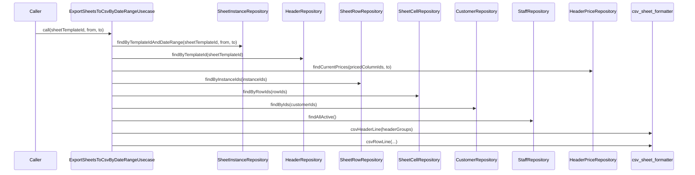

# ExportSheetsToCsvByDateRangeUsecase（export_sheets_to_csv_by_date_range_usecase.dart）

| 新規作成・更新日 | 作成・更新者名 | 作成・更新内容 |
|---|---|---|
| 2026-09-29 | minamiyama | 新規作成（CSV期間出力機能、FR-3） |
| 2026-10-03 | minamiyama | 伝票入力画面と同じく、同額の列のグループ（[header_grouping](./header_grouping.md)）を1列として出力するよう変更。グルーピングの単価取得のため[HeaderPriceRepository](../repositories/header_price_repository.md)への依存を追加（終了日時点の単価で一括取得） |

## 処理概要

指定した期間（開始日〜終了日）に含まれる全ての伝票インスタンスを、1つのCSV文字列としてまとめて出力するユースケース（FR-3）。列構成は[ExportDailySheetToCsvUsecase](./export_daily_sheet_to_csv_usecase.md)と同じ（「営業日」列で日付ごとの行を区別する）。期間内の営業日数に比例したDB呼び出しにならないよう、伝票インスタンス・行・セル・顧客の取得はそれぞれ1回のクエリで一括して行う。[SheetInstanceRepository](../repositories/sheet_instance_repository.md)・[HeaderRepository](../repositories/header_repository.md)・[SheetRowRepository](../repositories/sheet_row_repository.md)・[SheetCellRepository](../repositories/sheet_cell_repository.md)・[CustomerRepository](../repositories/customer_repository.md)・[StaffRepository](../repositories/staff_repository.md)・[HeaderPriceRepository](../repositories/header_price_repository.md)・[header_grouping](./header_grouping.md)・[csv_sheet_formatter.dart](./csv_sheet_formatter.md)に依存する。

## 処理シーケンス図

## call

### 処理概要
指定した伝票フォーマット（`sheetTemplateId`）の`from`〜`to`（両端含む）の営業日分をCSV文字列として出力する。1行目が列名（ヘッダー）、2行目以降が営業日昇順・行順の行データ。

### input

| 項目論理名 | 項目物理名 | カプセルの型 | データ型 | バリデーション | 備考 |
|---|---|---|---|---|---|
| 伝票フォーマットID | sheetTemplateId | - | string | 必須 | - |
| 開始日 | from | - | DateTime | 必須, 日付のみ | - |
| 終了日 | to | - | DateTime | 必須, 日付のみ | - |

### output

| 項目論理名 | 項目物理名 | カプセルの型 | データ型 | 備考 |
|---|---|---|---|---|
| CSV文字列 | - | - | string | 1行目が列名（ヘッダー）、2行目以降が行データ。列順は「営業日」「お名前」＋紙伝票の各列（価格列＋MEMO列）＋「合計金額」「担当」 |

### exception

| exception論理名 | exception物理名 | エラーコード | エラーメッセージ | 備考 |
|---|---|---|---|---|
| 業務ルール違反 | [ValidationException](../../../../core/errors/validation_exception.md) | - | - | `from`が`to`より後の場合／指定期間に該当する伝票が1件もない場合 |

### 処理詳細
1. 条件a: `from`が`to`より後の場合、`ValidationException`を送出し処理を終了する。\
   条件b: それ以外の場合、次のステップへ進む。
2. [SheetInstanceRepository.findByTemplateIdAndDateRange](../repositories/sheet_instance_repository.md)を`sheetTemplateId`・`from`・`to`で呼び出し、変数`instances`に格納する（`businessDate`昇順）。\
   条件a: `instances`が空リストの場合、`ValidationException`を送出し処理を終了する。\
   条件b: 1件以上の場合、次のステップへ進む。
3. `instances`を`sheetInstanceId`をキーとしたMapへ変換し、変数`instanceById`に格納する（メモリ内処理、DBアクセスなし）。
4. [HeaderRepository.findByTemplateId](../repositories/header_repository.md)を`sheetTemplateId`で呼び出し、変数`headers`に格納する（`displayOrder`昇順）。
   (1). `headers`のうち価格対象（`isPriced=true`）の列IDを変数`pricedColumnIds`に格納し、[HeaderPriceRepository.findCurrentPrices](../repositories/header_price_repository.md)を`pricedColumnIds`・終了日（`to`）で呼び出して変数`prices`に格納する（列ごとにループしてDBを呼び出すことはしない）。
   (2). [groupHeadersByPrice](./header_grouping.md#groupheadersbyprice)を`headers`・`prices`を列IDキーの単価Mapに変換したもので呼び出し、変数`headerGroups`に格納する（同額の列を1グループにまとめる）。
5. `instances`から`sheetInstanceId`を抽出し、変数`instanceIds`（リスト）に格納する（メモリ内処理、DBアクセスなし）。
6. [SheetRowRepository.findByInstanceIds](../repositories/sheet_row_repository.md)を`instanceIds`で呼び出し、変数`rows`に格納する（伝票インスタンス数分ループしてDBを呼び出すことはしない）。
7. `rows`から行IDを抽出し、[SheetCellRepository.findByRowIds](../repositories/sheet_cell_repository.md)で一括取得し、`"rowId:columnId"`をキーとしたMap（変数`cellByRowAndColumn`）に変換する。
8. `rows`から顧客IDを抽出し（`customerId`が`null`の行は除く）、[CustomerRepository.findByIds](../repositories/customer_repository.md)で一括取得し、`customerId`をキーとしたMap（変数`customersById`）に変換する。
9. [StaffRepository.findAllActive](../repositories/staff_repository.md)を呼び出し、`staffId`をキーとしたMap（変数`staffById`）に変換する。
10. [csv_sheet_formatter.csvHeaderLine](./csv_sheet_formatter.md)を`headerGroups`で呼び出し、変数`headerLine`に格納する。
11. `rows`を1件ずつ処理し、[csv_sheet_formatter.csvRowLine](./csv_sheet_formatter.md)を`instanceById[row.sheetInstanceId]`・行・`headerGroups`・`cellByRowAndColumn`・`customersById`・`staffById`で呼び出し、返却値を変数`rowLines`（リスト）に追加する。
12. `headerLine`と`rowLines`を結合したCSV文字列を返却する。

### 変数一覧

| 変数論理名 | 変数物理名 | データ型 | 格納値 | 備考欄 |
|---|---|---|---|---|
| 伝票インスタンス一覧 | instances | list<[SheetInstance](../entities/sheet_instance.md)> | [SheetInstanceRepository.findByTemplateIdAndDateRange](../repositories/sheet_instance_repository.md)の返却値 | `businessDate`昇順 |
| 伝票インスタンスID別インスタンスMap | instanceById | map<string, [SheetInstance](../entities/sheet_instance.md)> | `instances`を`sheetInstanceId`キーで変換したMap | 各行の営業日解決用 |
| 列一覧 | headers | list<[Header](../entities/header.md)> | [HeaderRepository.findByTemplateId](../repositories/header_repository.md)の返却値 | `displayOrder`昇順 |
| 単価一覧 | prices | list<[HeaderPrice](../entities/header_price.md)> | [HeaderPriceRepository.findCurrentPrices](../repositories/header_price_repository.md)の返却値 | 終了日時点で有効な単価（単価未登録の列は含まない） |
| 列グループ一覧 | headerGroups | list<list<[Header](../entities/header.md)>> | [groupHeadersByPrice](./header_grouping.md#groupheadersbyprice)の返却値 | 同額の列のグループ（CSVの1列＝1グループ） |
| 伝票インスタンスIDリスト | instanceIds | list\<string\> | `instances`から抽出した`sheetInstanceId`の一覧 | 行一括取得のキー |
| 行一覧 | rows | list<[SheetRow](../entities/sheet_row.md)> | [SheetRowRepository.findByInstanceIds](../repositories/sheet_row_repository.md)の返却値 | `sheetInstanceId`・`rowOrder`昇順 |
| 行列キー別セルMap | cellByRowAndColumn | map<string, [SheetCell](../entities/sheet_cell.md)> | セル一覧を`"rowId:columnId"`キーで変換したMap | O(1)参照のための事前変換結果 |
| 顧客ID別顧客Map | customersById | map<string, [Customer](../entities/customer.md)> | [CustomerRepository.findByIds](../repositories/customer_repository.md)の返却値を`customerId`キーで変換したMap | 「お名前」列の氏名解決用 |
| スタッフID別スタッフMap | staffById | map<string, [Staff](../entities/staff.md)> | [StaffRepository.findAllActive](../repositories/staff_repository.md)の返却値を`staffId`キーで変換したMap | 「担当」列の氏名解決用 |
| ヘッダー行文字列 | headerLine | string | ステップ10で組み立てたCSV1行目 | - |
| 行データ文字列リスト | rowLines | list\<string\> | ステップ11で組み立てたCSV各行 | - |
