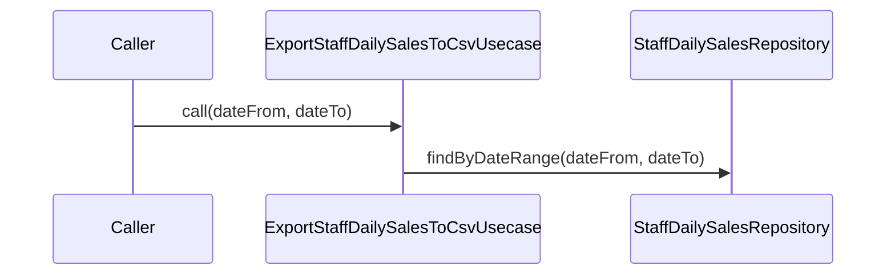

# ExportStaffDailySalesToCsvUsecase（export_staff_daily_sales_to_csv_usecase.dart）

| 新規作成・更新日 | 作成・更新者名 | 作成・更新内容 |
|---|---|---|
| 2026-09-25 | minamiyama | 新規作成 |

## 処理概要

指定した期間のスタッフ別・日別売上集計（[StaffDailySales](../entities/staff_daily_sales.md)）をCSVとして出力するユースケース（FR-4データの出力）。[StaffDailySalesRepository](../repositories/staff_daily_sales_repository.md)に依存する。

## 処理シーケンス図

## call

### 処理概要
指定した期間のスタッフ別・日別売上集計をCSVとして出力する。

### input

| 項目論理名 | 項目物理名 | カプセルの型 | データ型 | バリデーション | 備考 |
|---|---|---|---|---|---|
| 営業日(開始) | dateFrom | - | DateTime | 必須, 日付のみ | - |
| 営業日(終了) | dateTo | - | DateTime | 必須, 日付のみ, `dateFrom`以降 | - |

### output

| 項目論理名 | 項目物理名 | カプセルの型 | データ型 | 備考 |
|---|---|---|---|---|
| CSV文字列 | - | - | string | 1行目が列名（スタッフ名, 営業日, 来店件数, 売上合計） |

### exception

なし

### 処理詳細
1. [StaffDailySalesRepository.findByDateRange](../repositories/staff_daily_sales_repository.md)を`dateFrom`・`dateTo`で呼び出し、変数`salesList`に格納する。
2. 固定のヘッダー行（スタッフ名, 営業日, 来店件数, 売上合計）を組み立て、変数`headerLine`に格納する。
3. `salesList`を1件ずつ処理し、各項目を並べたCSV行を組み立て、変数`rowLines`（リスト）に追加する（メモリ内処理のみで、繰り返し内でのDB呼び出しは行わない）。
4. `headerLine`と`rowLines`を結合したCSV文字列を返却する。

### 変数一覧

| 変数論理名 | 変数物理名 | データ型 | 格納値 | 備考欄 |
|---|---|---|---|---|
| スタッフ別日別売上一覧 | salesList | list<[StaffDailySales](../entities/staff_daily_sales.md)> | [StaffDailySalesRepository.findByDateRange](../repositories/staff_daily_sales_repository.md)の返却値 | - |
| ヘッダー行文字列 | headerLine | string | ステップ2で組み立てたCSV1行目 | - |
| 行データ文字列リスト | rowLines | list\<string\> | ステップ3で組み立てたCSV各行 | - |
