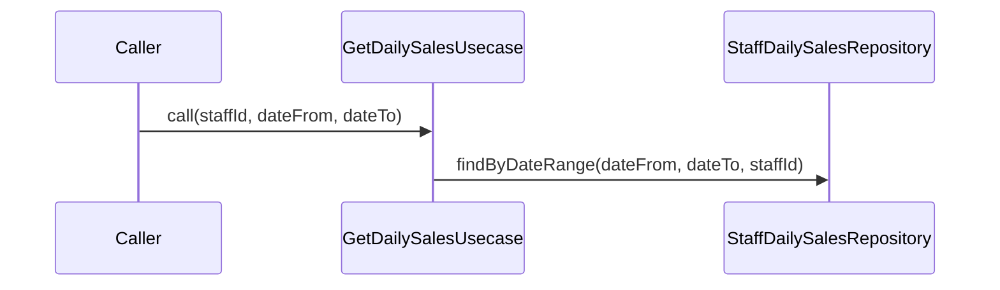

# GetDailySalesUsecase（get_daily_sales_usecase.dart）

| 新規作成・更新日 | 作成・更新者名 | 作成・更新内容 |
|---|---|---|
| 2026-09-25 | minamiyama | 新規作成 |

## 処理概要

スタッフごとの売上合計を確認するための集計取得を担うユースケース（FR-4、将来対応のスタッフ別売上可視化の土台）。集計軸（日次/月次等）は未確定のため、まずは行レベルの生データを基にしたビュー`v_staff_daily_sales`から日別の集計を取得する（[db_schema.md](../../../../../../../requried/db_schema.md) §6参照）。[StaffDailySalesRepository](../repositories/staff_daily_sales_repository.md)に依存する。

## 処理シーケンス図

## call

### 処理概要
指定した期間（・任意でスタッフ）のスタッフ別・日別売上集計（[StaffDailySales](../entities/staff_daily_sales.md)）を取得する。

### input

| 項目論理名 | 項目物理名 | カプセルの型 | データ型 | バリデーション | 備考 |
|---|---|---|---|---|---|
| スタッフID | staffId | optional | string | 任意 | 指定時は該当スタッフのみに絞り込む |
| 営業日(開始) | dateFrom | - | DateTime | 必須, 日付のみ | - |
| 営業日(終了) | dateTo | - | DateTime | 必須, 日付のみ, `dateFrom`以降 | - |

### output

| 項目論理名 | 項目物理名 | カプセルの型 | データ型 | 備考 |
|---|---|---|---|---|
| スタッフ別日別売上一覧 | - | list | [StaffDailySales](../entities/staff_daily_sales.md) | 該当なしの場合は空リスト |

### exception

| exception論理名 | exception物理名 | エラーコード | エラーメッセージ | 備考 |
|---|---|---|---|---|
| 業務ルール違反 | [ValidationException](../../../../core/errors/validation_exception.md) | - | - | `dateFrom`が`dateTo`より後の日付である場合 |

### 処理詳細
1. 条件a: `dateFrom`が`dateTo`より後の日付である場合、`ValidationException`を送出し処理を終了する。\
   条件b: それ以外の場合、次のステップへ進む。
2. [StaffDailySalesRepository.findByDateRange](../repositories/staff_daily_sales_repository.md)を`dateFrom`・`dateTo`・`staffId`で呼び出し、変数`salesList`に格納する。
3. `salesList`を返却する。

### 変数一覧

| 変数論理名 | 変数物理名 | データ型 | 格納値 | 備考欄 |
|---|---|---|---|---|
| スタッフ別日別売上一覧 | salesList | list<[StaffDailySales](../entities/staff_daily_sales.md)> | [StaffDailySalesRepository.findByDateRange](../repositories/staff_daily_sales_repository.md)の返却値 | - |
