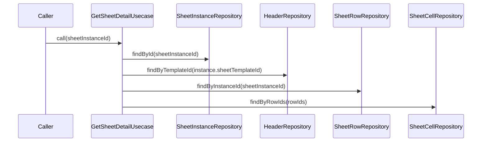

# GetSheetDetailUsecase（get_sheet_detail_usecase.dart）

| 新規作成・更新日 | 作成・更新者名 | 作成・更新内容 |
|---|---|---|
| 2026-09-25 | minamiyama | 新規作成（presentation層の画面表示用に追加） |

## 処理概要

伝票入力画面（`ENT_001_VOUCHER`）の描画に必要な情報一式を[SheetDetail](../entities/sheet_detail.md)として取得するユースケース。[ExportDailySheetToCsvUsecase](./export_daily_sheet_to_csv_usecase.md)と同様に行×列の参照をO(1)にするための事前変換を行う。[SheetInstanceRepository](../repositories/sheet_instance_repository.md)・[HeaderRepository](../repositories/header_repository.md)・[SheetRowRepository](../repositories/sheet_row_repository.md)・[SheetCellRepository](../repositories/sheet_cell_repository.md)に依存する。[VoucherSheetNotifier](../../presentation/controllers/voucher_sheet_notifier.md)から呼び出される。

## 処理シーケンス図

## call

### 処理概要
指定した伝票インスタンスの列一覧・行一覧・セル一覧を取得し、画面表示用に[SheetDetail](../entities/sheet_detail.md)として組み立てる。

### input

| 項目論理名 | 項目物理名 | カプセルの型 | データ型 | バリデーション | 備考 |
|---|---|---|---|---|---|
| 伝票インスタンスID | sheetInstanceId | - | string | 必須 | - |

### output

| 項目論理名 | 項目物理名 | カプセルの型 | データ型 | 備考 |
|---|---|---|---|---|
| 伝票詳細 | - | - | [SheetDetail](../entities/sheet_detail.md) | - |

### exception

| exception論理名 | exception物理名 | エラーコード | エラーメッセージ | 備考 |
|---|---|---|---|---|
| レコード未検出 | [RecordNotFoundException](../../../../core/errors/record_not_found_exception.md) | - | - | `sheetInstanceId`が存在しない場合 |

### 処理詳細
1. [SheetInstanceRepository.findById](../repositories/sheet_instance_repository.md)を呼び出し、変数`instance`に格納する。
2. [HeaderRepository.findByTemplateId](../repositories/header_repository.md)を`instance.sheetTemplateId`で呼び出し、変数`headers`に格納する。
3. [SheetRowRepository.findByInstanceId](../repositories/sheet_row_repository.md)を呼び出し、変数`rows`に格納する。
4. `rows`から行IDを抽出し、変数`rowIds`（リスト）に格納する（メモリ内処理、DBアクセスなし）。
5. [SheetCellRepository.findByRowIds](../repositories/sheet_cell_repository.md)を`rowIds`で呼び出し、変数`cells`に格納する（行ごとにループしてDBを呼び出すことはしない）。
6. `cells`を外側キー=`rowId`、内側キー=`columnId`のネストしたMapへ変換し、変数`cellsByRowIdAndColumnId`に格納する（O(n)のメモリ内処理。画面側での行×列の参照をO(1)にするための事前変換）。
7. `instance`・`headers`・`rows`・`cellsByRowIdAndColumnId`から[SheetDetail](../entities/sheet_detail.md)を組み立て、返却する。

### 変数一覧

| 変数論理名 | 変数物理名 | データ型 | 格納値 | 備考欄 |
|---|---|---|---|---|
| 伝票インスタンス | instance | [SheetInstance](../entities/sheet_instance.md) | [SheetInstanceRepository.findById](../repositories/sheet_instance_repository.md)の返却値 | - |
| 列一覧 | headers | list<[Header](../entities/header.md)> | [HeaderRepository.findByTemplateId](../repositories/header_repository.md)の返却値 | `displayOrder`昇順 |
| 行一覧 | rows | list<[SheetRow](../entities/sheet_row.md)> | [SheetRowRepository.findByInstanceId](../repositories/sheet_row_repository.md)の返却値 | `rowOrder`昇順 |
| 行IDリスト | rowIds | list\<string\> | `rows`から抽出した`rowId`の一覧 | セル一括取得のキー |
| セル一覧 | cells | list<[SheetCell](../entities/sheet_cell.md)> | [SheetCellRepository.findByRowIds](../repositories/sheet_cell_repository.md)の返却値 | - |
| 行列キー別セルMap | cellsByRowIdAndColumnId | map<string, map<string, [SheetCell](../entities/sheet_cell.md)>> | `cells`を`rowId`→`columnId`の2段Mapへ変換した結果 | O(1)参照のための事前変換結果 |
