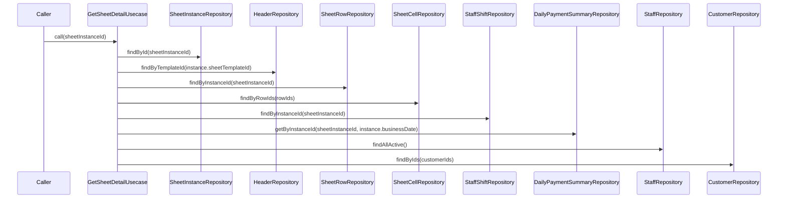

# GetSheetDetailUsecase（get_sheet_detail_usecase.dart）

| 新規作成・更新日 | 作成・更新者名 | 作成・更新内容 |
|---|---|---|
| 2026-09-25 | minamiyama | 新規作成（presentation層の画面表示用に追加） |
| 2026-09-27 | minamiyama | `staffShifts`・`dailySummary`・`staffRoster`・`customersById`の取得を追加（[agents.md](../../../../../../../requried/agents.md)のスタッフ欄・日機能要件・お名前列仕様を反映） |

## 処理概要

伝票入力画面（`ENT_001_VOUCHER`）の描画に必要な情報一式を[SheetDetail](../entities/sheet_detail.md)として取得するユースケース。[ExportDailySheetToCsvUsecase](./export_daily_sheet_to_csv_usecase.md)と同様に行×列の参照をO(1)にするための事前変換を行う。[SheetInstanceRepository](../repositories/sheet_instance_repository.md)・[HeaderRepository](../repositories/header_repository.md)・[SheetRowRepository](../repositories/sheet_row_repository.md)・[SheetCellRepository](../repositories/sheet_cell_repository.md)・[StaffShiftRepository](../repositories/staff_shift_repository.md)・[DailyPaymentSummaryRepository](../repositories/daily_payment_summary_repository.md)・[StaffRepository](../repositories/staff_repository.md)・[CustomerRepository](../repositories/customer_repository.md)に依存する。[VoucherSheetNotifier](../../presentation/controllers/voucher_sheet_notifier.md)から呼び出される。

## 処理シーケンス図

```mermaid
sequenceDiagram
    participant C as Caller
    participant U as GetSheetDetailUsecase
    participant SIR as SheetInstanceRepository
    participant HR as HeaderRepository
    participant SRR as SheetRowRepository
    participant SCR as SheetCellRepository
    participant SSR as StaffShiftRepository
    participant DPS as DailyPaymentSummaryRepository
    participant StR as StaffRepository
    participant CR as CustomerRepository

    C->>U: call(sheetInstanceId)
    U->>SIR: findById(sheetInstanceId)
    U->>HR: findByTemplateId(instance.sheetTemplateId)
    U->>SRR: findByInstanceId(sheetInstanceId)
    U->>SCR: findByRowIds(rowIds)
    U->>SSR: findByInstanceId(sheetInstanceId)
    U->>DPS: getByInstanceId(sheetInstanceId, instance.businessDate)
    U->>StR: findAllActive()
    U->>CR: findByIds(customerIds)
```

## call

### 処理概要
指定した伝票インスタンスの列一覧・行一覧・セル一覧を取得し、画面表示用に[SheetDetail](../entities/sheet_detail.md)として組み立てる。

### input

| 項目論理名 | 項目物理名 | カプセルの型 | データ型 | バリデーション | 備考 |
|---|---|---|---|---|---|
| 伝票インスタンスID | sheetInstanceId | - | string | 必須 | - |

### output

| 項目論理名 | 項目物理名 | カプセルの型 | データ型 | 備考 |
|---|---|---|---|---|
| 伝票詳細 | - | - | [SheetDetail](../entities/sheet_detail.md) | - |

### exception

| exception論理名 | exception物理名 | エラーコード | エラーメッセージ | 備考 |
|---|---|---|---|---|
| レコード未検出 | [RecordNotFoundException](../../../../core/errors/record_not_found_exception.md) | - | - | `sheetInstanceId`が存在しない場合 |

### 処理詳細
1. [SheetInstanceRepository.findById](../repositories/sheet_instance_repository.md)を呼び出し、変数`instance`に格納する。
2. [HeaderRepository.findByTemplateId](../repositories/header_repository.md)を`instance.sheetTemplateId`で呼び出し、変数`headers`に格納する。
3. [SheetRowRepository.findByInstanceId](../repositories/sheet_row_repository.md)を呼び出し、変数`rows`に格納する。
4. `rows`から行IDを抽出し、変数`rowIds`（リスト）に格納する（メモリ内処理、DBアクセスなし）。
5. [SheetCellRepository.findByRowIds](../repositories/sheet_cell_repository.md)を`rowIds`で呼び出し、変数`cells`に格納する（行ごとにループしてDBを呼び出すことはしない）。
6. `cells`を外側キー=`rowId`、内側キー=`columnId`のネストしたMapへ変換し、変数`cellsByRowIdAndColumnId`に格納する（O(n)のメモリ内処理。画面側での行×列の参照をO(1)にするための事前変換）。
7. [StaffShiftRepository.findByInstanceId](../repositories/staff_shift_repository.md)を呼び出し、変数`staffShifts`に格納する（右上「スタッフ」欄用。3件のシフト枠は[OpenSheetInstanceUsecase](./open_sheet_instance_usecase.md)が伝票インスタンス作成時に自動作成済みのため、通常はここで空リストになることはない）。
8. [DailyPaymentSummaryRepository.getByInstanceId](../repositories/daily_payment_summary_repository.md)を`sheetInstanceId`・`instance.businessDate`で呼び出し、変数`dailySummary`に格納する（伝票末尾の行用）。
9. [StaffRepository.findAllActive](../repositories/staff_repository.md)を呼び出し、変数`staffRoster`に格納する（「担当」列プルダウン・[VoucherStaffBar](../../presentation/widgets/voucher_staff_bar.md)の氏名プルダウン用）。
10. `rows`から`customerId`が非`null`のものを抽出し、変数`customerIds`（リスト）に格納する（メモリ内処理、DBアクセスなし）。
11. [CustomerRepository.findByIds](../repositories/customer_repository.md)を`customerIds`で呼び出し、変数`customers`に格納する。
12. `customers`を`customerId`をキーとしたMapへ変換し、変数`customersById`に格納する（「お名前」列の氏名表示用の事前変換）。
13. `instance`・`headers`・`rows`・`cellsByRowIdAndColumnId`・`staffShifts`・`dailySummary`・`staffRoster`・`customersById`から[SheetDetail](../entities/sheet_detail.md)を組み立て、返却する。

### 変数一覧

| 変数論理名 | 変数物理名 | データ型 | 格納値 | 備考欄 |
|---|---|---|---|---|
| 伝票インスタンス | instance | [SheetInstance](../entities/sheet_instance.md) | [SheetInstanceRepository.findById](../repositories/sheet_instance_repository.md)の返却値 | - |
| 列一覧 | headers | list<[Header](../entities/header.md)> | [HeaderRepository.findByTemplateId](../repositories/header_repository.md)の返却値 | `displayOrder`昇順 |
| 行一覧 | rows | list<[SheetRow](../entities/sheet_row.md)> | [SheetRowRepository.findByInstanceId](../repositories/sheet_row_repository.md)の返却値 | `rowOrder`昇順 |
| 行IDリスト | rowIds | list\<string\> | `rows`から抽出した`rowId`の一覧 | セル一括取得のキー |
| セル一覧 | cells | list<[SheetCell](../entities/sheet_cell.md)> | [SheetCellRepository.findByRowIds](../repositories/sheet_cell_repository.md)の返却値 | - |
| 行列キー別セルMap | cellsByRowIdAndColumnId | map<string, map<string, [SheetCell](../entities/sheet_cell.md)>> | `cells`を`rowId`→`columnId`の2段Mapへ変換した結果 | O(1)参照のための事前変換結果 |
| スタッフシフト一覧 | staffShifts | list<[StaffShift](../entities/staff_shift.md)> | [StaffShiftRepository.findByInstanceId](../repositories/staff_shift_repository.md)の返却値 | - |
| 日次集計 | dailySummary | [DailyPaymentSummary](../entities/daily_payment_summary.md) | [DailyPaymentSummaryRepository.getByInstanceId](../repositories/daily_payment_summary_repository.md)の返却値 | - |
| スタッフ選択肢一覧 | staffRoster | list<[Staff](../entities/staff.md)> | [StaffRepository.findAllActive](../repositories/staff_repository.md)の返却値 | - |
| 顧客IDリスト | customerIds | list\<string\> | `rows`から抽出した`customerId`（非`null`のみ）の一覧 | 顧客一括取得のキー |
| 顧客一覧 | customers | list<[Customer](../entities/customer.md)> | [CustomerRepository.findByIds](../repositories/customer_repository.md)の返却値 | - |
| 顧客ID別顧客Map | customersById | map<string, [Customer](../entities/customer.md)> | `customers`を`customerId`→Customerへ変換した結果 | O(1)参照のための事前変換結果 |
