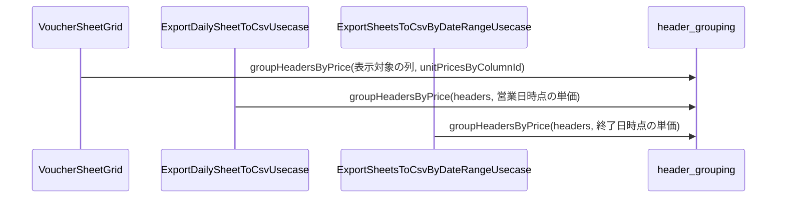

# header_grouping（header_grouping.dart）

| 新規作成・更新日 | 作成・更新者名 | 作成・更新内容 |
|---|---|---|
| 2026-10-03 | minamiyama | 新規作成。同額の列のグルーピング処理を、伝票入力画面（[VoucherSheetGrid](../../presentation/widgets/voucher_sheet_grid.md)・[VoucherHeaderRow](../../presentation/widgets/voucher_header_row.md)）とCSV出力（[csv_sheet_formatter](./csv_sheet_formatter.md)）で共有するため新設 |

## 処理概要

伝票の列（[Header](../entities/header.md)）を、現在の単価が同額のもの同士で1グループにまとめるトップレベル関数。伝票入力画面のヘッダー行のグルーピング表示・グループにつき1つの個数セル（[requirements.md](../../../../../../requried/requirements.md) FR-6）と、CSV出力のグループ単位の列（FR-3）で同一のグループ構成を使うための共通化。グループの先頭の列（`group.first`）を、グループの個数を保存する代表列とする。

## 処理シーケンス図

## groupHeadersByPrice

### 処理概要
列一覧を、同額の価格対象の列ごとのグループに分けて描画順に並べる。

### input

| 項目論理名 | 項目物理名 | カプセルの型 | データ型 | バリデーション | 備考 |
|---|---|---|---|---|---|
| 列一覧 | headers | list | [Header](../entities/header.md) | 必須 | `displayOrder`昇順 |
| 列ID別の単価Map | unitPricesByColumnId | map | string(key), int(value) | 必須 | 単価未登録の列はキーを持たない |

### output

| 項目論理名 | 項目物理名 | カプセルの型 | データ型 | 備考 |
|---|---|---|---|---|
| 列グループ一覧 | - | list(list) | [Header](../entities/header.md) | 描画順。各グループの先頭の列が代表列。例: `[[お茶ハイ, ソフトドリンク], [チャージ], [MEMO]]` |

### exception

なし

### 処理詳細
1. `headers`を先頭から順に処理する。
   (1). 条件a: 列が非価格対象（`isPriced=false`、MEMO）の場合、その列のみのグループを変数`nonPricedGroups`の末尾に加える。\
        条件b: 価格対象の場合、次の手順へ進む。
   (2). 条件a: `unitPricesByColumnId`に列の単価がない場合、その列のみのグループを変数`pricedGroups`の末尾に加える（元の位置を保つ）。\
        条件b: 単価があり、同額のグループが`groupByPrice`に未登録の場合、その列のみの新しいグループを`pricedGroups`の末尾に加え、`groupByPrice`に単価をキーとして登録する（グループの並びは価格ごとの初出順）。\
        条件c: 同額のグループが登録済みの場合、そのグループの末尾に列を加える（グループ内は`headers`の順）。
2. `pricedGroups`の後ろに`nonPricedGroups`を連結して返却する（MEMOは常に価格対象の列より後ろ）。

| 変数論理名 | 変数物理名 | データ型 | 格納値 | 備考欄 |
|---|---|---|---|---|
| 単価別グループMap | groupByPrice | map(int, list) | 単価→その単価のグループ | `pricedGroups`内のグループと同一の参照 |
| 価格対象のグループ一覧 | pricedGroups | list(list) | 価格対象の列のグループ | - |
| 非価格対象のグループ一覧 | nonPricedGroups | list(list) | MEMO列ごとの単独グループ | - |
