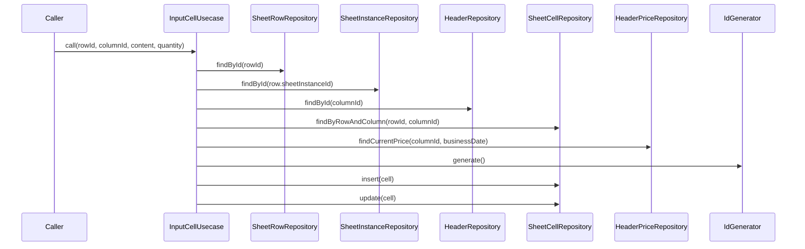

# InputCellUsecase（input_cell_usecase.dart）

| 新規作成・更新日 | 作成・更新者名 | 作成・更新内容 |
|---|---|---|
| 2026-09-25 | minamiyama | 新規作成 |

## 処理概要

行と列の組に対応するセル（[SheetCell](../entities/sheet_cell.md)）に値を入力するユースケース（FR-2）。価格対象の列（`isPriced=true`）の場合、入力時点の適用単価を[HeaderPrice](../entities/header_price.md)から取得してスナップショットし、数量×単価で金額を自動計算する。既存のセルがある場合は更新、ない場合は新規作成する。保存後、DBトリガーにより[SheetRow](../entities/sheet_row.md)の`totalAmount`が自動更新される。[SheetRowRepository](../repositories/sheet_row_repository.md)・[SheetInstanceRepository](../repositories/sheet_instance_repository.md)・[HeaderRepository](../repositories/header_repository.md)・[HeaderPriceRepository](../repositories/header_price_repository.md)・[SheetCellRepository](../repositories/sheet_cell_repository.md)・[IdGenerator](../../../../core/utils/id_generator.md)に依存する。

## 処理シーケンス図

## call

### 処理概要
行・列に対応するセルへ値を入力する。既存セルの有無・列の価格対象フラグに応じて計算方式を切り替え、保存する。

### input

| 項目論理名 | 項目物理名 | カプセルの型 | データ型 | バリデーション | 備考 |
|---|---|---|---|---|---|
| 行ID | rowId | - | string | 必須 | - |
| 列ID | columnId | - | string | 必須 | - |
| 内容 | content | optional | string | `isPriced=false`の列の場合必須 | - |
| 数量 | quantity | optional | int | `isPriced=true`の列の場合必須 | - |

### output

| 項目論理名 | 項目物理名 | カプセルの型 | データ型 | 備考 |
|---|---|---|---|---|
| セル | - | - | [SheetCell](../entities/sheet_cell.md) | 保存後のセル |

### exception

| exception論理名 | exception物理名 | エラーコード | エラーメッセージ | 備考 |
|---|---|---|---|---|
| レコード未検出 | [RecordNotFoundException](../../../../core/errors/record_not_found_exception.md) | - | - | `rowId`・`columnId`、または有効な単価が存在しない場合 |
| 業務ルール違反 | [ValidationException](../../../../core/errors/validation_exception.md) | - | - | `isPriced=true`の列で`quantity`未指定、または`isPriced=false`の列で`content`未指定の場合 |

### 処理詳細
1. [SheetRowRepository.findById](../repositories/sheet_row_repository.md)を呼び出し、変数`row`に格納する。
2. [SheetInstanceRepository.findById](../repositories/sheet_instance_repository.md)を`row.sheetInstanceId`で呼び出し、変数`sheetInstance`に格納する。
3. [HeaderRepository.findById](../repositories/header_repository.md)を呼び出し、変数`header`に格納する。
4. [SheetCellRepository.findByRowAndColumn](../repositories/sheet_cell_repository.md)を`rowId`・`columnId`で呼び出し、変数`existingCell`に格納する。
5. 条件a: `header.isPriced=true`の場合
   (1). `quantity`が`null`の場合、`ValidationException`を送出し処理を終了する。
   (2). [HeaderPriceRepository.findCurrentPrice](../repositories/header_price_repository.md)を`columnId`・`sheetInstance.businessDate`で呼び出し、変数`currentPrice`に格納する。
   (3). `quantity * currentPrice.price`を変数`amount`に格納し、変数`resolvedContent`に`null`を格納する。
   条件b: `header.isPriced=false`の場合
   (1). `content`が`null`の場合、`ValidationException`を送出し処理を終了する。
   (2). `quantity`・`amount`に`null`を格納し、変数`resolvedContent`に`content`を格納する。
6. 条件a: `existingCell`が`null`でない場合、`existingCell.cellId`を引き継いだ[SheetCell](../entities/sheet_cell.md)エンティティを組み立て、変数`cell`に格納し、[SheetCellRepository.update](../repositories/sheet_cell_repository.md)を`cell`で呼び出す。
   条件b: `existingCell`が`null`の場合、[IdGenerator.generate](../../../../core/utils/id_generator.md)を呼び出して変数`cellId`に格納し、`cellId`を用いた[SheetCell](../entities/sheet_cell.md)エンティティを組み立てて変数`cell`に格納し、[SheetCellRepository.insert](../repositories/sheet_cell_repository.md)を`cell`で呼び出す。
7. `cell`を返却する。

### 変数一覧

| 変数論理名 | 変数物理名 | データ型 | 格納値 | 備考欄 |
|---|---|---|---|---|
| 行 | row | [SheetRow](../entities/sheet_row.md) | [SheetRowRepository.findById](../repositories/sheet_row_repository.md)の返却値 | - |
| 伝票インスタンス | sheetInstance | [SheetInstance](../entities/sheet_instance.md) | [SheetInstanceRepository.findById](../repositories/sheet_instance_repository.md)の返却値 | 営業日の取得に使用 |
| 列 | header | [Header](../entities/header.md) | [HeaderRepository.findById](../repositories/header_repository.md)の返却値 | `isPriced`判定に使用 |
| 既存セル | existingCell | [SheetCell](../entities/sheet_cell.md)? | [SheetCellRepository.findByRowAndColumn](../repositories/sheet_cell_repository.md)の返却値 | 新規／更新の判定に使用 |
| 適用単価 | currentPrice | [HeaderPrice](../entities/header_price.md) | [HeaderPriceRepository.findCurrentPrice](../repositories/header_price_repository.md)の返却値 | `isPriced=true`の場合のみ使用 |
| 金額 | amount | int? | `quantity * currentPrice.price`、または`isPriced=false`の場合は`null` | - |
| 内容 | resolvedContent | string? | `content`、または`isPriced=true`の場合は`null` | - |
| セルID | cellId | string | [IdGenerator.generate](../../../../core/utils/id_generator.md)の返却値 | 新規作成時のみ使用。ULID形式 |
| セル | cell | [SheetCell](../entities/sheet_cell.md) | ステップ6で組み立てたエンティティ | - |
