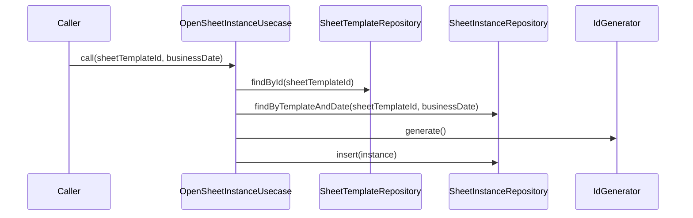

# OpenSheetInstanceUsecase（open_sheet_instance_usecase.dart）

| 新規作成・更新日 | 作成・更新者名 | 作成・更新内容 |
|---|---|---|
| 2026-09-25 | minamiyama | 新規作成 |

## 処理概要

指定した伝票フォーマット・営業日の伝票インスタンス（[SheetInstance](../entities/sheet_instance.md)）を取得する。存在しない場合は新規作成する（FR-1、FR-2）。[SheetTemplateRepository](../repositories/sheet_template_repository.md)・[SheetInstanceRepository](../repositories/sheet_instance_repository.md)・[IdGenerator](../../../../core/utils/id_generator.md)に依存する。

## 処理シーケンス図

## call

### 処理概要
指定した伝票フォーマット・営業日の伝票インスタンスを取得する。存在しない場合は新規作成する。

### input

| 項目論理名 | 項目物理名 | カプセルの型 | データ型 | バリデーション | 備考 |
|---|---|---|---|---|---|
| 伝票フォーマットID | sheetTemplateId | - | string | 必須 | - |
| 営業日 | businessDate | - | DateTime | 必須, 日付のみ | - |

### output

| 項目論理名 | 項目物理名 | カプセルの型 | データ型 | 備考 |
|---|---|---|---|---|
| 伝票インスタンス | - | - | [SheetInstance](../entities/sheet_instance.md) | 既存分、または新規作成分 |

### exception

| exception論理名 | exception物理名 | エラーコード | エラーメッセージ | 備考 |
|---|---|---|---|---|
| レコード未検出 | [RecordNotFoundException](../../../../core/errors/record_not_found_exception.md) | - | - | `sheetTemplateId`が存在しない場合 |

### 処理詳細
1. [SheetTemplateRepository.findById](../repositories/sheet_template_repository.md)を呼び出し、`sheetTemplateId`の存在を確認する。
2. [SheetInstanceRepository.findByTemplateAndDate](../repositories/sheet_instance_repository.md)を`sheetTemplateId`・`businessDate`で呼び出し、変数`existingInstance`に格納する。\
   条件a: `existingInstance`が`null`でない場合、`existingInstance`を返却し処理を終了する。\
   条件b: `existingInstance`が`null`の場合、次のステップへ進む。
3. [IdGenerator.generate](../../../../core/utils/id_generator.md)を呼び出し、変数`sheetInstanceId`に格納する。
4. `sheetTemplateId`・`businessDate`・`status=active`から[SheetInstance](../entities/sheet_instance.md)エンティティを組み立て、変数`newInstance`に格納する。
5. [SheetInstanceRepository.insert](../repositories/sheet_instance_repository.md)を`newInstance`で呼び出し、永続化する。
6. `newInstance`を返却する。

### 変数一覧

| 変数論理名 | 変数物理名 | データ型 | 格納値 | 備考欄 |
|---|---|---|---|---|
| 既存の伝票インスタンス | existingInstance | [SheetInstance](../entities/sheet_instance.md)? | [SheetInstanceRepository.findByTemplateAndDate](../repositories/sheet_instance_repository.md)の返却値 | 未作成の場合は`null` |
| 伝票インスタンスID | sheetInstanceId | string | [IdGenerator.generate](../../../../core/utils/id_generator.md)の返却値 | ULID形式 |
| 新規の伝票インスタンス | newInstance | [SheetInstance](../entities/sheet_instance.md) | ステップ4で組み立てたエンティティ | - |
