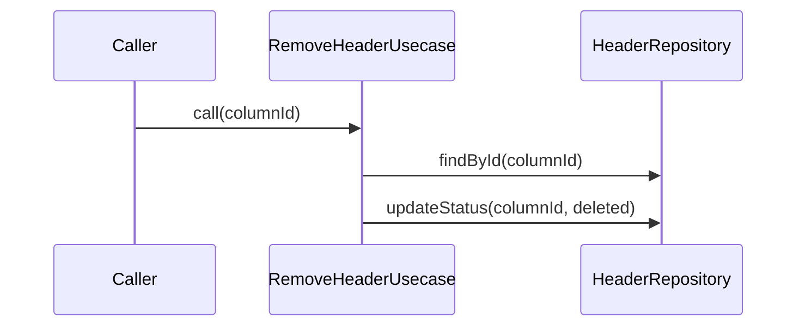

# RemoveHeaderUsecase（remove_header_usecase.dart）

| 新規作成・更新日 | 作成・更新者名 | 作成・更新内容 |
|---|---|---|
| 2026-09-25 | minamiyama | 新規作成 |

## 処理概要

列（[Header](../entities/header.md)）を論理削除するユースケース。削除後も過去に入力済みの[SheetCell](../entities/sheet_cell.md)は保持される。[HeaderRepository](../repositories/header_repository.md)に依存する。

## 処理シーケンス図

## call

### 処理概要
指定した列を論理削除する。

### input

| 項目論理名 | 項目物理名 | カプセルの型 | データ型 | バリデーション | 備考 |
|---|---|---|---|---|---|
| 列ID | columnId | - | string | 必須 | - |

### output

| 項目論理名 | 項目物理名 | カプセルの型 | データ型 | 備考 |
|---|---|---|---|---|
| - | - | - | void | - |

### exception

| exception論理名 | exception物理名 | エラーコード | エラーメッセージ | 備考 |
|---|---|---|---|---|
| レコード未検出 | [RecordNotFoundException](../../../../core/errors/record_not_found_exception.md) | - | - | `columnId`が存在しない場合 |

### 処理詳細
1. [HeaderRepository.findById](../repositories/header_repository.md)を呼び出し、`columnId`の存在を確認する。
2. [HeaderRepository.updateStatus](../repositories/header_repository.md)を`columnId`・`status=deleted`で呼び出す。
