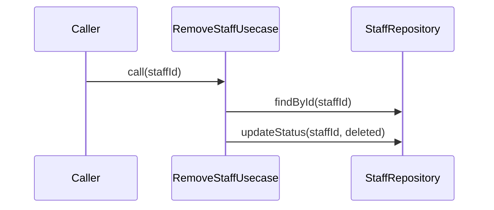

# RemoveStaffUsecase（remove_staff_usecase.dart）

| 新規作成・更新日 | 作成・更新者名 | 作成・更新内容 |
|---|---|---|
| 2026-09-29 | minamiyama | 新規作成（スタッフ管理機能、FR-7） |

## 処理概要

スタッフを論理削除するユースケース（FR-7）。物理削除は行わず`status=deleted`への更新のみを行うため、過去の伝票データ（`t_row.staff_id`・`t_staff_shift.staff_id`）は削除後も保持される。[StaffRepository](../repositories/staff_repository.md)に依存する。

## 処理シーケンス図

## call

### 処理概要
指定した`staffId`のスタッフを論理削除する。

### input

| 項目論理名 | 項目物理名 | カプセルの型 | データ型 | バリデーション | 備考 |
|---|---|---|---|---|---|
| スタッフID | staffId | - | string | 必須 | - |

### output

| 項目論理名 | 項目物理名 | カプセルの型 | データ型 | 備考 |
|---|---|---|---|---|
| - | - | - | void | - |

### exception

| exception論理名 | exception物理名 | エラーコード | エラーメッセージ | 備考 |
|---|---|---|---|---|
| レコード未検出 | [RecordNotFoundException](../../../../core/errors/record_not_found_exception.md) | - | - | `staffId`が存在しない場合 |

### 処理詳細
1. [StaffRepository.findById](../repositories/staff_repository.md)を`staffId`で呼び出し、存在を確認する。
2. [StaffRepository.updateStatus](../repositories/staff_repository.md)を`staffId`・`status=RecordStatus.deleted`で呼び出す。
