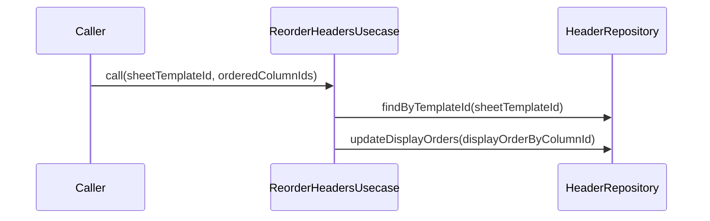

# ReorderHeadersUsecase（reorder_headers_usecase.dart）

| 新規作成・更新日 | 作成・更新者名 | 作成・更新内容 |
|---|---|---|
| 2026-09-25 | minamiyama | 新規作成 |

## 処理概要

伝票フォーマット配下の列の表示順を一括で並び替えるユースケース。紙伝票と同じ列構成を保つための表示順変更に対応する。[HeaderRepository](../repositories/header_repository.md)に依存する。

## 処理シーケンス図

## call

### 処理概要
指定した列ID順序に従って、伝票フォーマット配下の列の表示順を一括更新する。

### input

| 項目論理名 | 項目物理名 | カプセルの型 | データ型 | バリデーション | 備考 |
|---|---|---|---|---|---|
| 伝票フォーマットID | sheetTemplateId | - | string | 必須 | - |
| 並び替え後の列ID順序 | orderedColumnIds | list | string | 必須 | 先頭が`displayOrder=1`になる |

### output

| 項目論理名 | 項目物理名 | カプセルの型 | データ型 | 備考 |
|---|---|---|---|---|
| - | - | - | void | - |

### exception

| exception論理名 | exception物理名 | エラーコード | エラーメッセージ | 備考 |
|---|---|---|---|---|
| 業務ルール違反 | [ValidationException](../../../../core/errors/validation_exception.md) | - | - | `orderedColumnIds`の件数と現在の列数が一致しない場合 |

### 処理詳細
1. [HeaderRepository.findByTemplateId](../repositories/header_repository.md)を呼び出し、変数`existingHeaders`に格納する。
2. 条件a: `orderedColumnIds`の件数と`existingHeaders`の件数が一致しない場合、`ValidationException`を送出し処理を終了する。
   条件b: 一致する場合、次のステップへ進む。
3. `orderedColumnIds`のインデックス（0始まり）+1を表示順とした、列IDと表示順の対応を変数`displayOrderByColumnId`（メモリ内のMap）に組み立てる。
4. [HeaderRepository.updateDisplayOrders](../repositories/header_repository.md)を`displayOrderByColumnId`で呼び出し、一括更新する。

### 変数一覧

| 変数論理名 | 変数物理名 | データ型 | 格納値 | 備考欄 |
|---|---|---|---|---|
| 既存列一覧 | existingHeaders | list<[Header](../entities/header.md)> | [HeaderRepository.findByTemplateId](../repositories/header_repository.md)の返却値 | 件数比較に使用 |
| 列IDと表示順の対応 | displayOrderByColumnId | map<string, int> | ステップ3で組み立てたMap | key=columnId, value=displayOrder |
