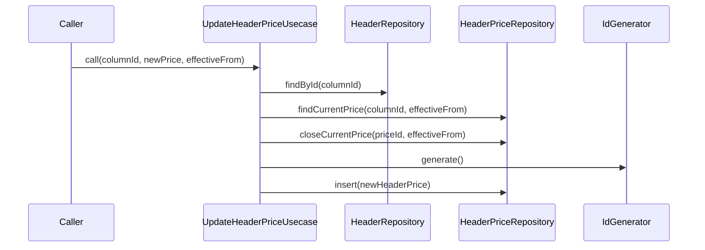

# UpdateHeaderPriceUsecase（update_header_price_usecase.dart）

| 新規作成・更新日 | 作成・更新者名 | 作成・更新内容 |
|---|---|---|
| 2026-09-25 | minamiyama | 新規作成 |

## 処理概要

既存の列（[Header](../entities/header.md)）の単価を改定するユースケース（FR-1、単価の期間変動対応）。既存の単価改定履歴（[HeaderPrice](../entities/header_price.md)）の有効期間を終了させ、新しい単価の履歴を追加する。[HeaderRepository](../repositories/header_repository.md)・[HeaderPriceRepository](../repositories/header_price_repository.md)・[IdGenerator](../../../../core/utils/id_generator.md)に依存する。

## 処理シーケンス図

## call

### 処理概要
列の単価を改定する。既存の有効な単価があれば有効期間を終了させたうえで、新しい単価改定履歴を追加する。

### input

| 項目論理名 | 項目物理名 | カプセルの型 | データ型 | バリデーション | 備考 |
|---|---|---|---|---|---|
| 列ID | columnId | - | string | 必須 | - |
| 新単価 | newPrice | - | int | 必須 | 単位は円 |
| 適用開始日 | effectiveFrom | - | DateTime | 必須, 日付のみ | 新単価の適用開始日。前の単価の適用終了日にもなる |

### output

| 項目論理名 | 項目物理名 | カプセルの型 | データ型 | 備考 |
|---|---|---|---|---|
| 単価改定履歴 | - | - | [HeaderPrice](../entities/header_price.md) | 新規追加された単価改定履歴 |

### exception

| exception論理名 | exception物理名 | エラーコード | エラーメッセージ | 備考 |
|---|---|---|---|---|
| レコード未検出 | [RecordNotFoundException](../../../../core/errors/record_not_found_exception.md) | - | - | `columnId`が存在しない場合 |

### 処理詳細
1. [HeaderRepository.findById](../repositories/header_repository.md)を呼び出し、`columnId`の存在を確認する。
2. [HeaderPriceRepository.findCurrentPrice](../repositories/header_price_repository.md)を`columnId`・`effectiveFrom`で呼び出す。\
   条件a: `RecordNotFoundException`が送出された場合（初回登録）、変数`currentPrice`に`null`を格納し、次のステップへ進む。\
   条件b: 取得できた場合、変数`currentPrice`に格納する。
3. 条件a: `currentPrice`が`null`でない場合、[HeaderPriceRepository.closeCurrentPrice](../repositories/header_price_repository.md)を`currentPrice.priceId`・`effectiveFrom`で呼び出し、有効期間を終了させる。\
   条件b: `currentPrice`が`null`の場合、このステップをスキップする。
4. [IdGenerator.generate](../../../../core/utils/id_generator.md)を呼び出し、変数`priceId`に格納する。
5. `columnId`・`newPrice`・`effectiveFrom`・`effectiveTo=null`から新しい[HeaderPrice](../entities/header_price.md)エンティティを組み立て、変数`newHeaderPrice`に格納する。
6. [HeaderPriceRepository.insert](../repositories/header_price_repository.md)を`newHeaderPrice`で呼び出し、永続化する。
7. `newHeaderPrice`を返却する。

### 変数一覧

| 変数論理名 | 変数物理名 | データ型 | 格納値 | 備考欄 |
|---|---|---|---|---|
| 現在の単価改定履歴 | currentPrice | [HeaderPrice](../entities/header_price.md)? | [HeaderPriceRepository.findCurrentPrice](../repositories/header_price_repository.md)の返却値、または初回登録時は`null` | - |
| 価格ID | priceId | string | [IdGenerator.generate](../../../../core/utils/id_generator.md)の返却値 | ULID形式 |
| 新しい単価改定履歴 | newHeaderPrice | [HeaderPrice](../entities/header_price.md) | ステップ5で組み立てたエンティティ | - |
