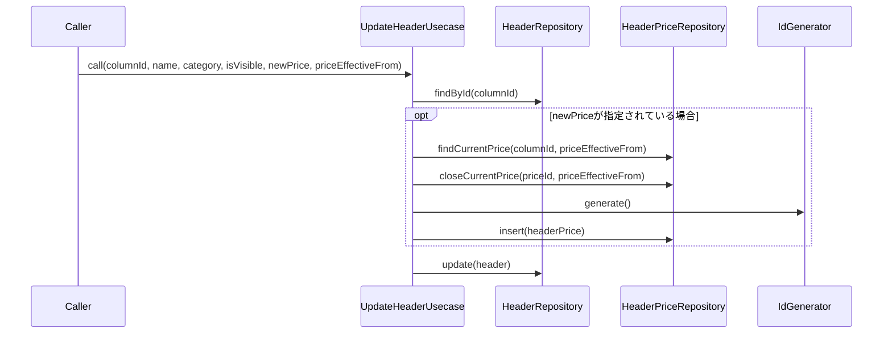

# UpdateHeaderUsecase（update_header_usecase.dart）

| 新規作成・更新日 | 作成・更新者名 | 作成・更新内容 |
|---|---|---|
| 2026-09-29 | minamiyama | 新規作成（ヘッダー管理機能、FR-6） |

## 処理概要

既存の列（[Header](../entities/header.md)）の項目名・カテゴリー・表示/非表示・単価を更新するユースケース（FR-6）。単価を変更する場合は、既存の[HeaderPrice](../entities/header_price.md)の適用終了日を確定させた上で新しい[HeaderPrice](../entities/header_price.md)を追加する（価格改定履歴として保持し、過去の伝票の単価は変えない）。[HeaderRepository](../repositories/header_repository.md)・[HeaderPriceRepository](../repositories/header_price_repository.md)・[IdGenerator](../../../../core/utils/id_generator.md)に依存する。

## 処理シーケンス図

## call

### 処理概要
指定した`columnId`の列を更新する。価格対象の列（`isPriced=true`）の単価を変更する場合は`newPrice`・`priceEffectiveFrom`を指定する。

### input

| 項目論理名 | 項目物理名 | カプセルの型 | データ型 | バリデーション | 備考 |
|---|---|---|---|---|---|
| 列ID | columnId | - | string | 必須 | - |
| 項目名 | name | - | string | 必須, 空文字列・空白のみ不可 | - |
| カテゴリー | category | - | [HeaderCategory](../entities/enums/header_category.md) | 必須 | - |
| 表示/非表示フラグ | isVisible | - | bool | 必須 | - |
| 新単価 | newPrice | optional | int | 単価を変更しない場合は`null` | 単位は円。`isPriced=false`の列には指定不可 |
| 単価適用開始日 | priceEffectiveFrom | optional | DateTime | `newPrice`指定時は必須, 日付のみ | - |

### output

| 項目論理名 | 項目物理名 | カプセルの型 | データ型 | 備考 |
|---|---|---|---|---|
| 列 | - | - | [Header](../entities/header.md) | 更新後の内容 |

### exception

| exception論理名 | exception物理名 | エラーコード | エラーメッセージ | 備考 |
|---|---|---|---|---|
| レコード未検出 | [RecordNotFoundException](../../../../core/errors/record_not_found_exception.md) | - | - | `columnId`が存在しない場合 |
| 業務ルール違反 | [ValidationException](../../../../core/errors/validation_exception.md) | - | - | `name`が空文字列・空白のみの場合／`isPriced=false`の列に`newPrice`を指定した場合／`newPrice`指定時に`priceEffectiveFrom`が未指定の場合 |

### 処理詳細
1. [HeaderRepository.findById](../repositories/header_repository.md)を呼び出し、変数`current`に格納する。
2. 条件a: `name`が空文字列または空白のみの場合、`ValidationException`を送出し処理を終了する。\
   条件b: それ以外の場合、次のステップへ進む。
3. 条件a: `newPrice`が指定されている場合\
   (1). 条件a: `current.isPriced=false`の場合、`ValidationException`を送出し処理を終了する。\
        条件b: `current.isPriced=true`の場合、次のステップへ進む。\
   (2). 条件a: `priceEffectiveFrom`が`null`の場合、`ValidationException`を送出し処理を終了する。\
        条件b: `priceEffectiveFrom`が指定されている場合、[価格改定処理](#価格改定処理_revisepriceifchanged)を実行する。\
   条件b: `newPrice`が指定されていない場合、このステップをスキップする。
4. `current.columnId`・`current.sheetTemplateId`・`current.typeId`・`name`・`current.displayOrder`・`current.isPriced`・`category`・`isVisible`・`current.status`・`current.createdAt`・現在時刻から[Header](../entities/header.md)エンティティを組み立て、変数`updated`に格納する。
5. [HeaderRepository.update](../repositories/header_repository.md)を`updated`で呼び出す。
6. `updated`を返却する。

### 変数一覧

| 変数論理名 | 変数物理名 | データ型 | 格納値 | 備考欄 |
|---|---|---|---|---|
| 更新前の列 | current | [Header](../entities/header.md) | [HeaderRepository.findById](../repositories/header_repository.md)の返却値 | - |
| 更新後の列 | updated | [Header](../entities/header.md) | ステップ4で組み立てたエンティティ | - |

## 価格改定処理（_revisePriceIfChanged）

### 処理概要
現在の単価と`newPrice`が異なる場合のみ、既存の[HeaderPrice](../entities/header_price.md)の適用終了日を確定させ、新しい[HeaderPrice](../entities/header_price.md)を追加する。

### input

| 項目論理名 | 項目物理名 | カプセルの型 | データ型 | バリデーション | 備考 |
|---|---|---|---|---|---|
| 列ID | columnId | - | string | 必須 | - |
| 新単価 | newPrice | - | int | 必須 | - |
| 単価適用開始日 | effectiveFrom | - | DateTime | 必須, 日付のみ | - |

### output

なし（voidで結果は[HeaderPriceRepository](../repositories/header_price_repository.md)への書き込みとして反映される）

### exception

なし

### 処理詳細
1. [HeaderPriceRepository.findCurrentPrice](../repositories/header_price_repository.md)を`columnId`・`effectiveFrom`で呼び出し、変数`currentPrice`に格納する。
2. 条件a: `currentPrice.price`が`newPrice`と等しい場合、処理を終了する（改定不要）。\
   条件b: 異なる場合、次のステップへ進む。
3. [HeaderPriceRepository.closeCurrentPrice](../repositories/header_price_repository.md)を`currentPrice.priceId`・`effectiveFrom`で呼び出し、現行価格の適用終了日を確定させる。
4. [IdGenerator.generate](../../../../core/utils/id_generator.md)を呼び出し、変数`priceId`に格納する。
5. `priceId`・`columnId`・`newPrice`・`effectiveFrom`・`effectiveTo=null`から[HeaderPrice](../entities/header_price.md)エンティティを組み立て、[HeaderPriceRepository.insert](../repositories/header_price_repository.md)で永続化する。

### 変数一覧

| 変数論理名 | 変数物理名 | データ型 | 格納値 | 備考欄 |
|---|---|---|---|---|
| 現行の単価改定履歴 | currentPrice | [HeaderPrice](../entities/header_price.md) | [HeaderPriceRepository.findCurrentPrice](../repositories/header_price_repository.md)の返却値 | - |
| 新しい価格ID | priceId | string | [IdGenerator.generate](../../../../core/utils/id_generator.md)の返却値 | ULID形式 |
