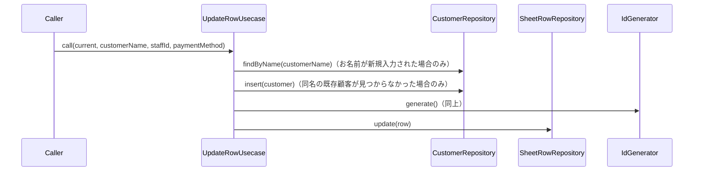

# UpdateRowUsecase（update_row_usecase.dart）

| 新規作成・更新日 | 作成・更新者名 | 作成・更新内容 |
|---|---|---|
| 2026-09-27 | minamiyama | 新規作成（[agents.md](../../../../../../../requried/agents.md)のお名前・担当・決済方法仕様を反映） |
| 2026-09-29 | minamiyama | 「お名前」列への新規入力時、[CustomerRepository.findByName](../repositories/customer_repository.md)で同名の既存顧客を検索するよう変更。既存顧客が見つかった場合はその顧客に紐付け、重複した[Customer](../entities/customer.md)を作成しないようにした（見つからない場合のみ従来どおり新規作成） |

## 処理概要

行作成後に発生する3種類の更新（「お名前」列の編集、「担当」列プルダウンでのスタッフ再選択、「合計金額」列に隣接する「P」「カ」決済方法の丸付け）をまとめて扱うユースケース。[SheetRowRepository](../repositories/sheet_row_repository.md)・[CustomerRepository](../repositories/customer_repository.md)・[IdGenerator](../../../../core/utils/id_generator.md)に依存する。項目ごとに呼び出されるため、更新対象以外は`current`の値を維持する（[UpdateStaffShiftUsecase](./update_staff_shift_usecase.md)と同様の部分更新方式）。「お名前」列への新規入力時は、同名の既存顧客がいないか[CustomerRepository.findByName](../repositories/customer_repository.md)で確認し、重複した[Customer](../entities/customer.md)を作成しない。

## 処理シーケンス図

## call

### 処理概要
指定した行の顧客紐付け・担当スタッフ・決済方法のうち、指定された項目のみを更新する。

### input

| 項目論理名 | 項目物理名 | カプセルの型 | データ型 | バリデーション | 備考 |
|---|---|---|---|---|---|
| 行 | current | - | [SheetRow](../entities/sheet_row.md) | 必須 | 更新前の現在値 |
| お名前列の入力テキスト | customerName | optional | string | 任意 | 「お名前」列を編集した場合のみ指定。空文字列は「未登録（新規客）」を意味する。`null`（未指定）の場合は顧客紐付けを変更しない |
| スタッフID | staffId | optional | string | 任意 | 「担当」列プルダウンを変更した場合のみ指定。`current`から変更しない場合は`Undefined`扱いとし、「未定」を選択した場合は明示的に`null`を渡す（[UpdateStaffShiftUsecase](./update_staff_shift_usecase.md)と同様の考え方） |
| 決済方法 | paymentMethod | optional | [PaymentMethod](../entities/enums/payment_method.md) | 任意 | 「P」「カ」トグルを変更した場合のみ指定。現金（丸なし）に戻す場合は明示的に`null`を渡す |

### output

| 項目論理名 | 項目物理名 | カプセルの型 | データ型 | 備考 |
|---|---|---|---|---|
| 行 | - | - | [SheetRow](../entities/sheet_row.md) | 更新後のエンティティ |

### exception

なし（`customerId`・`staffId`の存在確認は行わない。存在しないIDが渡されるのはアプリ内部のバグに限られるため、DBの外部キー制約に委ねる）

### 処理詳細
1. 変数`customerId`に`current.customerId`を初期値として格納する。
2. `customerName`が指定されている場合、次のとおり処理する。\
   条件a: `customerName`が空文字列の場合、`customerId`に`null`を設定する（新規客扱い。画面上は「-様」＋「NEW」マークで表示される）。\
   条件b: `customerName`が空文字列でなく、かつ`current.customerId`が`null`の場合、次のステップ3へ進む。\
   条件c: `customerName`が空文字列でなく、かつ`current.customerId`が非`null`の場合、氏名の変更は[Customer](../entities/customer.md)側の別ユースケースの責務とし、本ユースケースでは`customerId`を変更しない（このアプリでは氏名表示は[SheetRow](../entities/sheet_row.md)に直接持たないため）。ステップ3・4はスキップする。
3. （ステップ2条件bの場合のみ）[CustomerRepository.findByName](../repositories/customer_repository.md)を`customerName`で呼び出し、変数`existingCustomer`に格納する。
4. （ステップ2条件bの場合のみ）\
   条件a: `existingCustomer`が非`null`の場合、その`customerId`を変数`customerId`に設定する（同名の既存顧客に紐付け、重複作成しない）。\
   条件b: `existingCustomer`が`null`の場合、[IdGenerator.generate](../../../../core/utils/id_generator.md)で採番した`customerId`・`name=customerName`・`gender=none`・`status=active`から[Customer](../entities/customer.md)を組み立てて[CustomerRepository.insert](../repositories/customer_repository.md)で永続化し、その`customerId`を変数`customerId`に設定する。
5. `staffId`が指定されている場合はその値を、指定されていない場合は`current.staffId`を、変数`resolvedStaffId`に格納する。
6. `paymentMethod`が指定されている場合はその値を、指定されていない場合は`current.paymentMethod`を、変数`resolvedPaymentMethod`に格納する。
7. `current`を基に`customerId`・`resolvedStaffId`・`resolvedPaymentMethod`・`updatedAt=現在時刻`で上書きした[SheetRow](../entities/sheet_row.md)を変数`updated`に組み立てる。
8. [SheetRowRepository.update](../repositories/sheet_row_repository.md)を`updated`で呼び出し、永続化する。
9. `updated`を返却する。

### 変数一覧

| 変数論理名 | 変数物理名 | データ型 | 格納値 | 備考欄 |
|---|---|---|---|---|
| 顧客ID | customerId | string? | ステップ1・2・4で決定した値 | - |
| 既存の同名顧客 | existingCustomer | [Customer](../entities/customer.md)? | ステップ3（[CustomerRepository.findByName](../repositories/customer_repository.md)の返却値） | ステップ2条件bの場合のみ使用 |
| 担当スタッフID | resolvedStaffId | string? | ステップ5で決定した値 | - |
| 決済方法 | resolvedPaymentMethod | [PaymentMethod](../entities/enums/payment_method.md)? | ステップ6で決定した値 | - |
| 更新後の行 | updated | [SheetRow](../entities/sheet_row.md) | ステップ7で組み立てたエンティティ | - |
