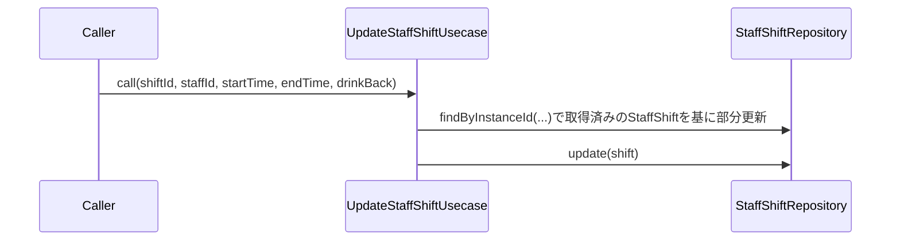

# UpdateStaffShiftUsecase（update_staff_shift_usecase.dart）

| 新規作成・更新日 | 作成・更新者名 | 作成・更新内容 |
|---|---|---|
| 2026-09-27 | minamiyama | 新規作成（[agents.md](../../../../../../../requried/agents.md)のスタッフ欄仕様を反映） |

## 処理概要

右上「スタッフ」欄（[VoucherStaffBar](../../presentation/widgets/voucher_staff_bar.md)）の氏名プルダウン・就業時刻ボタン・ドリンクバック入力の確定時に呼び出され、[StaffShift](../entities/staff_shift.md)を部分更新するユースケース。項目ごとに呼び出されるため、更新対象以外は`null`（未指定）を渡す。[StaffShiftRepository](../repositories/staff_shift_repository.md)に依存する。

## 処理シーケンス図

## call

### 処理概要
指定したシフトの氏名・就業開始時刻・就業終了時刻・ドリンクバックのうち、指定された項目のみを更新する。

### input

| 項目論理名 | 項目物理名 | カプセルの型 | データ型 | バリデーション | 備考 |
|---|---|---|---|---|---|
| シフト | current | - | [StaffShift](../entities/staff_shift.md) | 必須 | 更新前の現在値。[VoucherSheetState.sheetDetail](../../presentation/controllers/voucher_sheet_state.md).`staffShifts`から呼び出し元（[VoucherSheetNotifier](../../presentation/controllers/voucher_sheet_notifier.md)）が特定して渡す |
| スタッフID | staffId | optional | string | 任意 | 更新する場合のみ指定（`Undefined`と`null`を区別できないシンプルな設計のため、未指定時は`current.staffId`をそのまま使う。氏名プルダウンで「未定」を選んだ場合は明示的に`null`を渡す） |
| 就業開始時刻 | startTime | optional | string | 任意, `HH:mm`形式 | 更新する場合のみ指定。未指定時は`current.startTime`を維持 |
| 就業終了時刻 | endTime | optional | string | 任意, `HH:mm`形式 | 更新する場合のみ指定。未指定時は`current.endTime`を維持 |
| ドリンクバック | drinkBack | optional | string | 任意 | 更新する場合のみ指定。未指定時は`current.drinkBack`を維持 |

### output

| 項目論理名 | 項目物理名 | カプセルの型 | データ型 | 備考 |
|---|---|---|---|---|
| シフト | - | - | [StaffShift](../entities/staff_shift.md) | 更新後のエンティティ |

### exception

| exception論理名 | exception物理名 | エラーコード | エラーメッセージ | 備考 |
|---|---|---|---|---|
| バリデーション | [ValidationException](../../../../core/errors/validation_exception.md) | - | - | `startTime`・`endTime`が`HH:mm`形式でない場合 |

### 処理詳細
1. 各inputについて、指定されていれば`current`の対応フィールドを上書きし、指定されていなければ`current`の値をそのまま使い、変数`updated`（[StaffShift](../entities/staff_shift.md)）を組み立てる。`updatedAt`は現在時刻を設定する。
2. [StaffShiftRepository.update](../repositories/staff_shift_repository.md)を`updated`で呼び出し、永続化する。
3. `updated`を返却する。

### 変数一覧

| 変数論理名 | 変数物理名 | データ型 | 格納値 | 備考欄 |
|---|---|---|---|---|
| 更新後シフト | updated | [StaffShift](../entities/staff_shift.md) | ステップ1で組み立てたエンティティ | - |
