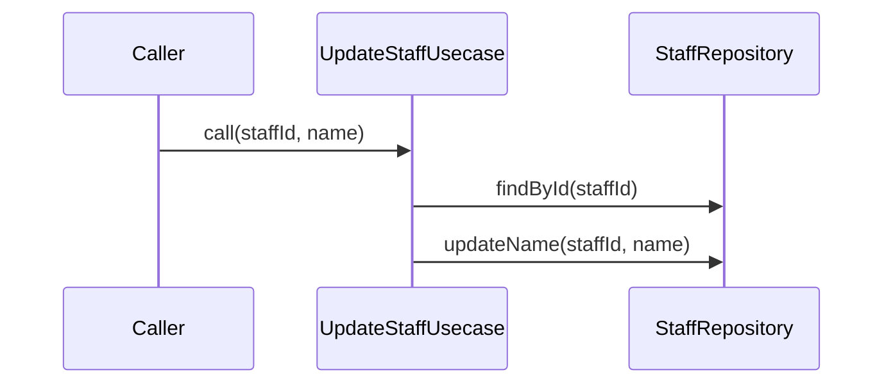

# UpdateStaffUsecase（update_staff_usecase.dart）

| 新規作成・更新日 | 作成・更新者名 | 作成・更新内容 |
|---|---|---|
| 2026-09-29 | minamiyama | 新規作成（スタッフ管理機能、FR-7） |

## 処理概要

スタッフの氏名を更新するユースケース（FR-7）。[StaffRepository](../repositories/staff_repository.md)に依存する。

## 処理シーケンス図

## call

### 処理概要
指定した`staffId`のスタッフの氏名を更新する。

### input

| 項目論理名 | 項目物理名 | カプセルの型 | データ型 | バリデーション | 備考 |
|---|---|---|---|---|---|
| スタッフID | staffId | - | string | 必須 | - |
| 氏名 | name | - | string | 必須, 空文字列・空白のみ不可 | - |

### output

| 項目論理名 | 項目物理名 | カプセルの型 | データ型 | 備考 |
|---|---|---|---|---|
| - | - | - | void | - |

### exception

| exception論理名 | exception物理名 | エラーコード | エラーメッセージ | 備考 |
|---|---|---|---|---|
| レコード未検出 | [RecordNotFoundException](../../../../core/errors/record_not_found_exception.md) | - | - | `staffId`が存在しない場合 |
| 業務ルール違反 | [ValidationException](../../../../core/errors/validation_exception.md) | - | - | `name`が空文字列・空白のみの場合 |

### 処理詳細
1. [StaffRepository.findById](../repositories/staff_repository.md)を`staffId`で呼び出し、存在を確認する。
2. 条件a: `name`が空文字列または空白のみの場合、`ValidationException`を送出し処理を終了する。\
   条件b: それ以外の場合、次のステップへ進む。
3. [StaffRepository.updateName](../repositories/staff_repository.md)を`staffId`・`name`で呼び出す。
