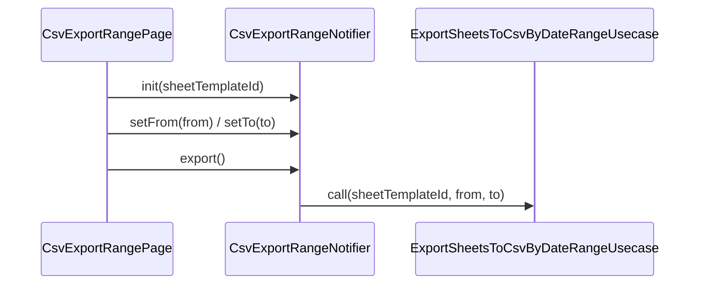

# CsvExportRangeNotifier（csv_export_range_notifier.dart）

| 新規作成・更新日 | 作成・更新者名 | 作成・更新内容 |
|---|---|---|
| 2026-09-29 | minamiyama | 新規作成（CSV期間出力機能、FR-3） |

## 処理概要

CSV出力画面（`MMM_005_VOUCHER`）の状態（[CsvExportRangeState](./csv_export_range_state.md)）を管理するRiverpod Notifier。開始日・終了日の選択保持と、期間指定でのCSV出力（FR-3）を担う。共有（Share、OS機能の呼び出し）はpresentation層（[CsvExportRangePage](../pages/csv_export_range_page.md)）が行う。`sheetTemplateId`は[init](#init)実行時にNotifier内部（状態外）で保持する。

## 依存

- [ExportSheetsToCsvByDateRangeUsecase](../../domain/usecases/export_sheets_to_csv_by_date_range_usecase.md)（domain層）

## 処理シーケンス図

## init

### 処理概要
画面生成時に呼び出され、対象の伝票フォーマットIDを保持する。

### input

| 項目論理名 | 項目物理名 | カプセルの型 | データ型 | バリデーション | 備考 |
|---|---|---|---|---|---|
| 伝票フォーマットID | sheetTemplateId | - | string | 必須 | Notifier内部の変数`_sheetTemplateId`に保持する |

### output

| 項目論理名 | 項目物理名 | カプセルの型 | データ型 | 備考 |
|---|---|---|---|---|
| - | - | - | void | - |

### exception

なし

### 処理詳細
1. `sheetTemplateId`をNotifier内部の変数`_sheetTemplateId`に保持する。

## setFrom / setTo

### 処理概要
開始日・終了日の選択確定時に呼び出され、状態に反映する（DB・usecase呼び出しなし）。

### input

| 項目論理名 | 項目物理名 | カプセルの型 | データ型 | バリデーション | 備考 |
|---|---|---|---|---|---|
| 日付 | from / to | - | DateTime | 必須 | - |

### output

| 項目論理名 | 項目物理名 | カプセルの型 | データ型 | 備考 |
|---|---|---|---|---|
| - | - | - | void | - |

### exception

なし

### 処理詳細
1. `from`（または`to`）とした状態を反映する。

## export

### 処理概要
選択中の期間でCSVを出力する。開始日・終了日が未選択の場合は失敗結果を返す。

### input

なし（状態が保持する`from`・`to`を使用する）

### output

| 項目論理名 | 項目物理名 | カプセルの型 | データ型 | 備考 |
|---|---|---|---|---|
| 実行結果 | - | - | [CsvExportResult](./csv_export_range_state.md) | 成功時`csvContent`、失敗時`errorMessage`のいずれかを持つ |

### exception

なし（例外は捕捉し[CsvExportResult](./csv_export_range_state.md)の失敗結果として返す）

### 処理詳細
1. 条件a: `from`または`to`が`null`の場合、失敗結果（`errorMessage='開始日と終了日を選択してください'`）を返却し処理を終了する。\
   条件b: 両方とも指定されている場合、次のステップへ進む。
2. `isExporting=true`とした状態を反映する。
3. [ExportSheetsToCsvByDateRangeUsecase.call](../../domain/usecases/export_sheets_to_csv_by_date_range_usecase.md)を`sheetTemplateId=_sheetTemplateId`・`from`・`to`で呼び出し、変数`csvContent`に格納する。\
   条件a: 例外が送出された場合、失敗結果（`errorMessage`=例外メッセージ）を変数`result`に格納する。\
   条件b: 成功した場合、成功結果（`csvContent`）を変数`result`に格納する。
4. `isExporting=false`とした状態を反映する（`finally`相当、3の結果によらず実行）。
5. `result`を返却する。

## 状態遷移仕様

| 現在の状態(論理名/物理名) | 契機（イベント/操作） | 遷移後の状態(論理名/物理名) | 処理内容・更新されるプロパティ |
|---|---|---|---|
| - | 画面生成（[CsvExportRangePage](../pages/csv_export_range_page.md)の初期化） | - | [init](#init)を呼び出す |
| - | 開始日/終了日の選択確定 | - | [setFrom](#setfrom--setto)/[setTo](#setfrom--setto)で`from`/`to`を更新 |
| - | 「出力」ボタン押下 | - | [export](#export)を実行し、`isExporting`を`true`→`false`に更新。結果は戻り値として[CsvExportRangePage](../pages/csv_export_range_page.md)へ返り、共有シート表示または`SnackBar`表示に使われる |
