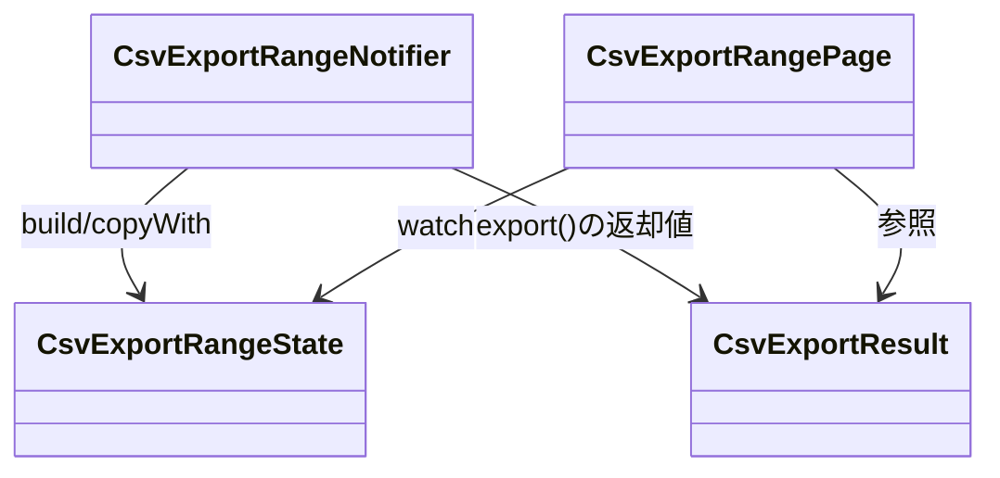

# CsvExportRangeState（csv_export_range_state.dart）

| 新規作成・更新日 | 作成・更新者名 | 作成・更新内容 |
|---|---|---|
| 2026-09-29 | minamiyama | 新規作成（CSV期間出力機能、FR-3） |

## 概要

CSV出力画面（`MMM_005_VOUCHER`）のUI状態（UiState）を表すクラス。[CsvExportRangeNotifier](./csv_export_range_notifier.md)が保持・更新し、[CsvExportRangePage](../pages/csv_export_range_page.md)が監視する。あわせて、[CsvExportRangeNotifier.export](./csv_export_range_notifier.md#export)の実行結果を表す`CsvExportResult`を定義する。

## 依存関係シーケンス図

## CsvExportResultの項目一覧

成功時は`csvContent`、失敗時は`errorMessage`のいずれか一方のみが非`null`となる（名前付きコンストラクタ`.success`/`.failure`で排他的に構築）。

| 項目論理名 | 項目物理名 | カプセルの型 | データ型 | バリデーション | 備考 |
|---|---|---|---|---|---|
| 出力されたCSV文字列 | csvContent | optional | string | 成功時のみ非`null` | - |
| エラーメッセージ | errorMessage | optional | string | 失敗時のみ非`null` | 開始日・終了日未選択、または[ExportSheetsToCsvByDateRangeUsecase](../../domain/usecases/export_sheets_to_csv_by_date_range_usecase.md)からの例外メッセージ |

## CsvExportRangeStateの項目一覧

| 項目論理名 | 項目物理名 | カプセルの型 | データ型 | バリデーション | 備考 |
|---|---|---|---|---|---|
| 開始日 | from | optional | DateTime | 任意 | 未選択の場合は`null` |
| 終了日 | to | optional | DateTime | 任意 | 未選択の場合は`null` |
| CSV出力中フラグ | isExporting | - | bool | 必須 | デフォルト`false` |
