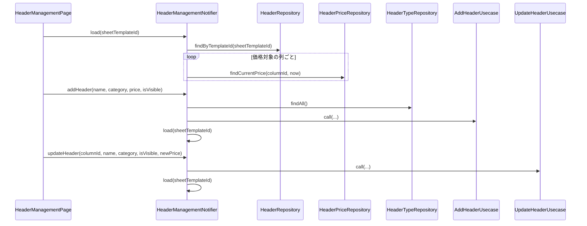

# HeaderManagementNotifier（header_management_notifier.dart）

| 新規作成・更新日 | 作成・更新者名 | 作成・更新内容 |
|---|---|---|
| 2026-09-29 | minamiyama | 新規作成（ヘッダー管理機能、FR-6） |

## 処理概要

ヘッダー管理画面（`MMM_003_VOUCHER`）の状態（[HeaderManagementState](./header_management_state.md)）を管理するRiverpod Notifier。価格対象の列一覧の読込・追加・更新（項目名・カテゴリー・単価・表示/非表示、FR-6）を担う。`sheetTemplateId`は[load](#load)実行時にNotifier内部（状態外）で保持する。[StaffManagementNotifier](./staff_management_notifier.md)と同様、1回限りの通知専用のEffectチャネルは持たず、追加/更新メソッドは成功時`null`、失敗時はエラーメッセージ文字列を返す。

## 依存

- [HeaderRepository](../../domain/repositories/header_repository.md)（domain層。`load`で直接参照）
- [HeaderPriceRepository](../../domain/repositories/header_price_repository.md)（domain層。`load`で現在の単価を取得するために直接参照）
- [HeaderTypeRepository](../../domain/repositories/header_type_repository.md)（domain層。`addHeader`で`decimal`型のtypeIdを解決するために直接参照）
- [AddHeaderUsecase](../../domain/usecases/add_header_usecase.md)（domain層）
- [UpdateHeaderUsecase](../../domain/usecases/update_header_usecase.md)（domain層）

## 処理シーケンス図

## load

### 処理概要
画面生成時に呼び出され、指定した伝票フォーマットの価格対象の列一覧（「お名前」「MEMO」「合計金額」「担当」を除く）と現在の適用単価を読み込む。

### input

| 項目論理名 | 項目物理名 | カプセルの型 | データ型 | バリデーション | 備考 |
|---|---|---|---|---|---|
| 伝票フォーマットID | sheetTemplateId | - | string | 必須 | Notifier内部の変数`_sheetTemplateId`にも保持する |

### output

| 項目論理名 | 項目物理名 | カプセルの型 | データ型 | 備考 |
|---|---|---|---|---|
| - | - | - | void | 結果は[HeaderManagementState](./header_management_state.md)の更新として反映される |

### exception

なし（例外は捕捉し`status=error`として状態に反映するため、呼び出し元には送出しない）

### 処理詳細
1. `sheetTemplateId`をNotifier内部の変数`_sheetTemplateId`に保持する。
2. `status=loading`とした状態を反映する。
3. [HeaderRepository.findByTemplateId](../../domain/repositories/header_repository.md)を`sheetTemplateId`で呼び出し、変数`allHeaders`に格納する。\
   条件a: 例外が送出された場合、`status=error`・`errorMessage`に例外メッセージを設定した状態を反映し、処理を終了する。\
   条件b: 成功した場合、次のステップへ進む。
4. `allHeaders`から`isPriced=true`の列のみを抽出し、変数`headers`に格納する（メモリ内処理、DBアクセスなし）。
5. `headers`を1件ずつ処理し、[HeaderPriceRepository.findCurrentPrice](../../domain/repositories/header_price_repository.md)を`columnId`・現在時刻で呼び出し、結果を`columnId`をキーとしたMap（変数`unitPricesByColumnId`）に格納する。単価未登録の列（`RecordNotFoundException`）は表示上「単価なし」として扱い、Mapにキーを追加しない（[GetSheetDetailUsecase](../../domain/usecases/get_sheet_detail_usecase.md)と同じ扱い）。
6. `status=success`・`headers=headers`・`unitPricesByColumnId=unitPricesByColumnId`とした状態を反映する。

### 変数一覧

| 変数論理名 | 変数物理名 | データ型 | 格納値 | 備考欄 |
|---|---|---|---|---|
| 全列一覧 | allHeaders | list<[Header](../../domain/entities/header.md)> | [HeaderRepository.findByTemplateId](../../domain/repositories/header_repository.md)の返却値 | 「お名前」「MEMO」「合計金額」「担当」を除くフィルタ前 |
| 価格対象の列一覧 | headers | list<[Header](../../domain/entities/header.md)> | `allHeaders`から`isPriced=true`を抽出した結果 | - |
| 列ID別の現在の適用単価Map | unitPricesByColumnId | map<string, int> | ステップ5で組み立てたMap | - |

## addHeader

### 処理概要
価格対象の列を1件追加する。列の入力型は既存のシード列と同じ`decimal`型を使用する。

### input

| 項目論理名 | 項目物理名 | カプセルの型 | データ型 | バリデーション | 備考 |
|---|---|---|---|---|---|
| 項目名 | name | - | string | 必須 | - |
| カテゴリー | category | - | [HeaderCategory](../../domain/entities/enums/header_category.md) | 必須 | - |
| 価格 | price | - | int | 必須 | 単位は円 |
| 表示/非表示フラグ | isVisible | - | bool | 必須 | - |

### output

| 項目論理名 | 項目物理名 | カプセルの型 | データ型 | 備考 |
|---|---|---|---|---|
| エラーメッセージ | - | optional | string | 成功時`null`、失敗時は例外メッセージ |

### exception

なし（例外は捕捉し戻り値として返す）

### 処理詳細
1. [HeaderTypeRepository.findAll](../../domain/repositories/header_type_repository.md)を呼び出し、`typeName=decimal`の型の`typeId`を変数`decimalTypeId`に格納する。
2. [AddHeaderUsecase.call](../../domain/usecases/add_header_usecase.md)を`sheetTemplateId=_sheetTemplateId`・`name`・`typeId=decimalTypeId`・`isPriced=true`・`initialPrice=price`・`effectiveFrom=現在時刻`・`category`・`isVisible`で呼び出す。\
   条件a: 例外が送出された場合、例外メッセージを返却し処理を終了する。\
   条件b: 成功した場合、次のステップへ進む。
3. [load](#load)を`_sheetTemplateId`で呼び出し、一覧を再読込する。
4. `null`を返却する。

## updateHeader

### 処理概要
列の項目名・カテゴリー・表示/非表示を更新する。`newPrice`を指定した場合は単価も改定する（適用開始日は更新実行時刻）。

### input

| 項目論理名 | 項目物理名 | カプセルの型 | データ型 | バリデーション | 備考 |
|---|---|---|---|---|---|
| 列ID | columnId | - | string | 必須 | - |
| 項目名 | name | - | string | 必須 | - |
| カテゴリー | category | - | [HeaderCategory](../../domain/entities/enums/header_category.md) | 必須 | - |
| 表示/非表示フラグ | isVisible | - | bool | 必須 | - |
| 新単価 | newPrice | optional | int | 単価を変更しない場合は`null` | フォームの入力値が現在の単価と同じ場合、[HeaderManagementPage](../pages/header_management_page.md)側で`null`に変換して渡す |

### output

| 項目論理名 | 項目物理名 | カプセルの型 | データ型 | 備考 |
|---|---|---|---|---|
| エラーメッセージ | - | optional | string | 成功時`null`、失敗時は例外メッセージ |

### exception

なし（例外は捕捉し戻り値として返す）

### 処理詳細
1. [UpdateHeaderUsecase.call](../../domain/usecases/update_header_usecase.md)を`columnId`・`name`・`category`・`isVisible`・`newPrice`・`priceEffectiveFrom=（newPrice!=nullの場合のみ現在時刻）`で呼び出す。\
   条件a: 例外が送出された場合、例外メッセージを返却し処理を終了する。\
   条件b: 成功した場合、次のステップへ進む。
2. [load](#load)を`_sheetTemplateId`で呼び出し、一覧を再読込する。
3. `null`を返却する。

## 状態遷移仕様

| 現在の状態(論理名/物理名) | 契機（イベント/操作） | 遷移後の状態(論理名/物理名) | 処理内容・更新されるプロパティ |
|---|---|---|---|
| 初期／initial | 画面生成（[HeaderManagementPage](../pages/header_management_page.md)の初期化） | 読込中／loading | [load](#load)を呼び出す |
| 読込中／loading | [load](#load)成功 | 成功／success | `headers`・`unitPricesByColumnId`を設定 |
| 読込中／loading | [load](#load)失敗 | エラー／error | `errorMessage`を設定 |
| エラー／error | 再試行ボタン押下 | 読込中／loading | [load](#load)を再実行 |
| 成功／success | 追加/編集操作 | 成功／success（結果により再読込） | [addHeader](#addheader)/[updateHeader](#updateheader)を実行し、成功時は[load](#load)で一覧を再読込。失敗時は状態を変えず、戻り値のエラーメッセージを[HeaderManagementPage](../pages/header_management_page.md)が`SnackBar`で表示 |
