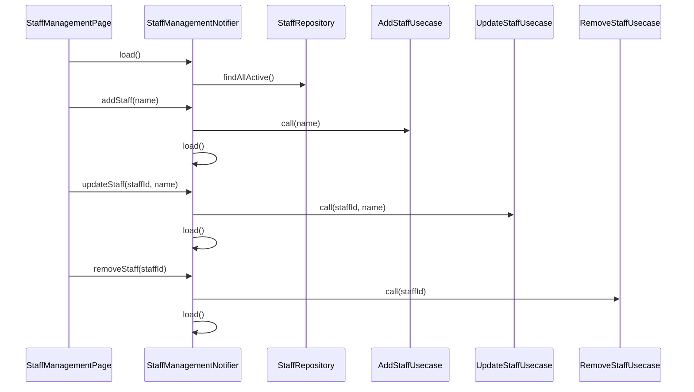

# StaffManagementNotifier（staff_management_notifier.dart）

| 新規作成・更新日 | 作成・更新者名 | 作成・更新内容 |
|---|---|---|
| 2026-09-29 | minamiyama | 新規作成（スタッフ管理機能、FR-7） |

## 処理概要

スタッフ管理画面（`MMM_004_VOUCHER`）の状態（[StaffManagementState](./staff_management_state.md)）を管理するRiverpod Notifier。スタッフ一覧の読込・追加・氏名更新・論理削除（FR-7）を担う。

[VoucherSheetNotifier](./voucher_sheet_notifier.md)と異なり、本画面は編集対象セルが同時に複数存在しない単純なCRUD一覧画面のため、1回限りの通知専用のEffectチャネル（[VoucherSheetEffect](./voucher_sheet_effect.md)相当）は持たない。追加/更新/削除の各メソッドは成功時`null`、失敗時はエラーメッセージ文字列を返す設計とし、[StaffManagementPage](../pages/staff_management_page.md)が呼び出し元（ダイアログのコールバック）でその場に応じて`SnackBar`表示を行う。

## 依存

- [StaffRepository](../../domain/repositories/staff_repository.md)（domain層。`load`で直接参照）
- [AddStaffUsecase](../../domain/usecases/add_staff_usecase.md)（domain層）
- [UpdateStaffUsecase](../../domain/usecases/update_staff_usecase.md)（domain層）
- [RemoveStaffUsecase](../../domain/usecases/remove_staff_usecase.md)（domain層）

## 処理シーケンス図

## load

### 処理概要
画面生成時に呼び出され、有効なスタッフ一覧を読み込む。

### input

なし

### output

| 項目論理名 | 項目物理名 | カプセルの型 | データ型 | 備考 |
|---|---|---|---|---|
| - | - | - | void | 結果は[StaffManagementState](./staff_management_state.md)の更新として反映される |

### exception

なし（例外は捕捉し`status=error`として状態に反映するため、呼び出し元には送出しない）

### 処理詳細
1. `status=loading`とした状態を反映する。
2. [StaffRepository.findAllActive](../../domain/repositories/staff_repository.md)を呼び出し、変数`staffRoster`に格納する。\
   条件a: 例外が送出された場合、`status=error`・`errorMessage`に例外メッセージを設定した状態を反映し、処理を終了する。\
   条件b: 成功した場合、次のステップへ進む。
3. `status=success`・`staffRoster=staffRoster`とした状態を反映する。

## addStaff

### 処理概要
スタッフを1件追加し、成功時は一覧を再読込する。

### input

| 項目論理名 | 項目物理名 | カプセルの型 | データ型 | バリデーション | 備考 |
|---|---|---|---|---|---|
| 氏名 | name | - | string | 必須 | - |

### output

| 項目論理名 | 項目物理名 | カプセルの型 | データ型 | 備考 |
|---|---|---|---|---|
| エラーメッセージ | - | optional | string | 成功時`null`、失敗時は例外メッセージ |

### exception

なし（例外は捕捉し戻り値として返す）

### 処理詳細
1. [AddStaffUsecase.call](../../domain/usecases/add_staff_usecase.md)を`name`で呼び出す。\
   条件a: 例外が送出された場合、例外メッセージを返却し処理を終了する。\
   条件b: 成功した場合、次のステップへ進む。
2. [load](#load)を呼び出し、一覧を再読込する。
3. `null`を返却する。

## updateStaff

### 処理概要
スタッフの氏名を更新し、成功時は一覧を再読込する。

### input

| 項目論理名 | 項目物理名 | カプセルの型 | データ型 | バリデーション | 備考 |
|---|---|---|---|---|---|
| スタッフID | staffId | - | string | 必須 | - |
| 氏名 | name | - | string | 必須 | - |

### output

| 項目論理名 | 項目物理名 | カプセルの型 | データ型 | 備考 |
|---|---|---|---|---|
| エラーメッセージ | - | optional | string | 成功時`null`、失敗時は例外メッセージ |

### exception

なし（例外は捕捉し戻り値として返す）

### 処理詳細
1. [UpdateStaffUsecase.call](../../domain/usecases/update_staff_usecase.md)を`staffId`・`name`で呼び出す。\
   条件a: 例外が送出された場合、例外メッセージを返却し処理を終了する。\
   条件b: 成功した場合、次のステップへ進む。
2. [load](#load)を呼び出し、一覧を再読込する。
3. `null`を返却する。

## removeStaff

### 処理概要
スタッフを論理削除し、成功時は一覧を再読込する。

### input

| 項目論理名 | 項目物理名 | カプセルの型 | データ型 | バリデーション | 備考 |
|---|---|---|---|---|---|
| スタッフID | staffId | - | string | 必須 | - |

### output

| 項目論理名 | 項目物理名 | カプセルの型 | データ型 | 備考 |
|---|---|---|---|---|
| エラーメッセージ | - | optional | string | 成功時`null`、失敗時は例外メッセージ |

### exception

なし（例外は捕捉し戻り値として返す）

### 処理詳細
1. [RemoveStaffUsecase.call](../../domain/usecases/remove_staff_usecase.md)を`staffId`で呼び出す。\
   条件a: 例外が送出された場合、例外メッセージを返却し処理を終了する。\
   条件b: 成功した場合、次のステップへ進む。
2. [load](#load)を呼び出し、一覧を再読込する。
3. `null`を返却する。

## 状態遷移仕様

| 現在の状態(論理名/物理名) | 契機（イベント/操作） | 遷移後の状態(論理名/物理名) | 処理内容・更新されるプロパティ |
|---|---|---|---|
| 初期／initial | 画面生成（[StaffManagementPage](../pages/staff_management_page.md)の初期化） | 読込中／loading | [load](#load)を呼び出す |
| 読込中／loading | [load](#load)成功 | 成功／success | `staffRoster`を設定 |
| 読込中／loading | [load](#load)失敗 | エラー／error | `errorMessage`を設定 |
| エラー／error | 再試行ボタン押下 | 読込中／loading | [load](#load)を再実行 |
| 成功／success | 追加/編集/削除操作 | 成功／success（結果により再読込） | [addStaff](#addstaff)/[updateStaff](#updatestaff)/[removeStaff](#removestaff)を実行し、成功時は[load](#load)で一覧を再読込。失敗時は状態を変えず、戻り値のエラーメッセージを[StaffManagementPage](../pages/staff_management_page.md)が`SnackBar`で表示 |
