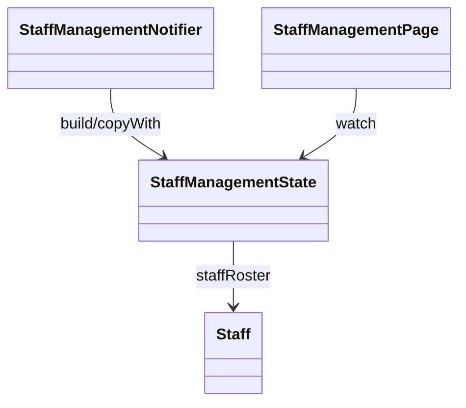

# StaffManagementState（staff_management_state.dart）

| 新規作成・更新日 | 作成・更新者名 | 作成・更新内容 |
|---|---|---|
| 2026-09-29 | minamiyama | 新規作成（スタッフ管理機能、FR-7） |

## 概要

スタッフ管理画面（`MMM_004_VOUCHER`）のUI状態（UiState）を表すクラス。[StaffManagementNotifier](./staff_management_notifier.md)が保持・更新し、[StaffManagementPage](../pages/staff_management_page.md)が監視する。

## 依存関係シーケンス図

## ライフサイクルに応じた状態遷移

| 状態（論理名/物理名） | 説明 |
|---|---|
| 初期／initial | 画面生成時の状態 |
| 読込中／loading | スタッフ一覧取得中の状態（インジケータ表示用） |
| 成功／success | 取得できた状態。一覧表示・追加/編集/削除操作が可能 |
| エラー／error | 取得に失敗した異常系（エラーメッセージ・再試行ボタン表示用） |

## プロパティ定義

| 項目論理名 | 項目物理名 | カプセルの型 | データ型 | バリデーション | 備考 |
|---|---|---|---|---|---|
| 画面状態 | status | - | StaffManagementStatus | 必須 | デフォルト`initial` |
| 有効なスタッフ一覧 | staffRoster | list | [Staff](../../domain/entities/staff.md) | 必須 | デフォルト空リスト |
| エラーメッセージ | errorMessage | optional | string | `status=error`の場合のみ非`null` | - |
