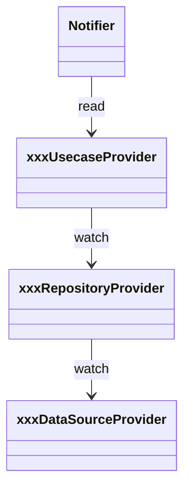

# voucher_providers（voucher_providers.dart）

| 新規作成・更新日 | 作成・更新者名 | 作成・更新内容 |
|---|---|---|
| 2026-09-25 | minamiyama | 新規作成（ドキュメント未整備分を今回補完） |
| 2026-09-29 | minamiyama | ヘッダー管理・スタッフ管理・CSV期間出力機能（FR-6・FR-7・FR-3）に伴い、`updateHeaderUsecaseProvider`・`addStaffUsecaseProvider`・`updateStaffUsecaseProvider`・`removeStaffUsecaseProvider`・`exportSheetsToCsvByDateRangeUsecaseProvider`を追加 |

## 概要

伝票機能（voucher）のRiverpod `Provider`定義を集約するファイル。「データソース → リポジトリ → ユースケース」の3層で、下位層に依存する上位層を`ref.watch`で組み立てる。データソースProviderは画面から直接参照させないため非公開（`_xxxDataSourceProvider`）とし、リポジトリ・ユースケースProviderのみ公開する。各Notifier（[VoucherSheetNotifier](../controllers/voucher_sheet_notifier.md)・[HeaderManagementNotifier](./header_management_notifier.md)・[StaffManagementNotifier](./staff_management_notifier.md)・[CsvExportRangeNotifier](./csv_export_range_notifier.md)）はこれらのユースケースProviderを`ref.read`で参照する。

## 依存関係シーケンス図

## Provider一覧

### データソース（非公開）

`Header`・`HeaderPrice`・`HeaderType`・`SheetTemplate`・`SheetInstance`・`Customer`・`Staff`・`StaffShift`・`SheetRow`・`SheetCell`・`DailyPaymentSummary`の各`LocalDataSource`を、`databaseProvider`（`AppDatabase.open()`で開いた`Database`）から組み立てる。

### リポジトリ

| Provider名 | 提供する型 |
|---|---|
| headerTypeRepositoryProvider | [HeaderTypeRepository](../../domain/repositories/header_type_repository.md) |
| headerRepositoryProvider | [HeaderRepository](../../domain/repositories/header_repository.md) |
| headerPriceRepositoryProvider | [HeaderPriceRepository](../../domain/repositories/header_price_repository.md) |
| sheetTemplateRepositoryProvider | [SheetTemplateRepository](../../domain/repositories/sheet_template_repository.md) |
| sheetInstanceRepositoryProvider | [SheetInstanceRepository](../../domain/repositories/sheet_instance_repository.md) |
| customerRepositoryProvider | [CustomerRepository](../../domain/repositories/customer_repository.md) |
| staffRepositoryProvider | [StaffRepository](../../domain/repositories/staff_repository.md) |
| staffShiftRepositoryProvider | [StaffShiftRepository](../../domain/repositories/staff_shift_repository.md) |
| sheetRowRepositoryProvider | [SheetRowRepository](../../domain/repositories/sheet_row_repository.md) |
| sheetCellRepositoryProvider | [SheetCellRepository](../../domain/repositories/sheet_cell_repository.md) |
| dailyPaymentSummaryRepositoryProvider | [DailyPaymentSummaryRepository](../../domain/repositories/daily_payment_summary_repository.md) |

### ユースケース

| Provider名 | 提供する型 | 備考 |
|---|---|---|
| createTemplateUsecaseProvider | [CreateTemplateUsecase](../../domain/usecases/create_template_usecase.md) | - |
| addHeaderUsecaseProvider | [AddHeaderUsecase](../../domain/usecases/add_header_usecase.md) | - |
| openSheetInstanceUsecaseProvider | [OpenSheetInstanceUsecase](../../domain/usecases/open_sheet_instance_usecase.md) | - |
| getSheetDetailUsecaseProvider | [GetSheetDetailUsecase](../../domain/usecases/get_sheet_detail_usecase.md) | - |
| addRowUsecaseProvider | [AddRowUsecase](../../domain/usecases/add_row_usecase.md) | - |
| inputCellUsecaseProvider | [InputCellUsecase](../../domain/usecases/input_cell_usecase.md) | - |
| updateRowUsecaseProvider | [UpdateRowUsecase](../../domain/usecases/update_row_usecase.md) | - |
| updateStaffShiftUsecaseProvider | [UpdateStaffShiftUsecase](../../domain/usecases/update_staff_shift_usecase.md) | - |
| exportDailySheetToCsvUsecaseProvider | [ExportDailySheetToCsvUsecase](../../domain/usecases/export_daily_sheet_to_csv_usecase.md) | - |
| exportSheetsToCsvByDateRangeUsecaseProvider | [ExportSheetsToCsvByDateRangeUsecase](../../domain/usecases/export_sheets_to_csv_by_date_range_usecase.md) | 2026-09-29追加（FR-3） |
| updateHeaderUsecaseProvider | [UpdateHeaderUsecase](../../domain/usecases/update_header_usecase.md) | 2026-09-29追加（FR-6） |
| addStaffUsecaseProvider | [AddStaffUsecase](../../domain/usecases/add_staff_usecase.md) | 2026-09-29追加（FR-7） |
| updateStaffUsecaseProvider | [UpdateStaffUsecase](../../domain/usecases/update_staff_usecase.md) | 2026-09-29追加（FR-7） |
| removeStaffUsecaseProvider | [RemoveStaffUsecase](../../domain/usecases/remove_staff_usecase.md) | 2026-09-29追加（FR-7） |

### その他

| Provider名 | 提供する型 |
|---|---|
| idGeneratorProvider | [IdGenerator](../../../../core/utils/id_generator.md) |
