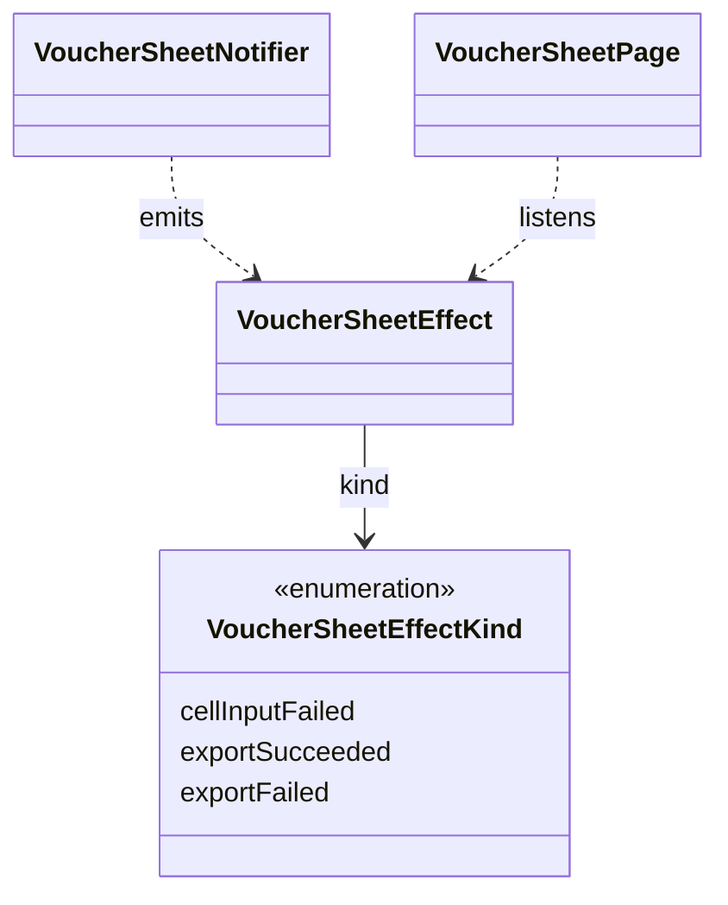

# VoucherSheetEffect（voucher_sheet_effect.dart）

| 新規作成・更新日 | 作成・更新者名 | 作成・更新内容 |
|---|---|---|
| 2026-09-25 | minamiyama | 新規作成 |

## 概要

伝票入力画面（`ENT_001_VOUCHER`）における副作用（Side Effect）を表す型。状態（[VoucherSheetState](./voucher_sheet_state.md)）としては保持せず、[VoucherSheetNotifier](./voucher_sheet_notifier.md)から[VoucherSheetPage](../pages/voucher_sheet_page.md)へ1回限り通知される（`ref.listen`相当で検知する）。バリアントごとに専用クラスを作らず、`kind`で種別を判別する1クラスとして表現する。

## 依存関係シーケンス図

## 項目一覧

| 項目論理名 | 項目物理名 | カプセルの型 | データ型 | バリデーション | 備考 |
|---|---|---|---|---|---|
| 種別 | kind | - | VoucherSheetEffectKind | 必須 | `cellInputFailed`/`exportSucceeded`/`exportFailed` |
| メッセージ | message | - | string | 必須 | 画面上部の[NoticeBanner](../../../../core/widgets/notice_banner.md)に表示する文言。`cellInputFailed`/`exportFailed`は例外メッセージ、`exportSucceeded`は固定の完了文言（例:「CSV出力が完了しました」） |
| CSV文字列 | csvContent | optional | string | `kind`が`exportSucceeded`の場合必須 | 共有シート（Share）に渡すCSV内容 |
