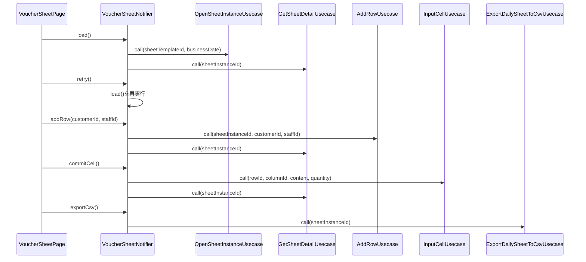

# VoucherSheetNotifier（voucher_sheet_notifier.dart）

| 新規作成・更新日 | 作成・更新者名 | 作成・更新内容 |
|---|---|---|
| 2026-09-25 | minamiyama | 新規作成 |

## 処理概要

伝票入力画面（`ENT_001_VOUCHER`）の状態（[VoucherSheetState](./voucher_sheet_state.md)）を管理するRiverpod Notifier。伝票インスタンスの読込・行追加・セル入力・CSV出力（FR-1〜FR-3）を担う。`sheetTemplateId`・`businessDate`はコンストラクタ引数として受け取り、`sheetInstanceId`は`load`実行後にNotifier内部（状態外）で保持する。

## 依存

- [OpenSheetInstanceUsecase](../../domain/usecases/open_sheet_instance_usecase.md)（Domain層）
- [GetSheetDetailUsecase](../../domain/usecases/get_sheet_detail_usecase.md)（Domain層）
- [AddRowUsecase](../../domain/usecases/add_row_usecase.md)（Domain層）
- [InputCellUsecase](../../domain/usecases/input_cell_usecase.md)（Domain層）
- [ExportDailySheetToCsvUsecase](../../domain/usecases/export_daily_sheet_to_csv_usecase.md)（Domain層）

## 処理シーケンス図

## load

### 処理概要
画面生成時に呼び出され、伝票インスタンスを取得（なければ新規作成）し、表示用の[SheetDetail](../../domain/entities/sheet_detail.md)を読み込む。

### input

なし（コンストラクタで受け取った`sheetTemplateId`・`businessDate`を使用する）

### output

| 項目論理名 | 項目物理名 | カプセルの型 | データ型 | 備考 |
|---|---|---|---|---|
| - | - | - | void | 結果は[VoucherSheetState](./voucher_sheet_state.md)の更新として反映される |

### exception

なし（例外は捕捉し`status=error`として状態に反映するため、呼び出し元には送出しない）

### 処理詳細
1. `status=loading`とした状態を反映する。
2. [OpenSheetInstanceUsecase.call](../../domain/usecases/open_sheet_instance_usecase.md)を`sheetTemplateId`・`businessDate`で呼び出し、変数`instance`に格納する。\
   条件a: 例外が送出された場合、`status=error`・`errorMessage`に例外メッセージを設定した状態を反映し、処理を終了する。\
   条件b: 成功した場合、次のステップへ進む。
3. `instance.sheetInstanceId`を、以降の`addRow`/`commitCell`/`exportCsv`で使うため、Notifier内部の変数`_sheetInstanceId`に保持する（状態には含めない）。
4. [GetSheetDetailUsecase.call](../../domain/usecases/get_sheet_detail_usecase.md)を`_sheetInstanceId`で呼び出し、変数`detail`に格納する。\
   条件a: 例外が送出された場合、`status=error`・`errorMessage`に例外メッセージを設定した状態を反映し、処理を終了する。\
   条件b: 成功した場合、次のステップへ進む。
5. 条件a: `detail.rows`が空の場合、`status=empty`・`sheetDetail=detail`とした状態を反映する。\
   条件b: `detail.rows`が空でない場合、`status=success`・`sheetDetail=detail`とした状態を反映する。

### 変数一覧

| 変数論理名 | 変数物理名 | データ型 | 格納値 | 備考欄 |
|---|---|---|---|---|
| 伝票インスタンス | instance | [SheetInstance](../../domain/entities/sheet_instance.md) | [OpenSheetInstanceUsecase.call](../../domain/usecases/open_sheet_instance_usecase.md)の返却値 | - |
| 伝票詳細 | detail | [SheetDetail](../../domain/entities/sheet_detail.md) | [GetSheetDetailUsecase.call](../../domain/usecases/get_sheet_detail_usecase.md)の返却値 | - |

## retry

### 処理概要
Error状態からの再試行。[load](#load)を再実行する。

### input

なし

### output

| 項目論理名 | 項目物理名 | カプセルの型 | データ型 | 備考 |
|---|---|---|---|---|
| - | - | - | void | - |

### exception

なし

### 処理詳細
1. [load](#load)を呼び出す。

## addRow

### 処理概要
現在の伝票インスタンスに1組の来店・卓を追加し、表示を更新する。

### input

| 項目論理名 | 項目物理名 | カプセルの型 | データ型 | バリデーション | 備考 |
|---|---|---|---|---|---|
| 顧客ID | customerId | optional | string | 任意 | 未登録の来店は`null` |
| スタッフID | staffId | optional | string | 任意 | - |

### output

| 項目論理名 | 項目物理名 | カプセルの型 | データ型 | 備考 |
|---|---|---|---|---|
| - | - | - | void | 結果は[VoucherSheetState](./voucher_sheet_state.md)の更新として反映される |

### exception

なし（例外は捕捉し、[副作用仕様](#副作用side-effect仕様)の`cellInputFailed`と同様に画面上部のお知らせ表示で通知する）

### 処理詳細
1. [AddRowUsecase.call](../../domain/usecases/add_row_usecase.md)を`_sheetInstanceId`・`customerId`・`staffId`で呼び出す。\
   条件a: 例外が送出された場合、`message`に例外メッセージを設定した[VoucherSheetEffect](./voucher_sheet_effect.md)（`kind=cellInputFailed`）を発行し、処理を終了する（画面の状態は`success`のまま維持する）。\
   条件b: 成功した場合、次のステップへ進む。
2. [GetSheetDetailUsecase.call](../../domain/usecases/get_sheet_detail_usecase.md)を`_sheetInstanceId`で呼び出し、変数`detail`に格納する。
3. `status=success`・`sheetDetail=detail`とした状態を反映する。

### 変数一覧

| 変数論理名 | 変数物理名 | データ型 | 格納値 | 備考欄 |
|---|---|---|---|---|
| 伝票詳細 | detail | [SheetDetail](../../domain/entities/sheet_detail.md) | [GetSheetDetailUsecase.call](../../domain/usecases/get_sheet_detail_usecase.md)の返却値 | 再読込した最新の表示データ |

## startEditingCell

### 処理概要
セルタップ時に呼び出され、編集中セルの位置と初期テキストを状態に反映する（DB・usecase呼び出しなし）。

### input

| 項目論理名 | 項目物理名 | カプセルの型 | データ型 | バリデーション | 備考 |
|---|---|---|---|---|---|
| 行ID | rowId | - | string | 必須 | - |
| 列ID | columnId | - | string | 必須 | - |
| 初期テキスト | initialText | - | string | 必須 | タップされたセルの現在表示値 |

### output

| 項目論理名 | 項目物理名 | カプセルの型 | データ型 | 備考 |
|---|---|---|---|---|
| - | - | - | void | - |

### exception

なし

### 処理詳細
1. `editingRowId=rowId`・`editingColumnId=columnId`・`editingText=initialText`とした状態を反映する。

## updateEditingText

### 処理概要
編集中セルのテキストフィールド入力値の変化を状態に反映する（DB・usecase呼び出しなし）。

### input

| 項目論理名 | 項目物理名 | カプセルの型 | データ型 | バリデーション | 備考 |
|---|---|---|---|---|---|
| 入力テキスト | text | - | string | 必須 | - |

### output

| 項目論理名 | 項目物理名 | カプセルの型 | データ型 | 備考 |
|---|---|---|---|---|
| - | - | - | void | - |

### exception

なし

### 処理詳細
1. `editingText=text`とした状態を反映する。

## commitCell

### 処理概要
編集中セルの入力を確定し、[InputCellUsecase](../../domain/usecases/input_cell_usecase.md)へ保存する。列の価格対象フラグに応じて`content`または`quantity`のいずれかとして送信する。

### input

なし（状態が保持する`editingRowId`・`editingColumnId`・`editingText`、および対象列の`isPriced`を使用する）

### output

| 項目論理名 | 項目物理名 | カプセルの型 | データ型 | 備考 |
|---|---|---|---|---|
| - | - | - | void | 結果は[VoucherSheetState](./voucher_sheet_state.md)の更新として反映される |

### exception

なし（例外は捕捉し、[副作用仕様](#副作用side-effect仕様)で通知する）

### 処理詳細
1. `sheetDetail.headers`から`editingColumnId`に一致する列を取得し、変数`header`に格納する。
2. 条件a: `header.isPriced=true`の場合、`editingText`を数値へ変換し変数`quantity`に格納し、変数`content`に`null`を格納する。\
   条件b: `header.isPriced=false`の場合、変数`content`に`editingText`を格納し、変数`quantity`に`null`を格納する。
3. [InputCellUsecase.call](../../domain/usecases/input_cell_usecase.md)を`editingRowId`・`editingColumnId`・`content`・`quantity`で呼び出す。\
   条件a: 例外が送出された場合、`message`に例外メッセージを設定した[VoucherSheetEffect](./voucher_sheet_effect.md)（`kind=cellInputFailed`）を発行し、次のステップに進まず処理を終了する（編集中の状態は維持し、利用者が再入力できるようにする）。\
   条件b: 成功した場合、次のステップへ進む。
4. [GetSheetDetailUsecase.call](../../domain/usecases/get_sheet_detail_usecase.md)を`_sheetInstanceId`で呼び出し、変数`detail`に格納する。
5. `status=success`・`sheetDetail=detail`・`editingRowId=null`・`editingColumnId=null`・`editingText=null`とした状態を反映する。

### 変数一覧

| 変数論理名 | 変数物理名 | データ型 | 格納値 | 備考欄 |
|---|---|---|---|---|
| 列 | header | [Header](../../domain/entities/header.md) | `sheetDetail.headers`から検索した対象列 | - |
| 数量 | quantity | int? | `editingText`の数値変換結果、または`isPriced=false`の場合は`null` | - |
| 内容 | content | string? | `editingText`、または`isPriced=true`の場合は`null` | - |
| 伝票詳細 | detail | [SheetDetail](../../domain/entities/sheet_detail.md) | [GetSheetDetailUsecase.call](../../domain/usecases/get_sheet_detail_usecase.md)の返却値 | 再読込した最新の表示データ |

## exportCsv

### 処理概要
現在の伝票インスタンスをCSVとして出力する。

### input

なし

### output

| 項目論理名 | 項目物理名 | カプセルの型 | データ型 | 備考 |
|---|---|---|---|---|
| - | - | - | void | 結果は[VoucherSheetEffect](./voucher_sheet_effect.md)として通知される |

### exception

なし（例外は捕捉し、[副作用仕様](#副作用side-effect仕様)で通知する）

### 処理詳細
1. `isExporting=true`とした状態を反映する。
2. [ExportDailySheetToCsvUsecase.call](../../domain/usecases/export_daily_sheet_to_csv_usecase.md)を`_sheetInstanceId`で呼び出し、変数`csvContent`に格納する。\
   条件a: 例外が送出された場合、`message`に例外メッセージを設定した[VoucherSheetEffect](./voucher_sheet_effect.md)（`kind=exportFailed`）を発行する。\
   条件b: 成功した場合、`csvContent`と固定文言「CSV出力が完了しました」を`message`に設定した[VoucherSheetEffect](./voucher_sheet_effect.md)（`kind=exportSucceeded`）を発行する。
3. `isExporting=false`とした状態を反映する。

### 変数一覧

| 変数論理名 | 変数物理名 | データ型 | 格納値 | 備考欄 |
|---|---|---|---|---|
| CSV文字列 | csvContent | string | [ExportDailySheetToCsvUsecase.call](../../domain/usecases/export_daily_sheet_to_csv_usecase.md)の返却値 | 成功時のみ使用 |

## 状態遷移仕様

| 現在の状態(論理名/物理名) | 契機（イベント/操作） | 遷移後の状態(論理名/物理名) | 処理内容・更新されるプロパティ |
|---|---|---|---|
| 初期／initial | 画面生成（[VoucherSheetPage](../pages/voucher_sheet_page.md)の初期化） | 読込中／loading | [load](#load)を呼び出す |
| 読込中／loading | [load](#load)成功・行1件以上 | 成功／success | `sheetDetail`を設定 |
| 読込中／loading | [load](#load)成功・行0件 | 空／empty | `sheetDetail`を設定 |
| 読込中／loading | [load](#load)失敗 | エラー／error | `errorMessage`を設定 |
| エラー／error | 再試行ボタン押下 | 読込中／loading | [retry](#retry)→[load](#load)を呼び出す |
| 成功／success, 空／empty | 行追加ボタン押下 | 成功／success, 空／empty（結果により変化） | [addRow](#addrow)を実行し、成功後`sheetDetail`を再設定。失敗時は状態を変えず`cellInputFailed`副作用を発行 |
| 成功／success | セルタップ | 成功／success | [startEditingCell](#starteditingcell)で`editingRowId`・`editingColumnId`・`editingText`を設定（状態自体は`success`のまま） |
| 成功／success（編集中） | テキスト入力変化 | 成功／success | [updateEditingText](#updateeditingtext)で`editingText`を更新 |
| 成功／success（編集中） | 編集確定（フォーカスアウト／Enter） | 成功／success | [commitCell](#commitcell)を実行し、成功時`sheetDetail`を再設定して`editingRowId`等をクリア。失敗時は編集中のまま`cellInputFailed`副作用を発行 |
| 成功／success | CSV出力ボタン押下 | 成功／success | [exportCsv](#exportcsv)を実行し、`isExporting`を`true`→`false`に更新。結果は副作用で通知 |

## 副作用（Side Effect）仕様

| 契機 | 発行する[VoucherSheetEffect](./voucher_sheet_effect.md) | UI側の処理 |
|---|---|---|
| [addRow](#addrow)・[commitCell](#commitcell)の失敗 | `kind=cellInputFailed`, `message`=例外メッセージ | 画面上部に[NoticeBanner](../../../../core/widgets/notice_banner.md)（`tone=error`）でエラーメッセージを表示する |
| [exportCsv](#exportcsv)の成功 | `kind=exportSucceeded`, `csvContent`=CSV文字列 | OS標準の共有シート（Share）を表示し、CSVファイルとして共有・保存できるようにする。あわせて画面上部に[NoticeBanner](../../../../core/widgets/notice_banner.md)（`tone=success`）で完了メッセージを表示する |
| [exportCsv](#exportcsv)の失敗 | `kind=exportFailed`, `message`=例外メッセージ | 画面上部に[NoticeBanner](../../../../core/widgets/notice_banner.md)（`tone=error`）でエラーメッセージを表示する |
