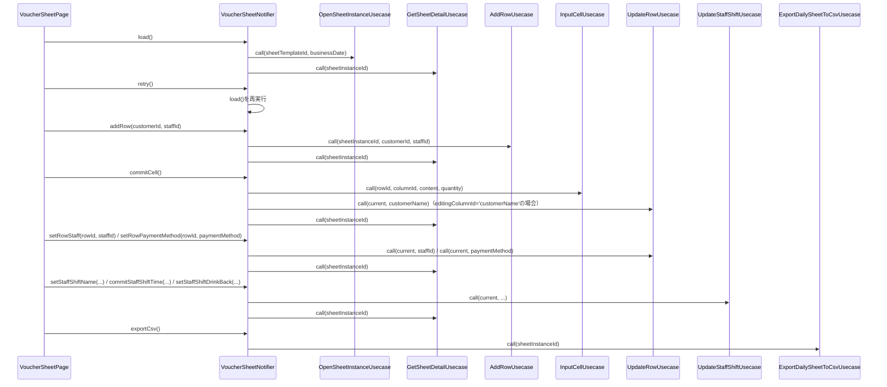

# VoucherSheetNotifier（voucher_sheet_notifier.dart）

| 新規作成・更新日 | 作成・更新者名 | 作成・更新内容 |
|---|---|---|
| 2026-09-25 | minamiyama | 新規作成 |
| 2026-09-27 | minamiyama | お名前の更新を[commitCell](#commitcell)に統合し、担当・決済方法の更新（[setRowStaff](#setrowstaff)・[setRowPaymentMethod](#setrowpaymentmethod)）、スタッフ欄の更新（[setStaffShiftName](#setstaffshiftname)・[startEditingStaffShiftTime](#starteditingstaffshifttime)・[commitStaffShiftTime](#commitstaffshifttime)・[setStaffShiftDrinkBack](#setstaffshiftdrinkback)）を追加（[agents.md](../../../../../../../requried/agents.md)を反映） |
| 2026-09-29 | minamiyama | [VoucherSheetGrid](../widgets/voucher_sheet_grid.md)導入に伴う呼び出し元の変更（旧`VoucherDataRow`→[VoucherNameCell](../widgets/voucher_name_cell.md)・[VoucherTotalCell](../widgets/voucher_total_cell.md)）を反映してリンクを更新（処理内容自体に変更はない） |
| 2026-10-03 | minamiyama | [commitStaffShiftTime](#commitstaffshifttime)で入力値を[normalizeHHmm](../../../../core/utils/time_format.md#normalizehhmm)により`HH:mm`形式へ正規化し、形式不正の場合は保存せず`cellInputFailed`を通知するよう変更。保存待ちの間に別の時刻ボタンがタップされた場合に、その編集状態を消さないよう、編集状態の解除を確定対象と一致する場合のみに限定 |

## 処理概要

伝票入力画面（`MMM_001_VOUCHER`）の状態（[VoucherSheetState](./voucher_sheet_state.md)）を管理するRiverpod Notifier。伝票インスタンスの読込・行追加・セル入力・行の付帯情報（お名前・担当・決済方法）更新・スタッフ欄更新・CSV出力（FR-1〜FR-3）を担う。`sheetTemplateId`・`businessDate`はコンストラクタ引数として受け取り、`sheetInstanceId`は`load`実行後にNotifier内部（状態外）で保持する。

## 依存

- [OpenSheetInstanceUsecase](../../domain/usecases/open_sheet_instance_usecase.md)（Domain層）
- [GetSheetDetailUsecase](../../domain/usecases/get_sheet_detail_usecase.md)（Domain層）
- [AddRowUsecase](../../domain/usecases/add_row_usecase.md)（Domain層）
- [InputCellUsecase](../../domain/usecases/input_cell_usecase.md)（Domain層）
- [UpdateRowUsecase](../../domain/usecases/update_row_usecase.md)（Domain層）
- [UpdateStaffShiftUsecase](../../domain/usecases/update_staff_shift_usecase.md)（Domain層）
- [ExportDailySheetToCsvUsecase](../../domain/usecases/export_daily_sheet_to_csv_usecase.md)（Domain層）

## 処理シーケンス図

```mermaid
sequenceDiagram
    participant P as VoucherSheetPage
    participant N as VoucherSheetNotifier
    participant OSI as OpenSheetInstanceUsecase
    participant GSD as GetSheetDetailUsecase
    participant AR as AddRowUsecase
    participant IC as InputCellUsecase
    participant UR as UpdateRowUsecase
    participant USS as UpdateStaffShiftUsecase
    participant EDC as ExportDailySheetToCsvUsecase

    P->>N: load()
    N->>OSI: call(sheetTemplateId, businessDate)
    N->>GSD: call(sheetInstanceId)

    P->>N: retry()
    N->>N: load()を再実行

    P->>N: addRow(customerId, staffId)
    N->>AR: call(sheetInstanceId, customerId, staffId)
    N->>GSD: call(sheetInstanceId)

    P->>N: commitCell()
    N->>IC: call(rowId, columnId, content, quantity)
    N->>UR: call(current, customerName)（editingColumnId='customerName'の場合）
    N->>GSD: call(sheetInstanceId)

    P->>N: setRowStaff(rowId, staffId) / setRowPaymentMethod(rowId, paymentMethod)
    N->>UR: call(current, staffId) / call(current, paymentMethod)
    N->>GSD: call(sheetInstanceId)

    P->>N: setStaffShiftName(...) / commitStaffShiftTime(...) / setStaffShiftDrinkBack(...)
    N->>USS: call(current, ...)
    N->>GSD: call(sheetInstanceId)

    P->>N: exportCsv()
    N->>EDC: call(sheetInstanceId)
```

## load

### 処理概要
画面生成時に呼び出され、伝票インスタンスを取得（なければ新規作成）し、表示用の[SheetDetail](../../domain/entities/sheet_detail.md)を読み込む。

### input

なし（コンストラクタで受け取った`sheetTemplateId`・`businessDate`を使用する）

### output

| 項目論理名 | 項目物理名 | カプセルの型 | データ型 | 備考 |
|---|---|---|---|---|
| - | - | - | void | 結果は[VoucherSheetState](./voucher_sheet_state.md)の更新として反映される |

### exception

なし（例外は捕捉し`status=error`として状態に反映するため、呼び出し元には送出しない）

### 処理詳細
1. `status=loading`とした状態を反映する。
2. [OpenSheetInstanceUsecase.call](../../domain/usecases/open_sheet_instance_usecase.md)を`sheetTemplateId`・`businessDate`で呼び出し、変数`instance`に格納する。\
   条件a: 例外が送出された場合、`status=error`・`errorMessage`に例外メッセージを設定した状態を反映し、処理を終了する。\
   条件b: 成功した場合、次のステップへ進む。
3. `instance.sheetInstanceId`を、以降の`addRow`/`commitCell`/`exportCsv`で使うため、Notifier内部の変数`_sheetInstanceId`に保持する（状態には含めない）。
4. [GetSheetDetailUsecase.call](../../domain/usecases/get_sheet_detail_usecase.md)を`_sheetInstanceId`で呼び出し、変数`detail`に格納する。\
   条件a: 例外が送出された場合、`status=error`・`errorMessage`に例外メッセージを設定した状態を反映し、処理を終了する。\
   条件b: 成功した場合、次のステップへ進む。
5. 条件a: `detail.rows`が空の場合、`status=empty`・`sheetDetail=detail`とした状態を反映する。\
   条件b: `detail.rows`が空でない場合、`status=success`・`sheetDetail=detail`とした状態を反映する。

### 変数一覧

| 変数論理名 | 変数物理名 | データ型 | 格納値 | 備考欄 |
|---|---|---|---|---|
| 伝票インスタンス | instance | [SheetInstance](../../domain/entities/sheet_instance.md) | [OpenSheetInstanceUsecase.call](../../domain/usecases/open_sheet_instance_usecase.md)の返却値 | - |
| 伝票詳細 | detail | [SheetDetail](../../domain/entities/sheet_detail.md) | [GetSheetDetailUsecase.call](../../domain/usecases/get_sheet_detail_usecase.md)の返却値 | - |

## retry

### 処理概要
Error状態からの再試行。[load](#load)を再実行する。

### input

なし

### output

| 項目論理名 | 項目物理名 | カプセルの型 | データ型 | 備考 |
|---|---|---|---|---|
| - | - | - | void | - |

### exception

なし

### 処理詳細
1. [load](#load)を呼び出す。

## addRow

### 処理概要
現在の伝票インスタンスに1組の来店・卓を追加し、表示を更新する。

### input

| 項目論理名 | 項目物理名 | カプセルの型 | データ型 | バリデーション | 備考 |
|---|---|---|---|---|---|
| 顧客ID | customerId | optional | string | 任意 | 未登録の来店は`null` |
| スタッフID | staffId | optional | string | 任意 | - |

### output

| 項目論理名 | 項目物理名 | カプセルの型 | データ型 | 備考 |
|---|---|---|---|---|
| - | - | - | void | 結果は[VoucherSheetState](./voucher_sheet_state.md)の更新として反映される |

### exception

なし（例外は捕捉し、[副作用仕様](#副作用side-effect仕様)の`cellInputFailed`と同様に画面上部のお知らせ表示で通知する）

### 処理詳細
1. [AddRowUsecase.call](../../domain/usecases/add_row_usecase.md)を`_sheetInstanceId`・`customerId`・`staffId`で呼び出す。\
   条件a: 例外が送出された場合、`message`に例外メッセージを設定した[VoucherSheetEffect](./voucher_sheet_effect.md)（`kind=cellInputFailed`）を発行し、処理を終了する（画面の状態は`success`のまま維持する）。\
   条件b: 成功した場合、次のステップへ進む。
2. [GetSheetDetailUsecase.call](../../domain/usecases/get_sheet_detail_usecase.md)を`_sheetInstanceId`で呼び出し、変数`detail`に格納する。
3. `status=success`・`sheetDetail=detail`とした状態を反映する。

### 変数一覧

| 変数論理名 | 変数物理名 | データ型 | 格納値 | 備考欄 |
|---|---|---|---|---|
| 伝票詳細 | detail | [SheetDetail](../../domain/entities/sheet_detail.md) | [GetSheetDetailUsecase.call](../../domain/usecases/get_sheet_detail_usecase.md)の返却値 | 再読込した最新の表示データ |

## startEditingCell

### 処理概要
セルタップ時に呼び出され、編集中セルの位置と初期テキストを状態に反映する（DB・usecase呼び出しなし）。

### input

| 項目論理名 | 項目物理名 | カプセルの型 | データ型 | バリデーション | 備考 |
|---|---|---|---|---|---|
| 行ID | rowId | - | string | 必須 | - |
| 列ID | columnId | - | string | 必須 | - |
| 初期テキスト | initialText | - | string | 必須 | タップされたセルの現在表示値 |

### output

| 項目論理名 | 項目物理名 | カプセルの型 | データ型 | 備考 |
|---|---|---|---|---|
| - | - | - | void | - |

### exception

なし

### 処理詳細
1. `editingRowId=rowId`・`editingColumnId=columnId`・`editingText=initialText`とした状態を反映する。

## updateEditingText

### 処理概要
編集中セルのテキストフィールド入力値の変化を状態に反映する（DB・usecase呼び出しなし）。

### input

| 項目論理名 | 項目物理名 | カプセルの型 | データ型 | バリデーション | 備考 |
|---|---|---|---|---|---|
| 入力テキスト | text | - | string | 必須 | - |

### output

| 項目論理名 | 項目物理名 | カプセルの型 | データ型 | 備考 |
|---|---|---|---|---|
| - | - | - | void | - |

### exception

なし

### 処理詳細
1. `editingText=text`とした状態を反映する。

## commitCell

### 処理概要
編集中セルの入力を確定し保存する。`editingColumnId`が実在の列IDの場合は[InputCellUsecase](../../domain/usecases/input_cell_usecase.md)へ、特別な値`'customerName'`（「お名前」列。[VoucherNameCell](../widgets/voucher_name_cell.md)が`onCellTap`にこの値を渡す）の場合は[UpdateRowUsecase](../../domain/usecases/update_row_usecase.md)へ保存する。列の価格対象フラグに応じて`content`または`quantity`のいずれかとして送信する。

### input

なし（状態が保持する`editingRowId`・`editingColumnId`・`editingText`、および対象列の`isPriced`を使用する）

### output

| 項目論理名 | 項目物理名 | カプセルの型 | データ型 | 備考 |
|---|---|---|---|---|
| - | - | - | void | 結果は[VoucherSheetState](./voucher_sheet_state.md)の更新として反映される |

### exception

なし（例外は捕捉し、[副作用仕様](#副作用side-effect仕様)で通知する）

### 処理詳細
1. 条件a: `editingColumnId`が`'customerName'`の場合、`sheetDetail.rows`から`editingRowId`に一致する行を取得し変数`currentRow`に格納したうえで、[UpdateRowUsecase.call](../../domain/usecases/update_row_usecase.md)を`current=currentRow`・`customerName=editingText`で呼び出し、ステップ4へ進む。\
   条件b: 上記以外の場合、次のステップへ進む（通常のセル入力）。
2. `sheetDetail.headers`から`editingColumnId`に一致する列を取得し、変数`header`に格納する。
3. 条件a: `header.isPriced=true`の場合、`editingText`を数値へ変換し変数`quantity`に格納し、変数`content`に`null`を格納する。\
   条件b: `header.isPriced=false`の場合、変数`content`に`editingText`を格納し、変数`quantity`に`null`を格納する。\
   続けて[InputCellUsecase.call](../../domain/usecases/input_cell_usecase.md)を`editingRowId`・`editingColumnId`・`content`・`quantity`で呼び出す。\
   条件a: 例外が送出された場合、`message`に例外メッセージを設定した[VoucherSheetEffect](./voucher_sheet_effect.md)（`kind=cellInputFailed`）を発行し、次のステップに進まず処理を終了する（編集中の状態は維持し、利用者が再入力できるようにする）。\
   条件b: 成功した場合、次のステップへ進む。
4. [GetSheetDetailUsecase.call](../../domain/usecases/get_sheet_detail_usecase.md)を`_sheetInstanceId`で呼び出し、変数`detail`に格納する。
5. `status=success`・`sheetDetail=detail`・`editingRowId=null`・`editingColumnId=null`・`editingText=null`とした状態を反映する。

### 変数一覧

| 変数論理名 | 変数物理名 | データ型 | 格納値 | 備考欄 |
|---|---|---|---|---|
| 編集中の行 | currentRow | [SheetRow](../../domain/entities/sheet_row.md) | `sheetDetail.rows`から検索した対象行 | `editingColumnId='customerName'`の場合のみ使用 |
| 列 | header | [Header](../../domain/entities/header.md) | `sheetDetail.headers`から検索した対象列 | - |
| 数量 | quantity | int? | `editingText`の数値変換結果、または`isPriced=false`の場合は`null` | - |
| 内容 | content | string? | `editingText`、または`isPriced=true`の場合は`null` | - |
| 伝票詳細 | detail | [SheetDetail](../../domain/entities/sheet_detail.md) | [GetSheetDetailUsecase.call](../../domain/usecases/get_sheet_detail_usecase.md)の返却値 | 再読込した最新の表示データ |

## setRowStaff

### 処理概要
「担当」列プルダウンでの選択確定時に呼び出され、[UpdateRowUsecase](../../domain/usecases/update_row_usecase.md)で行の担当スタッフを更新する（フリーテキスト編集ではなくプルダウン即時確定のため、`startEditingCell`/`commitCell`は使わない）。

### input

| 項目論理名 | 項目物理名 | カプセルの型 | データ型 | バリデーション | 備考 |
|---|---|---|---|---|---|
| 行ID | rowId | - | string | 必須 | - |
| スタッフID | staffId | optional | string | 任意 | 「未定」選択時は`null` |

### output

| 項目論理名 | 項目物理名 | カプセルの型 | データ型 | 備考 |
|---|---|---|---|---|
| - | - | - | void | 結果は[VoucherSheetState](./voucher_sheet_state.md)の更新として反映される |

### exception

なし（例外は捕捉し、[副作用仕様](#副作用side-effect仕様)の`cellInputFailed`と同様に通知する）

### 処理詳細
1. `sheetDetail.rows`から`rowId`に一致する行を取得し、変数`currentRow`に格納する。
2. [UpdateRowUsecase.call](../../domain/usecases/update_row_usecase.md)を`current=currentRow`・`staffId=staffId`で呼び出す。\
   条件a: 例外が送出された場合、`message`に例外メッセージを設定した[VoucherSheetEffect](./voucher_sheet_effect.md)（`kind=cellInputFailed`）を発行し、処理を終了する。\
   条件b: 成功した場合、次のステップへ進む。
3. [GetSheetDetailUsecase.call](../../domain/usecases/get_sheet_detail_usecase.md)を`_sheetInstanceId`で呼び出し、変数`detail`に格納する。
4. `status=success`・`sheetDetail=detail`とした状態を反映する。

## setRowPaymentMethod

### 処理概要
「合計金額」列に隣接する「P」「カ」トグルのタップ時に呼び出され、[UpdateRowUsecase](../../domain/usecases/update_row_usecase.md)で行の決済方法を更新する。同じ決済方法を再度タップした場合は現金（`null`）に戻す判定は、本メソッドを呼び出す側（[VoucherTotalCell](../widgets/voucher_total_cell.md)）が現在値と比較して行う。

### input

| 項目論理名 | 項目物理名 | カプセルの型 | データ型 | バリデーション | 備考 |
|---|---|---|---|---|---|
| 行ID | rowId | - | string | 必須 | - |
| 決済方法 | paymentMethod | optional | [PaymentMethod](../../domain/entities/enums/payment_method.md) | 任意 | 現金に戻す場合は`null` |

### output

| 項目論理名 | 項目物理名 | カプセルの型 | データ型 | 備考 |
|---|---|---|---|---|
| - | - | - | void | 結果は[VoucherSheetState](./voucher_sheet_state.md)の更新として反映される |

### exception

なし（例外は捕捉し、[副作用仕様](#副作用side-effect仕様)の`cellInputFailed`と同様に通知する）

### 処理詳細
1. `sheetDetail.rows`から`rowId`に一致する行を取得し、変数`currentRow`に格納する。
2. [UpdateRowUsecase.call](../../domain/usecases/update_row_usecase.md)を`current=currentRow`・`paymentMethod=paymentMethod`で呼び出す。\
   条件a: 例外が送出された場合、`message`に例外メッセージを設定した[VoucherSheetEffect](./voucher_sheet_effect.md)（`kind=cellInputFailed`）を発行し、処理を終了する。\
   条件b: 成功した場合、次のステップへ進む。
3. [GetSheetDetailUsecase.call](../../domain/usecases/get_sheet_detail_usecase.md)を`_sheetInstanceId`で呼び出し、変数`detail`に格納する（`dailySummary`の再集計を含む）。
4. `status=success`・`sheetDetail=detail`とした状態を反映する。

## setStaffShiftName

### 処理概要
[VoucherStaffBar](../widgets/voucher_staff_bar.md)の氏名プルダウンでの選択確定時に呼び出され、[UpdateStaffShiftUsecase](../../domain/usecases/update_staff_shift_usecase.md)でシフトの氏名を更新する。

### input

| 項目論理名 | 項目物理名 | カプセルの型 | データ型 | バリデーション | 備考 |
|---|---|---|---|---|---|
| シフトID | shiftId | - | string | 必須 | - |
| スタッフID | staffId | optional | string | 任意 | 「未定」選択時は`null` |

### output

| 項目論理名 | 項目物理名 | カプセルの型 | データ型 | 備考 |
|---|---|---|---|---|
| - | - | - | void | 結果は[VoucherSheetState](./voucher_sheet_state.md)の更新として反映される |

### exception

なし（例外は[副作用仕様](#副作用side-effect仕様)の`cellInputFailed`と同様に通知する）

### 処理詳細
1. `sheetDetail.staffShifts`から`shiftId`に一致するシフトを取得し、変数`currentShift`に格納する。
2. [UpdateStaffShiftUsecase.call](../../domain/usecases/update_staff_shift_usecase.md)を`current=currentShift`・`staffId=staffId`で呼び出す。
3. [GetSheetDetailUsecase.call](../../domain/usecases/get_sheet_detail_usecase.md)を`_sheetInstanceId`で呼び出し、変数`detail`に格納する。
4. `status=success`・`sheetDetail=detail`とした状態を反映する。

## setStaffShiftDrinkBack

### 処理概要
[VoucherStaffBar](../widgets/voucher_staff_bar.md)のドリンクバック入力欄のフォーカスアウト時に呼び出され、[UpdateStaffShiftUsecase](../../domain/usecases/update_staff_shift_usecase.md)でシフトのドリンクバックを更新する。

### input

| 項目論理名 | 項目物理名 | カプセルの型 | データ型 | バリデーション | 備考 |
|---|---|---|---|---|---|
| シフトID | shiftId | - | string | 必須 | - |
| ドリンクバック | drinkBack | - | string | 必須（空文字列許容） | - |

### output

| 項目論理名 | 項目物理名 | カプセルの型 | データ型 | 備考 |
|---|---|---|---|---|
| - | - | - | void | 結果は[VoucherSheetState](./voucher_sheet_state.md)の更新として反映される |

### exception

なし

### 処理詳細
1. `sheetDetail.staffShifts`から`shiftId`に一致するシフトを取得し、変数`currentShift`に格納する。
2. [UpdateStaffShiftUsecase.call](../../domain/usecases/update_staff_shift_usecase.md)を`current=currentShift`・`drinkBack=drinkBack`で呼び出す。
3. [GetSheetDetailUsecase.call](../../domain/usecases/get_sheet_detail_usecase.md)を`_sheetInstanceId`で呼び出し、変数`detail`に格納する。
4. `status=success`・`sheetDetail=detail`とした状態を反映する。

## startEditingStaffShiftTime

### 処理概要
就業時刻ボタンのタップ時に呼び出され、編集中シフトの位置を状態に反映する（DB・usecase呼び出しなし）。

### input

| 項目論理名 | 項目物理名 | カプセルの型 | データ型 | バリデーション | 備考 |
|---|---|---|---|---|---|
| シフトID | shiftId | - | string | 必須 | - |
| 項目 | field | - | string | 必須, `'start'`または`'end'` | - |

### output

| 項目論理名 | 項目物理名 | カプセルの型 | データ型 | 備考 |
|---|---|---|---|---|
| - | - | - | void | - |

### exception

なし

### 処理詳細
1. `editingStaffShiftId=shiftId`・`editingStaffShiftField=field`とした状態を反映する。

## commitStaffShiftTime

### 処理概要
就業時刻編集（`<input type="time">`相当）の確定時に呼び出され、[UpdateStaffShiftUsecase](../../domain/usecases/update_staff_shift_usecase.md)でシフトの時刻を更新する。

### input

| 項目論理名 | 項目物理名 | カプセルの型 | データ型 | バリデーション | 備考 |
|---|---|---|---|---|---|
| 時刻 | value | - | string | 必須 | 時刻入力欄の入力値。`H:mm`・`HH:mm`・`Hmm`・`HHmm`（全角可）を受け付け、`HH:mm`に正規化する |

### output

| 項目論理名 | 項目物理名 | カプセルの型 | データ型 | 備考 |
|---|---|---|---|---|
| - | - | - | void | 結果は[VoucherSheetState](./voucher_sheet_state.md)の更新として反映される |

### exception

なし（例外は[副作用仕様](#副作用side-effect仕様)の`cellInputFailed`と同様に通知する）

### 処理詳細
1. `editingStaffShiftId`・`editingStaffShiftField`をそれぞれ変数`shiftId`・`field`に格納する。\
   条件a: いずれかが`null`（編集中でない）の場合、処理を終了する。\
   条件b: いずれも`null`でない場合、次の手順へ進む。
2. [normalizeHHmm](../../../../core/utils/time_format.md#normalizehhmm)を`value`で呼び出し、変数`time`に格納する。\
   条件a: `time`が`null`（形式不正）の場合、手順5の編集状態の解除を行い、`cellInputFailed`（メッセージ: `時刻はHH:mm形式（例: 18:30）で入力してください`）を通知して処理を終了する（DBは更新しない）。\
   条件b: `null`でない場合、次の手順へ進む。
3. `sheetDetail.staffShifts`から`shiftId`に一致するシフトを取得し、変数`currentShift`に格納する。
4. 条件a: `field='start'`の場合、[UpdateStaffShiftUsecase.call](../../domain/usecases/update_staff_shift_usecase.md)を`current=currentShift`・`startTime=time`で呼び出す。\
   条件b: `field='end'`の場合、`endTime=time`で呼び出す。
5. `editingStaffShiftId=shiftId`かつ`editingStaffShiftField=field`のままの場合のみ、`editingStaffShiftId=null`・`editingStaffShiftField=null`とした状態を反映する（保存待ちの間に別の時刻ボタンがタップされた場合は、その編集状態を維持する）。
6. [GetSheetDetailUsecase.call](../../domain/usecases/get_sheet_detail_usecase.md)を`_sheetInstanceId`で呼び出し、変数`detail`に格納する。
7. `status=success`・`sheetDetail=detail`とした状態を反映する。

| 変数論理名 | 変数物理名 | データ型 | 格納値 | 備考 |
|---|---|---|---|---|
| 編集中シフトID | shiftId | string | `editingStaffShiftId` | - |
| 編集中項目 | field | string | `editingStaffShiftField` | `'start'`または`'end'` |
| 正規化済み時刻 | time | string（optional） | `normalizeHHmm(value)`の戻り値 | 例: `18:30`。形式不正の場合は`null`となり、手順2の条件aで処理を終了する |
| 対象シフト | currentShift | StaffShift | `sheetDetail.staffShifts`の該当要素 | - |

## exportCsv

### 処理概要
現在の伝票インスタンスをCSVとして出力する。

### input

なし

### output

| 項目論理名 | 項目物理名 | カプセルの型 | データ型 | 備考 |
|---|---|---|---|---|
| - | - | - | void | 結果は[VoucherSheetEffect](./voucher_sheet_effect.md)として通知される |

### exception

なし（例外は捕捉し、[副作用仕様](#副作用side-effect仕様)で通知する）

### 処理詳細
1. `isExporting=true`とした状態を反映する。
2. [ExportDailySheetToCsvUsecase.call](../../domain/usecases/export_daily_sheet_to_csv_usecase.md)を`_sheetInstanceId`で呼び出し、変数`csvContent`に格納する。\
   条件a: 例外が送出された場合、`message`に例外メッセージを設定した[VoucherSheetEffect](./voucher_sheet_effect.md)（`kind=exportFailed`）を発行する。\
   条件b: 成功した場合、`csvContent`と固定文言「CSV出力が完了しました」を`message`に設定した[VoucherSheetEffect](./voucher_sheet_effect.md)（`kind=exportSucceeded`）を発行する。
3. `isExporting=false`とした状態を反映する。

### 変数一覧

| 変数論理名 | 変数物理名 | データ型 | 格納値 | 備考欄 |
|---|---|---|---|---|
| CSV文字列 | csvContent | string | [ExportDailySheetToCsvUsecase.call](../../domain/usecases/export_daily_sheet_to_csv_usecase.md)の返却値 | 成功時のみ使用 |

## 状態遷移仕様

| 現在の状態(論理名/物理名) | 契機（イベント/操作） | 遷移後の状態(論理名/物理名) | 処理内容・更新されるプロパティ |
|---|---|---|---|
| 初期／initial | 画面生成（[VoucherSheetPage](../pages/voucher_sheet_page.md)の初期化） | 読込中／loading | [load](#load)を呼び出す |
| 読込中／loading | [load](#load)成功・行1件以上 | 成功／success | `sheetDetail`を設定 |
| 読込中／loading | [load](#load)成功・行0件 | 空／empty | `sheetDetail`を設定 |
| 読込中／loading | [load](#load)失敗 | エラー／error | `errorMessage`を設定 |
| エラー／error | 再試行ボタン押下 | 読込中／loading | [retry](#retry)→[load](#load)を呼び出す |
| 成功／success, 空／empty | 行追加ボタン押下 | 成功／success, 空／empty（結果により変化） | [addRow](#addrow)を実行し、成功後`sheetDetail`を再設定。失敗時は状態を変えず`cellInputFailed`副作用を発行 |
| 成功／success | セルタップ | 成功／success | [startEditingCell](#starteditingcell)で`editingRowId`・`editingColumnId`・`editingText`を設定（状態自体は`success`のまま） |
| 成功／success（編集中） | テキスト入力変化 | 成功／success | [updateEditingText](#updateeditingtext)で`editingText`を更新 |
| 成功／success（編集中） | 編集確定（フォーカスアウト／Enter） | 成功／success | [commitCell](#commitcell)を実行し、成功時`sheetDetail`を再設定して`editingRowId`等をクリア。失敗時は編集中のまま`cellInputFailed`副作用を発行 |
| 成功／success | 「担当」列プルダウン選択／「合計金額」列「P」「カ」トグル | 成功／success | [setRowStaff](#setrowstaff)／[setRowPaymentMethod](#setrowpaymentmethod)を実行し、成功時`sheetDetail`を再設定（`dailySummary`の再集計を含む）。失敗時は`cellInputFailed`副作用を発行 |
| 成功／success | [VoucherStaffBar](../widgets/voucher_staff_bar.md)の氏名プルダウン選択／ドリンクバック入力確定 | 成功／success | [setStaffShiftName](#setstaffshiftname)／[setStaffShiftDrinkBack](#setstaffshiftdrinkback)を実行し、成功後`sheetDetail`を再設定 |
| 成功／success | 就業時刻ボタンタップ | 成功／success | [startEditingStaffShiftTime](#starteditingstaffshifttime)で`editingStaffShiftId`・`editingStaffShiftField`を設定（状態自体は`success`のまま） |
| 成功／success（シフト時刻編集中） | 時刻編集確定（Enter／欄の外のタップ／フォーカスアウト） | 成功／success | [commitStaffShiftTime](#commitstaffshifttime)を実行し、成功時`sheetDetail`を再設定して`editingStaffShiftId`等をクリア。形式不正の場合は保存せず`editingStaffShiftId`等をクリアし`cellInputFailed`副作用を発行 |
| 成功／success | CSV出力ボタン押下 | 成功／success | [exportCsv](#exportcsv)を実行し、`isExporting`を`true`→`false`に更新。結果は副作用で通知 |

## 副作用（Side Effect）仕様

| 契機 | 発行する[VoucherSheetEffect](./voucher_sheet_effect.md) | UI側の処理 |
|---|---|---|
| [addRow](#addrow)・[commitCell](#commitcell)・[setRowStaff](#setrowstaff)・[setRowPaymentMethod](#setrowpaymentmethod)の失敗 | `kind=cellInputFailed`, `message`=例外メッセージ | 画面上部に[NoticeBanner](../../../../core/widgets/notice_banner.md)（`tone=error`）でエラーメッセージを表示する |
| [commitStaffShiftTime](#commitstaffshifttime)の入力値の形式不正・失敗 | `kind=cellInputFailed`, `message`=`時刻はHH:mm形式（例: 18:30）で入力してください`（形式不正時）または例外メッセージ | 画面上部に[NoticeBanner](../../../../core/widgets/notice_banner.md)（`tone=error`）でエラーメッセージを表示する |
| [exportCsv](#exportcsv)の成功 | `kind=exportSucceeded`, `csvContent`=CSV文字列 | OS標準の共有シート（Share）を表示し、CSVファイルとして共有・保存できるようにする。あわせて画面上部に[NoticeBanner](../../../../core/widgets/notice_banner.md)（`tone=success`）で完了メッセージを表示する |
| [exportCsv](#exportcsv)の失敗 | `kind=exportFailed`, `message`=例外メッセージ | 画面上部に[NoticeBanner](../../../../core/widgets/notice_banner.md)（`tone=error`）でエラーメッセージを表示する |
