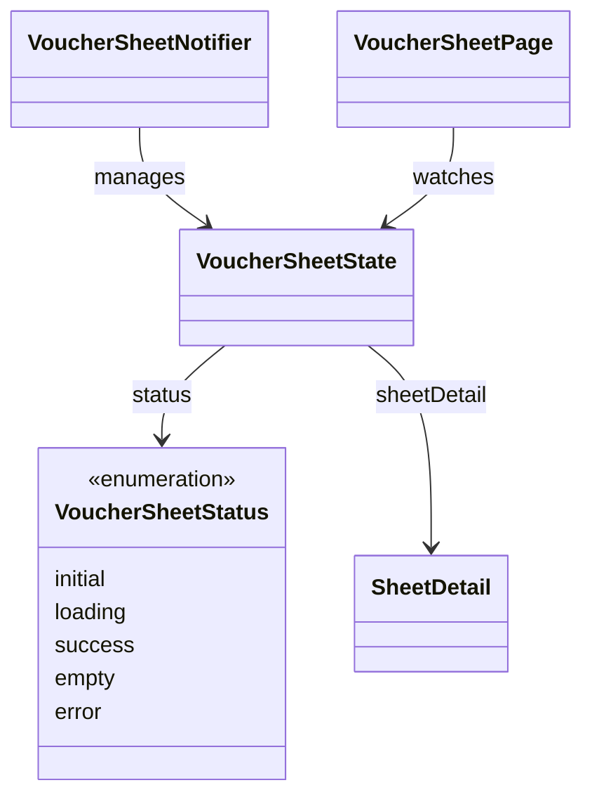

# VoucherSheetState（voucher_sheet_state.dart）

| 新規作成・更新日 | 作成・更新者名 | 作成・更新内容 |
|---|---|---|
| 2026-09-25 | minamiyama | 新規作成 |

## 概要

伝票入力画面（`ENT_001_VOUCHER`）のUI状態（UiState）を表すクラス。[VoucherSheetNotifier](./voucher_sheet_notifier.md)が保持・更新し、[VoucherSheetPage](../pages/voucher_sheet_page.md)が監視（watch）する。ライフサイクル状態は`status`（`VoucherSheetStatus`列挙型、本ファイル内に同居させる）で表現し、単一のクラスが初期・読込中・成功・エラー・空のすべての状態を`status`と各プロパティの組み合わせで表現する。

`VoucherSheetStatus`の値:
- `initial`: 画面生成直後、まだ読み込みを開始していない状態
- `loading`: [GetSheetDetailUsecase](../../domain/usecases/get_sheet_detail_usecase.md)等の実行中（インジケータ表示用）
- `success`: [SheetDetail](../../domain/entities/sheet_detail.md)の`rows`が1件以上あり、画面描画が可能な状態
- `empty`: 取得できたが`rows`が0件の状態（空状態専用UI表示用）
- `error`: 取得・更新に失敗した異常系（エラーメッセージ・再試行ボタン表示用）

## 依存関係シーケンス図

## 項目一覧

| 項目論理名 | 項目物理名 | カプセルの型 | データ型 | バリデーション | 備考 |
|---|---|---|---|---|---|
| 画面状態 | status | - | VoucherSheetStatus | 必須 | デフォルト`initial` |
| 伝票詳細 | sheetDetail | optional | [SheetDetail](../../domain/entities/sheet_detail.md) | `status`が`success`/`empty`の場合のみ非`null` | 画面に表示するデータ本体 |
| エラーメッセージ | errorMessage | optional | string | `status`が`error`の場合のみ非`null` | [RecordNotFoundException](../../../../core/errors/record_not_found_exception.md)・[ValidationException](../../../../core/errors/validation_exception.md)等のメッセージ |
| 編集中の行ID | editingRowId | optional | string | 任意 | セル編集中のみ非`null`。テキスト入力欄の現在値の一部 |
| 編集中の列ID | editingColumnId | optional | string | 任意 | セル編集中のみ非`null`。テキスト入力欄の現在値の一部 |
| 編集中の入力テキスト | editingText | optional | string | 任意 | セル編集中のテキストフィールドの現在値（未確定の入力中の値） |
| CSV出力中フラグ | isExporting | - | bool | 必須 | デフォルト`false`。[ExportDailySheetToCsvUsecase](../../domain/usecases/export_daily_sheet_to_csv_usecase.md)実行中は`true` |
