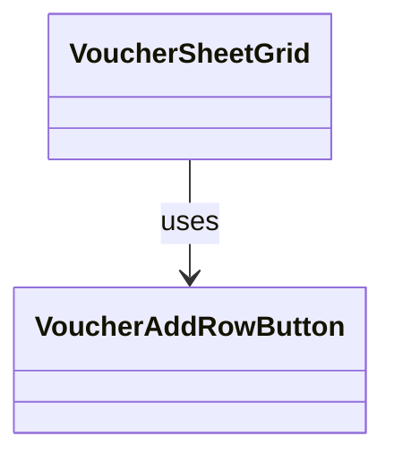

# VoucherAddRowButton（voucher_add_row_button.dart）

| 新規作成・更新日 | 作成・更新者名 | 作成・更新内容 |
|---|---|---|
| 2026-09-27 | minamiyama | 新規作成。画面右下のFloatingActionButtonから、表内・[VoucherDailySummaryRow](./voucher_daily_summary_row.md)の一つ前の行への変更に伴い新設 |
| 2026-09-29 | minamiyama | [VoucherSheetGrid](./voucher_sheet_grid.md)導入に伴い、「お名前」列と同じ横スクロールしない固定領域の最終行として配置するよう変更。全列にまたがるセルではなくなったため`columnCount`引数を削除 |

## 概要

「行を追加」ボタンを表すウィジェット。[VoucherSheetGrid](./voucher_sheet_grid.md)の「お名前」列（左端固定領域）のデータ行一覧の最後、[VoucherDailySummaryRow](./voucher_daily_summary_row.md)（本日の合計行）の直前に配置する。「お名前」列と同じ固定領域に属するため、価格列側を横スクロールしても常に視認できる。縦スクロールでは他の行と同様に通常どおり流れる。タップで行を追加する（FR-1）。画面内でのみ使用する。

## 依存関係シーケンス図

## 項目一覧（コンストラクタ引数）

| 項目論理名 | 項目物理名 | カプセルの型 | データ型 | バリデーション | 備考 |
|---|---|---|---|---|---|
| タップ時コールバック | onTap | - | function() -> void | 必須 | [VoucherSheetNotifier.addRow](../controllers/voucher_sheet_notifier.md#addrow)を呼び出す |

## 表示ルール

- 縦方向: 固定表示しない（「お名前」列内の通常の行として、末尾までスクロールすると見える）。
- 横方向: 「お名前」列と同じ固定領域に属するため、価格列側の横スクロール位置に関わらず常に視認できる（[VoucherSheetGrid](./voucher_sheet_grid.md)参照）。
