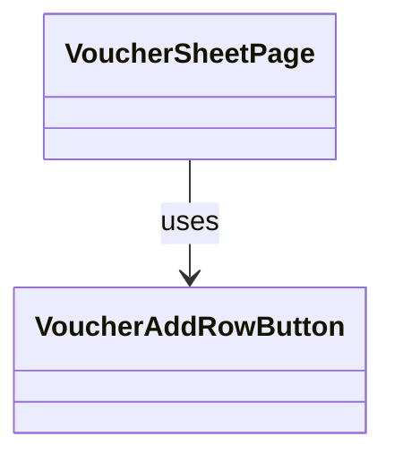

# VoucherAddRowButton（voucher_add_row_button.dart）

| 新規作成・更新日 | 作成・更新者名 | 作成・更新内容 |
|---|---|---|
| 2026-09-27 | minamiyama | 新規作成。画面右下のFloatingActionButtonから、表内・[VoucherDailySummaryRow](./voucher_daily_summary_row.md)の一つ前の行への変更に伴い新設 |

## 概要

「行を追加」ボタンを表す行ウィジェット。[VoucherDataRow](./voucher_data_row.md)一覧の最後、[VoucherDailySummaryRow](./voucher_daily_summary_row.md)（本日の合計行）の直前の行として表に組み込む。縦スクロールでは他の行と同様に通常どおり流れる一方、横スクロール（価格列が多いため）ではボタン自体を「お名前」列の右隣に水平方向のみ固定表示し、どの位置までスクロールしても見失わないようにする。タップで行を追加する（FR-1）。画面内でのみ使用する。

## 依存関係シーケンス図

## 項目一覧（コンストラクタ引数）

| 項目論理名 | 項目物理名 | カプセルの型 | データ型 | バリデーション | 備考 |
|---|---|---|---|---|---|
| 列数 | columnCount | - | int | 必須 | セルを列全体にまたがって描画するための合計列数（お名前＋価格列＋MEMO＋合計金額＋担当）。[VoucherHeaderRow](./voucher_header_row.md)と揃える |
| タップ時コールバック | onTap | - | function() -> void | 必須 | [VoucherSheetNotifier.addRow](../controllers/voucher_sheet_notifier.md#addrow)を呼び出す |

## 表示ルール

- 縦方向: 固定表示しない（通常の行として、末尾までスクロールすると見える）。
- 横方向: ボタン自体を「お名前」列の右隣（水平スクロール位置に関わらず一定の位置）に固定表示する（sticky）。行を囲むセル自体は全列にまたがる1つのセルとして描画する。
