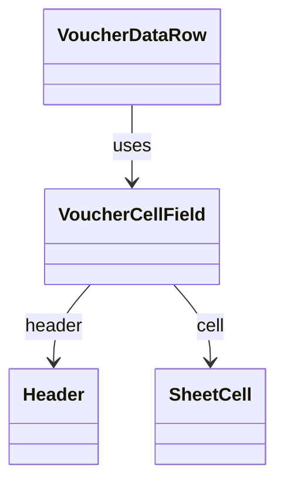

# VoucherCellField（voucher_cell_field.dart）

| 新規作成・更新日 | 作成・更新者名 | 作成・更新内容 |
|---|---|---|
| 2026-09-25 | minamiyama | 新規作成 |

## 概要

[VoucherDataRow](./voucher_data_row.md)内の1セル分の入力ウィジェット。列（[Header](../../domain/entities/header.md)）の`isPriced`に応じて、数量入力（数値キーボード）またはテキスト入力を切り替える。非編集時は保存済みの[SheetCell](../../domain/entities/sheet_cell.md)の表示値（`isPriced=true`の場合は`quantity`、`false`の場合は`content`）を表示する。画面内でのみ使用する。

## 依存関係シーケンス図

## 項目一覧（コンストラクタ引数）

| 項目論理名 | 項目物理名 | カプセルの型 | データ型 | バリデーション | 備考 |
|---|---|---|---|---|---|
| 列 | header | - | [Header](../../domain/entities/header.md) | 必須 | `isPriced`で入力方式を切り替える |
| セル | cell | optional | [SheetCell](../../domain/entities/sheet_cell.md) | 任意 | 未入力の場合は`null`。表示値なしとして描画する |
| 編集中フラグ | isEditing | - | bool | 必須 | `true`の場合、テキスト入力欄を表示する |
| 編集中の入力テキスト | editingText | optional | string | `isEditing=true`の場合のみ使用 | - |
| タップ時コールバック | onTap | - | function() -> void | 必須 | 親（[VoucherDataRow](./voucher_data_row.md)）の`onCellTap`へ列IDと現在の表示値を渡して呼び出す |
| テキスト変更時コールバック | onChanged | - | function(text: string) -> void | 必須 | 親の`onTextChanged`をそのまま呼び出す |
| 入力確定時コールバック | onSubmitted | - | function() -> void | 必須 | 親の`onCommit`をそのまま呼び出す |
