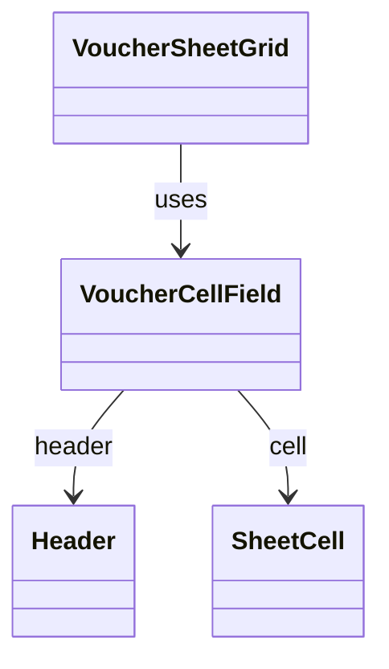

# VoucherCellField（voucher_cell_field.dart）

| 新規作成・更新日 | 作成・更新者名 | 作成・更新内容 |
|---|---|---|
| 2026-09-25 | minamiyama | 新規作成 |
| 2026-09-29 | minamiyama | [VoucherSheetGrid](./voucher_sheet_grid.md)導入に伴い、使用元を旧`VoucherDataRow`から[VoucherSheetGrid](./voucher_sheet_grid.md)に変更 |
| 2026-09-29 | minamiyama | `isPriced=true`（MEMO以外）の列について、テキスト入力（数値キーボード）から数量の増減ボタン（スピンボタン）方式に変更。MEMO列（`isPriced=false`）は従来どおりタップして編集するテキスト入力のまま |

## 概要

[VoucherSheetGrid](./voucher_sheet_grid.md)内で1セル分の入力を表すウィジェット。列（[Header](../../domain/entities/header.md)）の`isPriced=true`（MEMO以外）の場合は数量の増減ボタン（スピンボタン）、`false`（MEMO列）の場合はタップして編集するテキスト入力を表示する。画面内でのみ使用する。

## 依存関係シーケンス図

```mermaid
classDiagram
    VoucherSheetGrid --> VoucherCellField : uses
    VoucherCellField --> Header : header
    VoucherCellField --> SheetCell : cell
```

## 項目一覧（コンストラクタ引数）

| 項目論理名 | 項目物理名 | カプセルの型 | データ型 | バリデーション | 備考 |
|---|---|---|---|---|---|
| 列 | header | - | [Header](../../domain/entities/header.md) | 必須 | `isPriced`で入力方式を切り替える |
| セル | cell | optional | [SheetCell](../../domain/entities/sheet_cell.md) | 任意 | 未入力の場合は`null`。`isPriced=true`は数量0、`false`は表示値なしとして描画する |
| 編集中フラグ | isEditing | - | bool | 必須 | MEMO列（`isPriced=false`）でのみ使用。`true`の場合、テキスト入力欄を表示する |
| 編集中の入力テキスト | editingText | optional | string | `isEditing=true`の場合のみ使用 | MEMO列でのみ使用 |
| タップ時コールバック | onTap | - | function() -> void | 必須 | 親（[VoucherSheetGrid](./voucher_sheet_grid.md)）の`onCellTap`へ列IDと現在の表示値を渡して呼び出す |
| テキスト変更時コールバック | onChanged | - | function(text: string) -> void | 必須 | 親の`onTextChanged`をそのまま呼び出す |
| 入力確定時コールバック | onSubmitted | - | function() -> void | 必須 | 親の`onCommit`をそのまま呼び出す |

## 表示ルール

- `header.isPriced=true`（MEMO以外）の場合: `cell?.quantity ?? 0`を中央に、左右に「-」「＋」の増減ボタン（スピンボタン）を表示する。「-」ボタンは数量が0の場合は無効化する。ボタン押下時は、押下後の数量を`onTap`→`onChanged`→`onSubmitted`の順に呼び出して即時確定する（`isEditing`/`editingText`は使用しない）。
- `header.isPriced=false`（MEMO列）の場合: 従来どおり、非編集時は`cell?.content`（未入力は「–」）を表示し、タップでテキスト入力欄に切り替わる。
