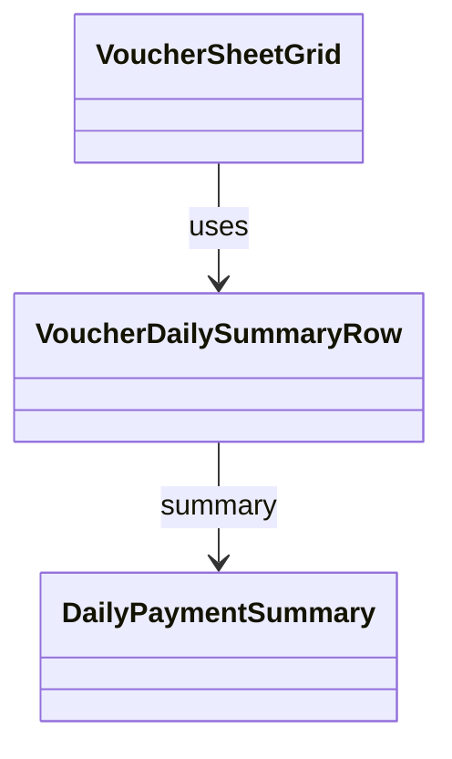

# VoucherDailySummaryRow（voucher_daily_summary_row.dart）

| 新規作成・更新日 | 作成・更新者名 | 作成・更新内容 |
|---|---|---|
| 2026-09-27 | minamiyama | 新規作成（[agents.md](../../../../../../../requried/agents.md) §2「日機能要件」を反映） |
| 2026-09-29 | minamiyama | [VoucherSheetGrid](./voucher_sheet_grid.md)導入に伴い、責務を「合計金額」列セルの表示のみに縮小（「本日の合計」ラベル・価格列/MEMO列の空欄・「担当」列の空欄は[VoucherSheetGrid](./voucher_sheet_grid.md)側で描画するよう変更）。`headers`引数を削除 |
| 2026-09-29 | minamiyama | 金額表示を[currency_format](../../../../core/utils/currency_format.md)の`formatYen`による3桁区切りカンマ付き表示に変更 |

## 概要

伝票の末尾の行（本日の合計行）のうち、「合計金額」列セルとして、その日（営業日）の合計金額と決済方法別内訳（現金／カード／PayPay）を表示するウィジェット（FR-2）。[VoucherSheetGrid](./voucher_sheet_grid.md)の右端固定列（「合計金額」列位置）に配置する。縦スクロールしても常に画面下部に見えるよう固定表示（sticky）される点、横スクロールしても常に右端に固定表示される点はいずれも[VoucherSheetGrid](./voucher_sheet_grid.md)側の責務であり、本ウィジェット自体はセル内容の描画のみを担う。画面内でのみ使用する。

## 依存関係シーケンス図

## 項目一覧（コンストラクタ引数）

| 項目論理名 | 項目物理名 | カプセルの型 | データ型 | バリデーション | 備考 |
|---|---|---|---|---|---|
| 日次集計 | summary | - | [DailyPaymentSummary](../../domain/entities/daily_payment_summary.md) | 必須 | `sheetDetail.dailySummary`をそのまま渡す |

## 表示ルール

- `summary.totalAmount`を太字・大きめのフォントサイズで表示し、その下に「現金 ¥xxx」「カード ¥xxx」「PayPay ¥xxx」（`summary.cashAmount`/`cardAmount`/`paypayAmount`）を小さめのフォントサイズで縦に並べる。
