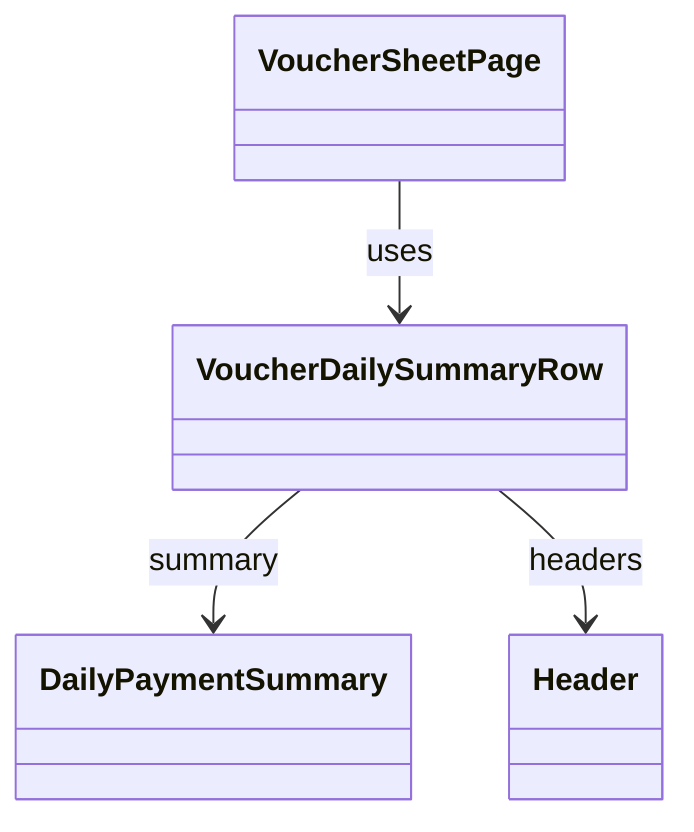

# VoucherDailySummaryRow（voucher_daily_summary_row.dart）

| 新規作成・更新日 | 作成・更新者名 | 作成・更新内容 |
|---|---|---|
| 2026-09-27 | minamiyama | 新規作成（[agents.md](../../../../../../../requried/agents.md) §2「日機能要件」を反映） |

## 概要

伝票の末尾の行として、その日（営業日）の合計金額と決済方法別内訳（現金／カード／PayPay）を表示するウィジェット（FR-2）。[VoucherDataRow](./voucher_data_row.md)一覧の最後、かつ[VoucherAddRowButton](./voucher_add_row_button.md)の直後（画面上は1つ下）に表示し、縦スクロールしても常に画面下部に見えるよう固定表示（sticky）する。列構成は[VoucherHeaderRow](./voucher_header_row.md)に合わせ、「お名前」列位置にラベル「本日の合計」を表示し、価格列・MEMO列は空欄、「合計金額」列位置に金額と内訳、「担当」列位置は空欄とする。画面内でのみ使用する。

## 依存関係シーケンス図

## 項目一覧（コンストラクタ引数）

| 項目論理名 | 項目物理名 | カプセルの型 | データ型 | バリデーション | 備考 |
|---|---|---|---|---|---|
| 日次集計 | summary | - | [DailyPaymentSummary](../../domain/entities/daily_payment_summary.md) | 必須 | `sheetDetail.dailySummary`をそのまま渡す |
| 列一覧 | headers | list | [Header](../../domain/entities/header.md) | 必須 | 空欄セルの列数を[VoucherHeaderRow](./voucher_header_row.md)と揃えるために使用する |

## 表示ルール

- 「合計金額」列位置: `summary.totalAmount`を太字・大きめのフォントサイズで表示し、その下に「現金 ¥xxx」「カード ¥xxx」「PayPay ¥xxx」（`summary.cashAmount`/`cardAmount`/`paypayAmount`）を小さめのフォントサイズで縦に並べる。
- 縦方向: 常に画面下端に固定表示する（sticky）。
- 横方向: 「お名前」列は左端に、「合計金額」列・「担当」列は右端に固定表示し、価格列・MEMO列をスクロールしても常に視認できるようにする（[VoucherDataRow](./voucher_data_row.md)の列固定方式に合わせる）。
