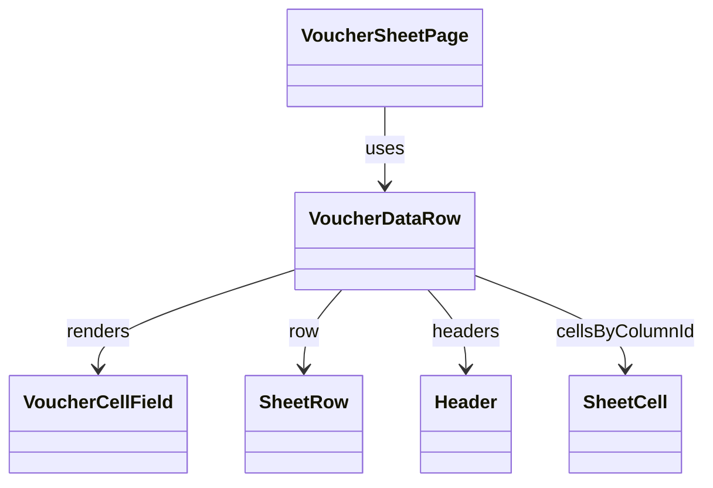

# VoucherDataRow（voucher_data_row.dart）

| 新規作成・更新日 | 作成・更新者名 | 作成・更新内容 |
|---|---|---|
| 2026-09-25 | minamiyama | 新規作成 |

## 概要

1組の来店・卓（[SheetRow](../../domain/entities/sheet_row.md)）を表す1行のウィジェット。[VoucherCellField](./voucher_cell_field.md)を列数分横並びに配置し、行末に担当スタッフ・合計金額（[SheetRow.totalAmount](../../domain/entities/sheet_row.md)）を表示する。セルタップ・入力確定は[VoucherSheetNotifier](../controllers/voucher_sheet_notifier.md)のコールバックとして親（[VoucherSheetPage](../pages/voucher_sheet_page.md)）から渡される。画面内でのみ使用する。

## 依存関係シーケンス図

## 項目一覧（コンストラクタ引数）

| 項目論理名 | 項目物理名 | カプセルの型 | データ型 | バリデーション | 備考 |
|---|---|---|---|---|---|
| 行 | row | - | [SheetRow](../../domain/entities/sheet_row.md) | 必須 | - |
| 列一覧 | headers | list | [Header](../../domain/entities/header.md) | 必須 | `displayOrder`昇順。[VoucherHeaderRow](./voucher_header_row.md)と同じ一覧を渡す |
| 列ID別セルMap | cellsByColumnId | map | string(key), [SheetCell](../../domain/entities/sheet_cell.md)(value) | 必須, 該当なしの列は未入力として扱う | [SheetDetail.cellsByRowIdAndColumnId](../../domain/entities/sheet_detail.md)の`row.rowId`部分 |
| 編集中の列ID | editingColumnId | optional | string | 任意 | この行が編集中の場合のみ非`null`。[VoucherSheetState.editingRowId](../controllers/voucher_sheet_state.md)が`row.rowId`と一致する場合に渡す |
| 編集中の入力テキスト | editingText | optional | string | 任意 | `editingColumnId`が非`null`の場合のみ使用 |
| セルタップ時コールバック | onCellTap | - | function(columnId: string, initialText: string) -> void | 必須 | [VoucherSheetNotifier.startEditingCell](../controllers/voucher_sheet_notifier.md#starteditingcell)を呼び出す |
| テキスト変更時コールバック | onTextChanged | - | function(text: string) -> void | 必須 | [VoucherSheetNotifier.updateEditingText](../controllers/voucher_sheet_notifier.md#updateeditingtext)を呼び出す |
| 入力確定時コールバック | onCommit | - | function() -> void | 必須 | [VoucherSheetNotifier.commitCell](../controllers/voucher_sheet_notifier.md#commitcell)を呼び出す |
