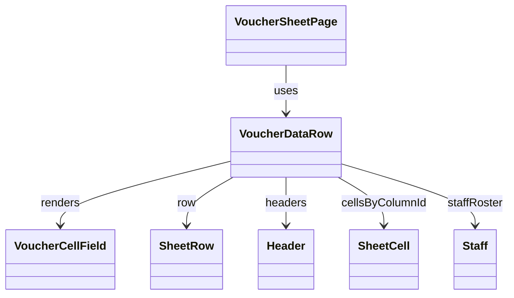

# VoucherDataRow（voucher_data_row.dart）

| 新規作成・更新日 | 作成・更新者名 | 作成・更新内容 |
|---|---|---|
| 2026-09-25 | minamiyama | 新規作成 |
| 2026-09-27 | minamiyama | 「お名前」列の「-様」＋「NEW」マーク表示、「合計金額」列の決済方法トグル、「担当」列のプルダウン化を追加（[agents.md](../../../../../../../requried/agents.md)を反映） |

## 概要

1組の来店・卓（[SheetRow](../../domain/entities/sheet_row.md)）を表す1行のウィジェット。「お名前」列・[VoucherCellField](./voucher_cell_field.md)を列数分・「合計金額」列（決済方法トグル付き）・「担当」列（プルダウン）の順に横並びに配置する（紙伝票のレイアウトに合わせ「担当」列を一番右端とする）。「お名前」列は`row.customerId`が`null`の場合デフォルトで「-様」と表示し「様」の隣に「NEW」マークを付ける。セルタップ・入力確定・担当変更・決済方法変更は[VoucherSheetNotifier](../controllers/voucher_sheet_notifier.md)のコールバックとして親（[VoucherSheetPage](../pages/voucher_sheet_page.md)）から渡される。画面内でのみ使用する。

## 依存関係シーケンス図

```mermaid
classDiagram
    VoucherSheetPage --> VoucherDataRow : uses
    VoucherDataRow --> VoucherCellField : renders
    VoucherDataRow --> SheetRow : row
    VoucherDataRow --> Header : headers
    VoucherDataRow --> SheetCell : cellsByColumnId
    VoucherDataRow --> Staff : staffRoster
```

## 項目一覧（コンストラクタ引数）

| 項目論理名 | 項目物理名 | カプセルの型 | データ型 | バリデーション | 備考 |
|---|---|---|---|---|---|
| 行 | row | - | [SheetRow](../../domain/entities/sheet_row.md) | 必須 | - |
| 列一覧 | headers | list | [Header](../../domain/entities/header.md) | 必須 | `displayOrder`昇順。[VoucherHeaderRow](./voucher_header_row.md)と同じ一覧を渡す |
| 列ID別セルMap | cellsByColumnId | map | string(key), [SheetCell](../../domain/entities/sheet_cell.md)(value) | 必須, 該当なしの列は未入力として扱う | [SheetDetail.cellsByRowIdAndColumnId](../../domain/entities/sheet_detail.md)の`row.rowId`部分 |
| スタッフ選択肢一覧 | staffRoster | list | [Staff](../../domain/entities/staff.md) | 必須 | 「担当」列プルダウンの選択肢。`sheetDetail.staffRoster`をそのまま渡す |
| 顧客ID別顧客Map | customersById | map | string(key), [Customer](../../domain/entities/customer.md)(value) | 必須 | 「お名前」列の氏名表示用。`sheetDetail.customersById`をそのまま渡す |
| 編集中の列ID | editingColumnId | optional | string | 任意 | この行が編集中の場合のみ非`null`。[VoucherSheetState.editingRowId](../controllers/voucher_sheet_state.md)が`row.rowId`と一致する場合に渡す。「お名前」列編集中の場合は特別な値`'customerName'` |
| 編集中の入力テキスト | editingText | optional | string | 任意 | `editingColumnId`が非`null`の場合のみ使用 |
| セルタップ時コールバック | onCellTap | - | function(columnId: string, initialText: string) -> void | 必須 | [VoucherSheetNotifier.startEditingCell](../controllers/voucher_sheet_notifier.md#starteditingcell)を呼び出す。「お名前」列タップ時は`columnId='customerName'`・`initialText=row.customerId`が`null`なら空文字列、非`null`なら顧客氏名を渡す |
| テキスト変更時コールバック | onTextChanged | - | function(text: string) -> void | 必須 | [VoucherSheetNotifier.updateEditingText](../controllers/voucher_sheet_notifier.md#updateeditingtext)を呼び出す |
| 入力確定時コールバック | onCommit | - | function() -> void | 必須 | [VoucherSheetNotifier.commitCell](../controllers/voucher_sheet_notifier.md#commitcell)を呼び出す |
| 担当変更時コールバック | onStaffChanged | - | function(staffId: string?) -> void | 必須 | [VoucherSheetNotifier.setRowStaff](../controllers/voucher_sheet_notifier.md#setrowstaff)を呼び出す |
| 決済方法変更時コールバック | onPaymentMethodChanged | - | function(paymentMethod: PaymentMethod?) -> void | 必須 | [VoucherSheetNotifier.setRowPaymentMethod](../controllers/voucher_sheet_notifier.md#setrowpaymentmethod)を呼び出す。タップした決済方法が既に選択中の場合は`null`（現金）を渡す |

## 表示ルール（「お名前」列）

- `row.customerId`が非`null`の場合: `customersById[row.customerId]`から引いた[Customer.name](../../domain/entities/customer.md)＋「様」を表示する。
- `row.customerId`が`null`の場合: 「-様」を表示し、「様」の隣に「NEW」マーク（塗りつぶし角丸のバッジ）を表示する。

## 表示ルール（「合計金額」列）

- `row.totalAmount`を太字で表示する。
- その隣に「P」「カ」の2つの決済方法トグルボタンを配置する。`row.paymentMethod`が該当する値と一致する場合は選択中（塗りつぶし）の見た目にする。どちらも選択中でない場合は現金決済を意味する。

## 表示ルール（「担当」列）

- `staffRoster`から選択するプルダウンとして表示する。`row.staffId`が`null`の場合は「未定」を選択状態とする。
