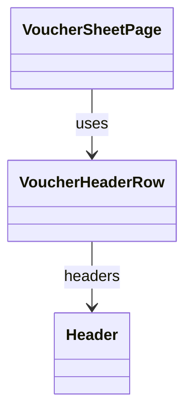

# VoucherHeaderRow（voucher_header_row.dart）

| 新規作成・更新日 | 作成・更新者名 | 作成・更新内容 |
|---|---|---|
| 2026-09-25 | minamiyama | 新規作成 |

## 概要

伝票入力画面（[VoucherSheetPage](../pages/voucher_sheet_page.md)、`ENT_001_VOUCHER`）の列名・単価を固定表示するヘッダー行ウィジェット。紙伝票のヘッダー行固定表示（[requirements.md](../../../../../../../requried/requirements.md) FR-1）に対応する。画面内でのみ使用する。

## 依存関係シーケンス図

## 項目一覧（コンストラクタ引数）

| 項目論理名 | 項目物理名 | カプセルの型 | データ型 | バリデーション | 備考 |
|---|---|---|---|---|---|
| 列一覧 | headers | list | [Header](../../domain/entities/header.md) | 必須 | `displayOrder`昇順。列名と、`isPriced=true`の列は単価を表示する |
