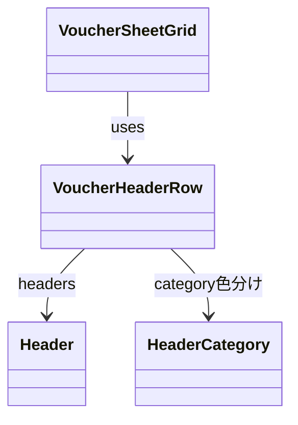

# VoucherHeaderRow（voucher_header_row.dart）

| 新規作成・更新日 | 作成・更新者名 | 作成・更新内容 |
|---|---|---|
| 2026-09-25 | minamiyama | 新規作成 |
| 2026-09-29 | minamiyama | [docs/ui/wireframe](../../../../../../../ui/wireframe/style.css)を正として、各列の右罫線に加え下罫線を追加し、罫線色を`colorScheme.outline`（wireframeの`--color-border`相当）に統一。[VoucherSheetGrid](./voucher_sheet_grid.md)内で価格列＋MEMO列部分のヘッダーとして使用するよう変更 |
| 2026-09-29 | minamiyama | 列名の文字数に関わらずヘッダーの高さを統一するため、`Row`の`crossAxisAlignment`を`stretch`に変更（各列のセルが親の高さいっぱいに広がり、文字列を縦方向中央揃えで表示する） |
| 2026-09-29 | minamiyama | 単価表示を[currency_format](../../../../core/utils/currency_format.md)の`formatYen`による3桁区切りカンマ付き表示に変更 |
| 2026-09-29 | minamiyama | ヘッダー管理機能（FR-6）に伴い、(1)現在の単価が同額の隣接列を1セル内に改行してまとめて表示するグルーピング表示、(2)[HeaderCategory](../../domain/entities/enums/header_category.md)ごとの背景色分け、を追加。非表示列（`isVisible=false`）の除外は呼び出し元（[VoucherSheetGrid](./voucher_sheet_grid.md)）が行うようになり、本ウィジェットは表示対象の列のみを受け取る想定に変更（項目一覧の備考を更新） |

## 概要

伝票入力画面（[VoucherSheetPage](../pages/voucher_sheet_page.md)、`MMM_001_VOUCHER`）のグリッド（[VoucherSheetGrid](./voucher_sheet_grid.md)）内で、価格列＋MEMO列部分の列名・単価を表示するヘッダー行ウィジェット。紙伝票のヘッダー行固定表示（[requirements.md](../../../../../../../requried/requirements.md) FR-1）に対応する。現在の単価が同額の隣接列は1セル内にまとめて改行表示し、カテゴリーごとに背景色を変える（FR-6）。「お名前」「合計金額」「担当」の各見出しは[VoucherSheetGrid](./voucher_sheet_grid.md)側で描画するため含まない。画面内でのみ使用する。

## 依存関係シーケンス図

```mermaid
classDiagram
    VoucherSheetGrid --> VoucherHeaderRow : uses
    VoucherHeaderRow --> Header : headers
    VoucherHeaderRow --> HeaderCategory : category色分け
```

## 項目一覧（コンストラクタ引数）

| 項目論理名 | 項目物理名 | カプセルの型 | データ型 | バリデーション | 備考 |
|---|---|---|---|---|---|
| 列一覧 | headers | list | [Header](../../domain/entities/header.md) | 必須 | `displayOrder`昇順、**表示対象（`isVisible=true`）のみ**。非表示列の除外は[VoucherSheetGrid](./voucher_sheet_grid.md)が行う。列名と、`isPriced=true`の列は単価を表示する |
| 列ID別の現在の適用単価Map | unitPricesByColumnId | map | string(key), int(value) | 必須 | `SheetDetail.unitPricesByColumnId`。単価表示・グルーピング判定（同額かどうか）の両方に使用する |

## 表示ルール

- 隣接する列のうち、現在の単価（`unitPricesByColumnId`）が同額かつ両方`isPriced=true`の列を1グループとしてまとめ、幅`96px × グループ内列数`の1セル内に列名を改行して表示する（単価はグループ先頭の列の値を1つのみ表示）。価格が異なる、または非価格対象の列を挟むとグループは分割される。
- グループの背景色は、グループ先頭の列の[HeaderCategory](../../domain/entities/enums/header_category.md)に応じて変える（`drink`＝水色系、`bottle`＝紫系、`food`＝緑系、`none`＝無色）。
- 各セルの右側・下側に罫線（`colorScheme.outline`）を表示する。
- 各セルは、列名の文字数（折り返し行数）に関わらず高さを統一する（親から与えられた高さいっぱいに広がり、文字列は縦方向中央揃え）。
