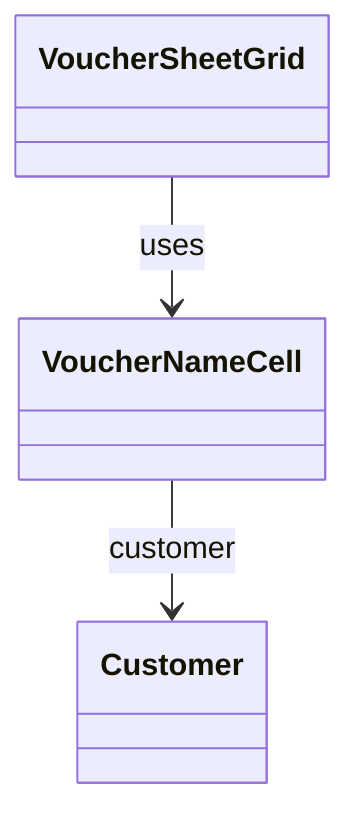

# VoucherNameCell（voucher_name_cell.dart）

| 新規作成・更新日 | 作成・更新者名 | 作成・更新内容 |
|---|---|---|
| 2026-09-29 | minamiyama | 新規作成。[VoucherSheetGrid](./voucher_sheet_grid.md)の「お名前」列固定表示対応に伴い、旧`VoucherDataRow`から「お名前」セルの表示・編集ロジックを分離 |
| 2026-09-29 | minamiyama | `customer`が非`null`の場合に氏名のみが表示され「様」が付与されていなかったバグを修正。「{氏名} 様」（半角スペース区切り）で表示するよう修正 |
| 2026-10-03 | minamiyama | お名前の登録後も初来店の伝票で「NEW」マークを表示するため、`isNewCustomer`を追加し、「NEW」マークの表示条件を`customer == null`から`isNewCustomer`に変更 |

## 概要

伝票入力画面（[VoucherSheetPage](../pages/voucher_sheet_page.md)、`MMM_001_VOUCHER`）のグリッド内で1行分の「お名前」列セルを表すウィジェット。[VoucherSheetGrid](./voucher_sheet_grid.md)の左端固定列（横スクロールしても常に視認できる領域）で、行数分繰り返し使用する。顧客が紐付いている場合は氏名＋「様」、未登録の場合は「-様」を表示し、新規客（未登録、または表示中の営業日が初来店の顧客）の場合は「NEW」マークを付ける。タップでインライン編集に切り替わる。画面内でのみ使用する。

## 依存関係シーケンス図

## 項目一覧（コンストラクタ引数）

| 項目論理名 | 項目物理名 | カプセルの型 | データ型 | バリデーション | 備考 |
|---|---|---|---|---|---|
| 紐付く顧客 | customer | optional | [Customer](../../domain/entities/customer.md) | 任意 | 未登録（新規客）の場合は`null`。`row.customerId`が非`null`の場合に`customersById[row.customerId]`を渡す |
| 新規客フラグ | isNewCustomer | - | bool | 必須 | `row.customerId`が`null`、または[SheetDetail.newCustomerIds](../../domain/entities/sheet_detail.md)に含まれる場合に`true` |
| 編集中フラグ | isEditing | - | bool | 必須 | `editingRowId`が対象行と一致し、かつ`editingColumnId`が`'customerName'`の場合に`true` |
| 編集中の入力テキスト | editingText | optional | string | 任意 | `isEditing=true`の場合のみ使用 |
| タップ時コールバック | onTap | - | function() -> void | 必須 | [VoucherSheetNotifier.startEditingCell](../controllers/voucher_sheet_notifier.md#starteditingcell)を`columnId='customerName'`・`initialText=customer?.name ?? ''`で呼び出す |
| テキスト変更時コールバック | onChanged | - | function(text: string) -> void | 必須 | [VoucherSheetNotifier.updateEditingText](../controllers/voucher_sheet_notifier.md#updateeditingtext)を呼び出す |
| 入力確定時コールバック | onSubmitted | - | function() -> void | 必須 | [VoucherSheetNotifier.commitCell](../controllers/voucher_sheet_notifier.md#commitcell)を呼び出す |

## 表示ルール

- `customer`が非`null`の場合: [Customer.name](../../domain/entities/customer.md)＋半角スペース＋「様」（「{氏名} 様」）を表示する。
- `customer`が`null`の場合: 「-様」を表示する。
- `isNewCustomer=true`の場合: 「様」の隣に「NEW」マーク（塗りつぶし角丸のバッジ）を表示する（お名前を入力して顧客が登録された後も、初来店の営業日の伝票では表示する）。
- `isEditing=true`の場合、表示の代わりにテキスト入力欄を表示する。
